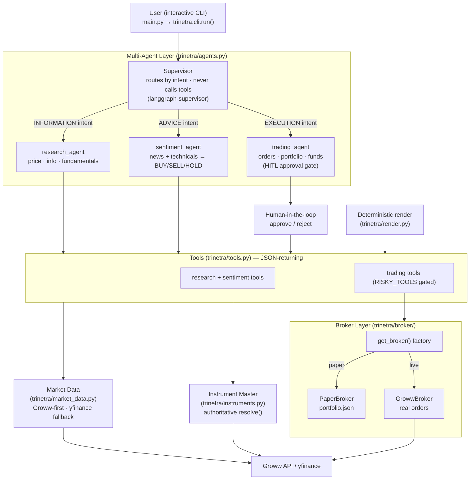

# 🔱 Trinetra Capital AI — Introduction & Project Overview

> *Multi-Agents. One Market. Zero Missed Moves.*
> *"Har decision mein teen nazar — research ki, trading ki, aur insaan ki."*

**Trinetra Capital AI** is an autonomous, multi-agent artificial-intelligence trading system for Indian equities (NSE/BSE). It coordinates three specialist AI agents under a central supervisor to research stocks, evaluate market sentiment, and place real buy/sell orders through the [Groww Trading API](https://groww.in/trade-api/docs) — while keeping a human in the loop on every order. The system ships in **paper-trading mode by default**, exercising the entire pipeline against live market data without risking capital, and flips to **live, real-money execution** through a single environment variable guarded by layered safety controls. This document introduces the project: the problem it addresses, its conceptual framing, its objectives, its novel contributions, and its deliberate scope boundaries. It is the entry point to the wider `docs/` set and assumes no prior familiarity with the codebase.

---

## Table of Contents

1. [Executive Abstract](#1-executive-abstract)
2. [Problem Statement](#2-problem-statement)
3. [Motivation](#3-motivation)
4. [The "Trinetra" Conceptual Framing](#4-the-trinetra-conceptual-framing)
5. [Project Objectives](#5-project-objectives)
6. [Key Contributions and Novelty](#6-key-contributions-and-novelty)
7. [System at a Glance](#7-system-at-a-glance)
8. [Scope and Non-Goals](#8-scope-and-non-goals)
9. [Intended Users](#9-intended-users)
10. [Reading Guide](#10-reading-guide)

---

## 1. Executive Abstract

Retail algorithmic trading sits at an uncomfortable intersection: large language models (LLMs) are fluent reasoners but unreliable executors — they hallucinate prices, invent ticker symbols, and have no native concept of a financial safety budget. Trinetra Capital AI is a research artefact that demonstrates how a hierarchical, **provider-pluggable multi-agent architecture** can harness LLM reasoning for market analysis while structurally constraining the LLM's authority over money.

The system, version `1.0.0` (defined in `trinetra/__init__.py`), is built on **LangGraph**, **LangChain**, and the **`langgraph-supervisor`** hierarchical-supervisor pattern. A supervisor agent routes each user request by *intent* to exactly one of three specialists — a research agent, a sentiment agent, and a trading agent — and relays that specialist's answer verbatim. The supervisor never touches a tool itself, and the trading agent is the only path to order placement. Every order-mutating action passes through a `HumanInTheLoopMiddleware` approval interrupt and a deterministic per-order rupee cap before any broker is invoked.

Beneath the agents, a **broker-abstraction layer** presents one interface (`Broker`) with two interchangeable implementations: a `PaperBroker` that simulates fills and persists a trade log to `portfolio.json`, and a `GrowwBroker` that places real orders against the user's Groww account. Market data is always real and live — sourced from Groww with a `yfinance` fallback — in both modes. An authoritative **instrument-master resolver** downloads Groww's public instrument CSV and resolves user-typed names to genuinely tradable symbols before any order is built, eliminating the dead-ticker guessing that plagues naive LLM agents. Portfolio and order tables are rendered by **deterministic Python**, not by the LLM, so the figures a user sees can never be hallucinated.

The result is a system that is intellectually honest about where the LLM is trusted (natural-language understanding, routing, qualitative analysis) and where it is not (symbol resolution, numeric rendering, order authorisation, value caps). This document and its siblings document that system exactly as the code implements it.

---

## 2. Problem Statement

Building an autonomous trading agent that is simultaneously **capable, safe, and honest** on Indian retail markets is hard for several compounding reasons.

**LLMs cannot be trusted with numbers or identifiers.** A model asked to "buy ₹10,000 of Infosys" may confidently emit a non-existent ticker (`INFOSYS.NS` rather than the tradable `INFY`), invent a last-traded price, or miscompute a quantity. In a chat assistant such errors are embarrassing; in a trading system wired to a real brokerage they are financially dangerous. Any serious design must remove numeric fabrication and symbol guessing from the LLM's responsibilities entirely.

**Retail markets demand multi-perspective reasoning.** A single prompt cannot competently answer "what is Reliance trading at?", "should I buy Infosys?", and "place this order" — these are *different kinds* of question requiring different tools, different data, and crucially different risk postures. Conflating them into one monolithic agent produces a model that is mediocre at all three and dangerous at the last.

**Real-money execution requires defence in depth, not a single switch.** Connecting an autonomous agent to a live brokerage API introduces an irreversible-action surface. A responsible system cannot rely on one safety mechanism; it needs paper-by-default operation, explicit confirmation gates, per-order value ceilings enforced independently of the model, and a human approval step on every irreversible action.

**The Indian-market data and execution stack is fragmented.** Groww provides live quotes, portfolio, and order APIs, but research often needs fundamentals and history that are more readily available via `yfinance`; symbol conventions differ between providers (`NSE_RELIANCE`, `RELIANCE.NS`, bare `RELIANCE`); and the brokerage may not even be connected when a user merely wants to look up a price. The system must degrade gracefully across all of these.

**Latency matters for usability.** A naive multi-agent loop where a heavyweight model performs every routing decision is too slow for an interactive CLI. Routing and specialist reasoning have different cost/latency profiles and benefit from different models.

Trinetra addresses each of these tensions structurally rather than by prompt-engineering alone.

---

## 3. Motivation

The motivation is to show that LLM agents can be *delegated meaningful financial agency* without being *trusted blindly*. Most agentic-trading demonstrations either stop at simulation (never touching real money, and so never confronting the hard safety questions) or wire an LLM directly to a broker with little more than a system prompt for protection. Trinetra occupies the harder middle ground: it places **real orders on a real exchange** in live mode, and therefore had to be engineered so that the LLM's fallibility is contained by architecture, not hope.

The project also reflects a conviction that the right division of labour is *the human decides, the agents inform and prepare*. The agents do the tireless work — watching prices, scoring sentiment, resolving symbols, computing order quantities, drafting the order — but the irreversible act of committing capital is gated behind an explicit human approval. This is the "third eye" that gives the project its name.

---

## 4. The "Trinetra" Conceptual Framing

*Trinetra* (त्रिनेत्र) is the Sanskrit term for the **three-eyed vision** of Shiva — the faculty of seeing what ordinary sight misses. The project maps this motif onto its architecture as a guiding metaphor: *teen nazar* — three perspectives — on every market decision.

| Eye / Perspective | Embodied as | Responsibility |
|---|---|---|
| **Research** (ki research) | `research_agent` | Objective facts: live price, company information, fundamentals, symbol lookup |
| **Trading** (ki trading) | `trading_agent` | Execution: orders, portfolio, holdings, funds, order history — behind a HITL gate |
| **The human** (ki insaan) | Human-in-the-loop + sentiment | Judgement: qualitative outlook, and final authority over every irreversible order |

The "third eye" is best understood as twofold. The **sentiment agent** supplies the analytical *judgement* layer — synthesising news headlines and technical indicators into a BUY/SELL/HOLD view with confidence and risk levels — while the **human-in-the-loop** supplies the *final* judgement, the irreducible human authority over committing real capital. Together they ensure no order reaches the market on the strength of pattern-matching alone. The supervisor sits above all three, acting as the central nervous system that directs each request to the eye best suited to answer it.

This is not decorative branding. It is a literal description of the routing contract: the supervisor classifies each request by intent and hands it to exactly one specialist, and the human gate stands between the trading agent and the broker.

---

## 5. Project Objectives

The project pursues the following concrete objectives, each realised in the tracked codebase:

1. **Hierarchical multi-agent orchestration.** Route every user request, by intent, to exactly one specialist via a supervisor that never itself calls a tool (`trinetra/agents.py`).
2. **Real, safe execution.** Place genuine Groww orders in live mode while defaulting to fully simulated paper trading (`trinetra/broker/`).
3. **Layered, model-independent safety.** Enforce a per-order rupee cap, a human approval interrupt on every order-mutating action, and an explicit `I UNDERSTAND` gate before any live session.
4. **Authoritative symbol resolution.** Resolve user-typed names against Groww's official instrument master *before* an order is constructed, rejecting non-tradable symbols with suggestions (`trinetra/instruments.py`).
5. **Hallucination-free presentation.** Render all portfolio and order tables in deterministic Python (`trinetra/render.py`), never via the LLM.
6. **Graceful degradation.** Keep research and sentiment working even with no broker connected, via a `yfinance` fallback and a stale-cache instrument fallback (`trinetra/market_data.py`).
7. **Provider-pluggable LLM layer.** Allow agent and supervisor models to be swapped between NVIDIA NIM, Groq, and OpenRouter without code changes (`trinetra/config.py`).

---

## 6. Key Contributions and Novelty

Trinetra's contribution is less any single technique than the *coherent composition* of several, each chosen to neutralise a specific LLM failure mode:

- **Provider-pluggable hierarchical multi-agent orchestration.** The supervisor/specialist split uses `langgraph-supervisor` with intent-based routing to a *single* specialist per turn, with the supervisor relaying the specialist's answer verbatim. The LLM layer is configuration-driven: worker agents default to NVIDIA NIM (`ChatNVIDIA`), the supervisor to Groq (`ChatGroq`) for fast routing with a fallback to the worker model, and an optional OpenRouter override (`ChatOpenAI`-compatible) can power both. The code default for both `agent_model` and `supervisor_model` is `meta/llama-3.3-70b-instruct`; the OpenRouter default is `openai/gpt-4o-mini`.

- **A broker-abstracted paper/live execution layer.** One `Broker` interface, two implementations selected by a `get_broker()` singleton factory. The same agent code drives both simulated and real execution; switching is a single `.env` line plus a restart. Critically, the per-order value cap is enforced in the abstract `Broker.guard_order()` for **both** paper and live modes — the safety budget is not a live-only afterthought.

- **An authoritative instrument-master resolver.** Rather than letting the LLM guess tickers, `trinetra/instruments.py` downloads Groww's public instrument CSV, filters to the equity CASH segment on NSE/BSE, and ranks candidates with a transparent scoring function (exact-ticker, name-prefix, token-subset, exchange and series bonuses, ETF penalties). This converts fuzzy human input into a single genuinely tradable record before any order is built.

- **Deterministic, non-hallucinated rendering.** Portfolio and order-book tables are formatted by pure Python in `trinetra/render.py`. Combined with prompt rules that forbid the model from inventing numbers and require it to echo a pre-rendered "display" table verbatim, this structurally prevents fabricated figures from reaching the user.

- **Layered real-money safety.** Paper-by-default; a hard per-order rupee cap in `guard_order()`; a HITL approval interrupt on every place/cancel/modify; an explicit `I UNDERSTAND` confirmation before live sessions; authoritative symbol resolution with a `buy_allowed` check; deterministic rendering; a `chmod 600` token cache; and graceful degradation throughout. These are independent layers, so the failure of any one does not by itself permit an unintended order.

---

## 7. System at a Glance

The diagram below shows the system end-to-end: a single user request enters via the CLI, is routed by the supervisor to one specialist, which calls tools that read live market data and (for the trading agent, behind a human gate) reach the broker layer.

The facts table summarises the system's identity and operating envelope:

| Attribute | Value |
|---|---|
| **Project** | Trinetra Capital AI |
| **Version** | `1.0.0` (`trinetra/__init__.py`) |
| **Tagline** | Multi-Agents. One Market. Zero Missed Moves. |
| **Author** | Udit |
| **Domain** | Autonomous multi-agent trading for Indian equities (NSE/BSE) via the Groww Trading API |
| **Entrypoint** | `python main.py` → `trinetra.cli.run()` |
| **Agent framework** | LangGraph + LangChain + `langgraph-supervisor` |
| **LLM (agents)** | `langchain-nvidia-ai-endpoints` (`ChatNVIDIA`); default `meta/llama-3.3-70b-instruct` |
| **LLM (supervisor)** | `langchain-groq` (`ChatGroq`), fallback to worker model; default `meta/llama-3.3-70b-instruct` |
| **LLM (optional override)** | OpenRouter (`ChatOpenAI`-compatible); default `openai/gpt-4o-mini` |
| **Broker** | `growwapi >= 1.5.0` + `pyotp` |
| **Market data** | Groww live + `yfinance` fallback |
| **Sentiment / TA** | `requests` + `BeautifulSoup` (Yahoo headlines) + `TextBlob`; `numpy` + `pandas` |
| **Conversation state** | LangGraph `InMemorySaver` checkpointer |
| **Modes** | `paper` (default) / `live` — switched via `GROWW_TRADING_MODE` |
| **Container** | Docker (`python:3.12-slim`) + docker-compose |
| **Scope (v1)** | Equity CASH segment, NSE/BSE only |

---

## 8. Scope and Non-Goals

Honest scoping is part of the artefact's credibility. Version 1 deliberately limits itself:

- **Equity cash segment only.** Both the instrument master and the broker layer restrict to the CASH segment on NSE and BSE. Futures & options (F&O) and commodity segments are explicitly out of scope for v1 (they appear on the roadmap as *Planned*).
- **No long-term cross-turn memory yet.** Conversation state uses LangGraph's `InMemorySaver`, and the CLI assigns a **fresh `thread_id` per turn**. There is therefore no persistent memory across turns or sessions in v1; a persistent `PostgresSaver` is roadmapped.
- **Stop-loss orders are not simulated in paper mode.** `PaperBroker` fills market and limit orders instantly but rejects SL/SL-M orders, because a simulator cannot monitor a live trigger. Stop-loss execution is therefore a live-mode capability only.
- **News sentiment is best-effort.** Sentiment relies on scraping up to ten Yahoo Finance headlines and scoring polarity with `TextBlob`. It is a heuristic signal, not a curated newsfeed, and is treated as one input among several in the composite score.
- **Not investment advice.** The system places orders the user approves; it does not constitute financial advice. Live trading carries real financial risk, and the project documentation, the CLI gates, and the README disclaimer all reinforce that the user is solely responsible for every order. Consulting a SEBI-registered advisor is recommended before live trading.

These boundaries are features, not omissions: each is a place where the system declines to over-claim.

---

## 9. Intended Users

Trinetra is aimed at three overlapping audiences:

- **Technically literate retail traders** on Indian markets who want an LLM-assisted research-and-execution workflow with strong safety rails, and who are comfortable managing API credentials and reviewing every order before it is sent.
- **Researchers and engineers** studying agentic systems, human-in-the-loop design, and the practical containment of LLM unreliability in high-stakes, irreversible-action domains.
- **Builders and reviewers** — including competition evaluators — who want a complete, code-grounded reference for how a provider-pluggable multi-agent trading system is structured end to end.

In all cases the expectation is the same: start in paper mode, keep the per-order cap conservative, and treat the human approval gate as a genuine decision point rather than a formality.

---

## 10. Reading Guide

This document is the first in the `docs/` set. To go deeper:

- **[System Architecture](02-system-architecture.md)** details the supervisor/specialist topology, the tool surface, and how the layers compose.
- Subsequent documents in the `docs/` folder elaborate the agent layer, the tool catalogue, the broker abstraction and Groww integration, the market-data and instrument-resolution subsystems, the configuration and environment surface, and the cross-cutting safety model.

Read this introduction for *why* and *what*; read the architecture document next for *how the pieces fit*; then consult the subsystem documents for *how each piece works in detail*. Throughout the set, the code is the authority: where the README is aspirational, the documents follow the tracked source.

---

[↑ Documentation Index](README.md)  |  [System Architecture →](02-system-architecture.md)
