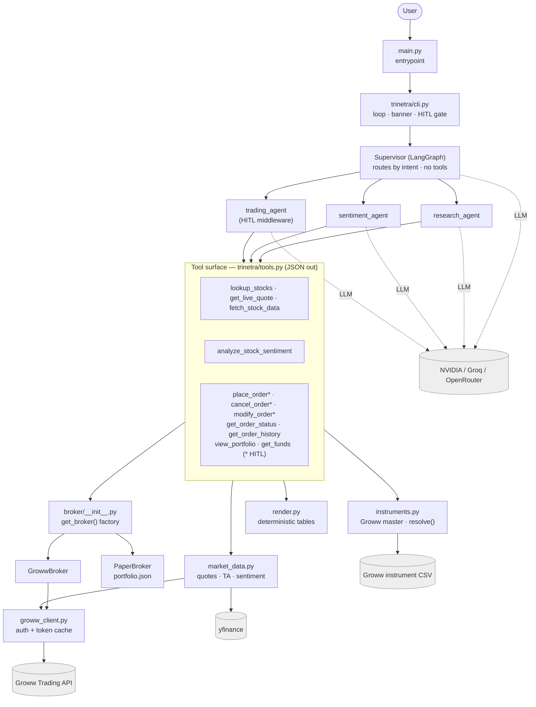
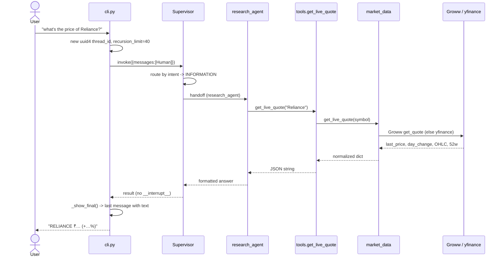
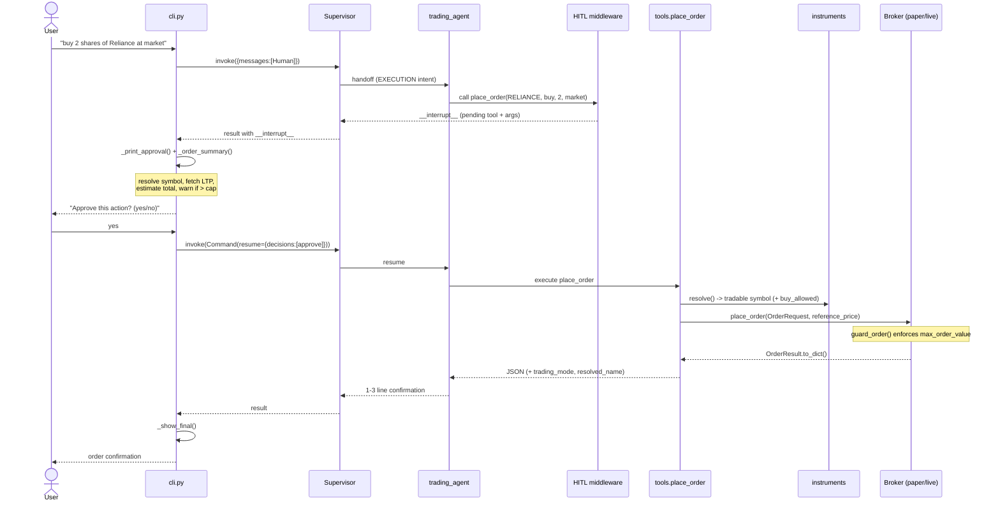
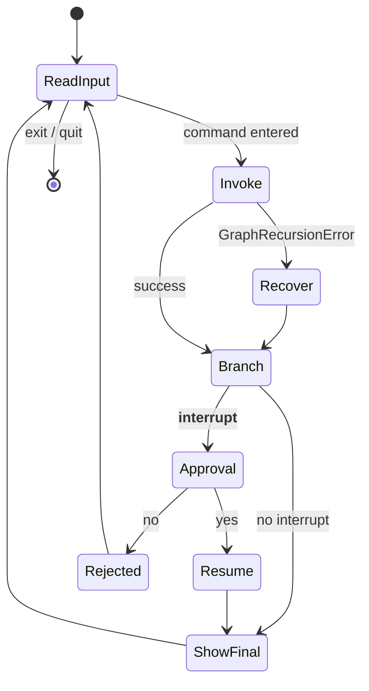

# System Architecture

> 🔱 **Trinetra Capital AI**  *Multi-Agents. One Market. Zero Missed Moves.*

This document describes the end-to-end architecture of Trinetra Capital AI, an autonomous multi-agent trading system for Indian equities (NSE/BSE) wired to the Groww Trading API. It establishes the design principles that govern the codebase, presents the layered architecture from the interactive CLI down to external providers, traces two representative request lifecycles (an informational query and a human-approved order), and explains the cross-cutting concerns — dependency direction, caching, and failure recovery — that make the system safe to run against real money. It is grounded strictly in the tracked source code; where the README is aspirational, this document reflects what the code actually does and notes the divergence. Subsystem internals are deferred to the deeper companion documents: see [03-multi-agent-system.md](03-multi-agent-system.md) for orchestration, [04-execution-and-broker-layer.md](04-execution-and-broker-layer.md) for the broker layer, and [05-market-data-and-quant-analytics.md](05-market-data-and-quant-analytics.md) for data and symbol resolution.

## Table of Contents

1. [Architectural Goals and Design Principles](#1-architectural-goals-and-design-principles)
2. [The Layered Architecture](#2-the-layered-architecture)
3. [Component Diagram](#3-component-diagram)
4. [Package and Module Map](#4-package-and-module-map)
5. [Request Lifecycle (a): Informational Query](#5-request-lifecycle-a-informational-query)
6. [Request Lifecycle (b): Order with HITL Approval](#6-request-lifecycle-b-order-with-hitl-approval)
7. [Dependency Direction: Tools as the Sole LLM Surface](#7-dependency-direction-tools-as-the-sole-llm-surface)
8. [Concurrency and Caching Touchpoints](#8-concurrency-and-caching-touchpoints)
9. [Error Handling and Recovery](#9-error-handling-and-recovery)
10. [Current Limitations](#10-current-limitations)

---

## 1. Architectural Goals and Design Principles

Trinetra is built on the premise that an AI system permitted to place real-money orders must be *safe by construction*, not merely safe by convention. Every structural choice in the codebase serves one or more of the following principles.

**Separation of concerns.** The system is decomposed into strictly layered responsibilities: presentation (`trinetra/cli.py`), orchestration (`trinetra/agents.py`), a tool surface (`trinetra/tools.py`), domain services (`trinetra/market_data.py`, `trinetra/instruments.py`, `trinetra/broker/`), and external adapters. Each layer depends only on the layer beneath it through a narrow, well-typed interface, so a change in one rarely ripples upward.

**Single source of truth in configuration.** `trinetra/config.py` exposes a frozen `Settings` dataclass and a process-wide `settings` singleton. Trading mode, the per-order rupee cap, default product and exchange, model identifiers, and credential material are all read once from `.env` and never re-derived elsewhere. Every layer — the CLI banner, the broker factory, the trading prompt, the order-value guard — consults the same object, which eliminates configuration drift.

**Broker abstraction.** The abstract `Broker` interface in `trinetra/broker/base.py` defines a normalized vocabulary (`BUY`/`SELL`, `MARKET`/`LIMIT`/`SL`/`SL_M`, `CNC`/`MIS`, `CASH`, `DAY`) and a fixed set of operations. The `get_broker()` factory in `trinetra/broker/__init__.py` returns a `PaperBroker` or a `GrowwBroker` depending solely on `settings.is_live`. Because the tools depend only on the interface, simulated and live execution are interchangeable and the agents never know which is active.

**Fail-safe defaults.** The default trading mode is `paper`; live trading must be opted into explicitly (`GROWW_TRADING_MODE=live`) and then confirmed interactively. The abstract `Broker.guard_order()` enforces `settings.max_order_value` *for both modes* before any order is constructed, so even a simulated run cannot exceed the configured ceiling. Defaults favour the least dangerous behaviour at every junction.

**Deterministic rendering.** Financial tables (portfolios, order books) are formatted by plain Python in `trinetra/render.py`, not by the LLM. Tools attach a pre-rendered `display` string, and the trading prompt instructs the agent to emit it verbatim. This removes the single largest hallucination risk — fabricated numbers in a table the user might act on.

**Graceful degradation.** No data path hard-fails. Market data is Groww-first with a yfinance fallback, so research and sentiment work even before a broker is connected; the instrument master falls back to a stale cache when the download fails; the Groww client performs one transparent re-authentication on a 401; and the CLI recovers from a supervisor recursion-limit instead of crashing the turn.

## 2. The Layered Architecture

The runtime is organised as five horizontal layers. Control flows top-to-bottom on a request and data flows bottom-to-top on the response.

| Layer | Responsibility | Modules |
|---|---|---|
| **Presentation / CLI** | Banner, mode gating, the input loop, the HITL approval prompt, final rendering | `main.py`, `trinetra/cli.py` |
| **Orchestration** | Supervisor routing by intent; three specialist agents; HITL middleware on risky tools | `trinetra/agents.py` |
| **Tool surface** | The only functions the LLMs may call; each returns a JSON string | `trinetra/tools.py` |
| **Domain services** | Market data, symbol/instrument resolution, broker execution, deterministic rendering | `trinetra/market_data.py`, `trinetra/instruments.py`, `trinetra/symbols.py`, `trinetra/broker/`, `trinetra/render.py` |
| **External systems** | Groww Trading API, yfinance, Yahoo headlines, LLM providers | `growwapi`, `yfinance`, `requests`+`BeautifulSoup`, NVIDIA/Groq/OpenRouter |

The **presentation layer** owns all human interaction. `main.py` is a thin entrypoint that calls `trinetra.cli.run()`. The CLI prints the PAPER/LIVE banner, requires the literal string `I UNDERSTAND` before a live session begins, warms the instrument master, builds the supervisor graph, and then loops: read input, build a per-turn config, invoke the graph, surface any approval interrupt, and print the final answer.

The **orchestration layer** is a LangGraph supervisor (`langgraph_supervisor.create_supervisor`) over three specialists built with `langchain.agents.create_agent`. The supervisor routes each request by intent to exactly one specialist and relays its answer; it never calls tools itself. The trading agent alone wraps a `HumanInTheLoopMiddleware` that pauses execution on every risky tool.

The **tool surface** is a deliberately small set of LangChain `@tool` functions. They are the only place the model touches application logic, and each one is a thin wrapper that validates input, calls a domain service, and returns structured JSON.

The **domain services** carry the real behaviour: live quotes and technical analysis (`market_data.py`), authoritative symbol resolution against the Groww instrument master (`instruments.py`), order execution and portfolio aggregation (`broker/`), and clean table formatting (`render.py`).

The **external systems** are reached only through adapters in the domain layer, so the upper layers remain provider-agnostic.

## 3. Component Diagram

## 4. Package and Module Map

| Path | Layer | Role |
|---|---|---|
| `main.py` | Presentation | Entrypoint; delegates to `trinetra.cli.run()`. |
| `connect_groww.py` | Presentation | Guided onboarding + read-only health check; places no orders. |
| `Human_in_Loop/prebuilt_HITL.py` | Presentation | Legacy shim that launches the current CLI. |
| `trinetra/__init__.py` | — | Package surface; `__version__ = "1.0.0"`. |
| `trinetra/cli.py` | Presentation | Interactive loop, banner, live-mode gate, approval prompt, recursion recovery. |
| `trinetra/agents.py` | Orchestration | LLM construction, three specialists, supervisor wiring, HITL middleware. |
| `trinetra/tools.py` | Tool surface | All `@tool` functions; `RESEARCH_TOOLS`, `SENTIMENT_TOOLS`, `TRADING_TOOLS`, `RISKY_TOOLS`. |
| `trinetra/market_data.py` | Domain | Groww-first quotes/LTP, fundamentals, symbol lookup, technical + sentiment snapshot. |
| `trinetra/instruments.py` | Domain | Authoritative Groww instrument master; `search()`, `resolve()`, `to_instrument()`. |
| `trinetra/symbols.py` | Domain | Pure, network-free symbol normalisation (`Instrument`, `.yf_symbol`, `.exchange_token`). |
| `trinetra/render.py` | Domain | Deterministic Markdown tables for portfolios and order books. |
| `trinetra/config.py` | Cross-cutting | `Settings` frozen dataclass + `settings` singleton; enums; live-mode validation. |
| `trinetra/logging_setup.py` | Cross-cutting | `get_logger()`; single stderr handler under the `trinetra` namespace. |
| `trinetra/broker/base.py` | Domain | `Broker` ABC, `BrokerError`, normalized constants, `OrderRequest`/`OrderResult`/`Holding`/`Position`/`Funds`. |
| `trinetra/broker/__init__.py` | Domain | `get_broker()` singleton factory (paper vs live). |
| `trinetra/broker/paper_broker.py` | Domain | Simulated fills; trade log in `portfolio.json`; derived holdings/positions/funds. |
| `trinetra/broker/groww_broker.py` | Domain | Live broker over `growwapi`; defensive constant mapping; batched LTP enrichment. |
| `trinetra/broker/groww_client.py` | Domain | Session management; daily token cache; TOTP / approval auth flows. |

## 5. Request Lifecycle (a): Informational Query

Consider a user typing *"what's the price of Reliance?"*. The supervisor recognises an INFORMATION intent and routes to `research_agent`, which calls a single tool. No interrupt is raised, so the answer returns directly.

Two design notes are visible here. First, the supervisor relays the specialist's answer rather than re-deriving it; `create_supervisor` is configured with `output_mode="last_message"` and handoff messages disabled, and `_show_final()` walks the message list in reverse to print the last entry that actually carries text — which is the specialist's clean output. Second, `get_live_quote` inside `market_data.py` is Groww-first with a yfinance fallback, so this query succeeds even when no broker is connected.

## 6. Request Lifecycle (b): Order with HITL Approval

Now consider *"buy 2 shares of Reliance at market"*. The supervisor routes EXECUTION intent to `trading_agent`, whose `place_order` tool is wrapped by the HITL middleware. The first invocation runs the agent up to the tool boundary and then returns an interrupt; the CLI renders an approval summary, collects a yes/no, and resumes the graph with a `Command`.

Several safety layers stack on this single path. Before the user ever sees the prompt, `_order_summary()` independently resolves the raw symbol through `instruments.resolve()` (so *"INFOSYS"* surfaces as `INFY`), fetches a reference LTP, computes the estimated total, and warns if it would exceed `settings.max_order_value`. On resume, `place_order` resolves the symbol *again* against the instrument master before anything reaches the broker — rejecting unknown tickers with suggestions and rejecting a buy on a non-`buy_allowed` instrument. The broker's `guard_order()` then enforces the rupee cap a final time. Only if all three checks pass does the order reach `PaperBroker` (simulated, logged to `portfolio.json`) or `GrowwBroker` (sent to the real account). A rejection at any stage short-circuits cleanly, and the agent is instructed to reply with only a one-to-three-line confirmation built from the returned fields.

## 7. Dependency Direction: Tools as the Sole LLM Surface

A strict, one-directional dependency rule underpins the whole design: **the LLMs can only affect the world through `trinetra/tools.py`.** The agents are constructed with explicit tool lists (`RESEARCH_TOOLS`, `SENTIMENT_TOOLS`, `TRADING_TOOLS`), and the model has no other handle on the broker, the instrument master, or the network. Domain modules import nothing from the agent or CLI layers; the dependency arrows point strictly downward (CLI → agents → tools → domain → external).

This containment yields three concrete benefits. First, **auditability**: every action the model can take is enumerated in one file, and the risky subset is captured in a single set, `RISKY_TOOLS = {"place_order", "cancel_order", "modify_order"}`, which `agents.py` turns directly into the HITL `interrupt_on` configuration. Second, **structured, hallucination-resistant I/O**: every tool returns a JSON string via the `_json()` helper, so the model always receives unambiguous fields rather than prose it might misread. Third, **defence in depth**: validation that must not be skipped — symbol resolution, the `buy_allowed` check, the value cap, deterministic rendering — lives in the tools and the domain services, *below* the model, so it executes regardless of what the model decides. The trading agent additionally carries its own copy of `get_live_quote` so it can price market and budget orders without an extra hop through the research agent, keeping execution paths short and self-contained.

## 8. Concurrency and Caching Touchpoints

Trinetra runs as a single-process, single-user interactive CLI; there is no request-level concurrency to coordinate. The performance-sensitive state is therefore a small set of process-lifetime caches and singletons, each chosen to deduplicate expensive external calls without staleness that would matter for a human-paced session.

| Cache / singleton | Location | Scope & policy | Purpose |
|---|---|---|---|
| **LTP cache** | `market_data.py` (`_ltp_cache`) | TTL 10 s, keyed by `exchange_token` | Deduplicates last-traded-price lookups within a turn (e.g. a portfolio view priced across many symbols) while keeping prices effectively live. |
| **Instrument master** | `instruments.py` (`.groww_instruments.csv`) | Daily refresh (`MAX_AGE` 86400 s); stale cache on download failure | Authoritative symbol resolution loaded once at startup; warmed by the CLI banner so the first query is instant. |
| **Token cache** | `groww_client.py` (`.groww_token_cache.json`) | Per-day, keyed by date + auth method; file `chmod 600` best-effort | Avoids re-authenticating to Groww on every run; `reset_client()` drops it to force re-auth. |
| **Broker singleton** | `broker/__init__.py` (`_broker`) | Process-lifetime; rebuilt only with `force=True` | One `PaperBroker`/`GrowwBroker` instance so the live session (and its authenticated client) is reused across turns. |
| **Batched LTP** | `market_data.ltp_many()` / `groww_broker.py` | Groww batch of 50 symbols/call | Bounds API calls when enriching holdings; yfinance fills any remainder. |

The LTP cache is consulted by `try_ltp()` and `ltp_many()` before any network call and populated after a successful read, so a single `view_portfolio` that touches a dozen holdings hits the data source at most once per symbol per ten seconds. The instrument master is loaded lazily and reused; on a failed daily refresh, `instruments` deliberately keeps serving the stale cache rather than returning nothing.

## 9. Error Handling and Recovery

The system is engineered so that recoverable faults degrade rather than abort, and irrecoverable ones surface as a single clear line instead of a stack trace.

**Recursion-limit recovery.** Each turn runs with `recursion_limit=40`. If the supervisor occasionally routes back to a worker one extra time and exhausts the limit, `_invoke()` catches `GraphRecursionError`, logs a warning, and recovers the latest state via `supervisor.get_state(config)` — returning the messages already produced. Because the underlying tool has already run exactly once and is HITL-gated, this recovery never causes a duplicate order; it simply salvages the answer.

**Transparent re-authentication.** `GrowwBroker._call()` performs exactly one transparent re-auth retry when the Groww SDK raises a 401/auth error, so a daily token expiring mid-session does not fail the user's request. The retry is bounded to a single attempt to avoid masking a genuine credential problem.

**Layered data fallbacks.** Market data degrades along a defined chain: Groww live quote → yfinance quote; Groww batched LTP → per-symbol yfinance; the instrument master → stale cache; and `instruments.search` as the authoritative symbol lookup → yfinance search only if the master is unavailable. The `_finite()` guard rejects `NaN`/`inf` values before they can serialise to invalid JSON or mislead the model. Sentiment headline scraping is explicitly best-effort: a scrape failure yields an empty list and a neutral score rather than an error.

**Tool-level isolation.** Every tool wraps its body in `try/except`, distinguishing a domain `BrokerError` (returned as a structured `status: "rejected"`/`"error"` JSON) from an unexpected exception (logged and returned as `status: "failed"`). The CLI loop similarly guards both the initial invoke and the resume-after-approval, printing a one-line `❌ Error` and continuing rather than killing the session. This ensures a single bad symbol, a transient network blip, or a malformed model argument never terminates an interactive trading session.

## 10. Current Limitations

In the interest of research credibility, the following limitations of the current code (v1.0.0) are stated plainly:

- **No long-term memory yet.** Conversation state uses LangGraph's `InMemorySaver`, and the CLI assigns a *fresh* `uuid4` `thread_id` on every turn. The system therefore has no cross-turn memory today; persistent `PostgresSaver`-backed memory is on the roadmap, not in the code.
- **Paper mode does not simulate stop-loss triggers.** `PaperBroker` fills market and limit orders instantly and rejects `SL`/`SL_M` orders, because it cannot monitor a live trigger. Stop-loss orders are LIVE-only.
- **Equity cash segment only.** v1 is scoped to the NSE/BSE equity CASH segment; F&O and commodities are future work.
- **Best-effort sentiment.** News sentiment is headline scraping from Yahoo Finance (up to ten `<h3>` headlines) scored with TextBlob; it is a heuristic signal, not a curated feed.
- **Pluggable, provider-configurable LLM layer.** The code defaults both `agent_model` and `supervisor_model` to `meta/llama-3.3-70b-instruct` in `trinetra/config.py`, with NVIDIA NIM (`ChatNVIDIA`) for workers, Groq (`ChatGroq`) for the supervisor, and an optional OpenRouter override (default model `openai/gpt-4o-mini`) that powers both when enabled. The README's tech table cites an NVIDIA `nemotron-3-super-120b` model; the authoritative behaviour is the configurable default in the code, and the LLM layer should be understood as provider-pluggable rather than tied to any one model.

For the orchestration internals behind these flows, continue to [03-multi-agent-system.md](03-multi-agent-system.md); for execution semantics, [04-execution-and-broker-layer.md](04-execution-and-broker-layer.md); and for the data and instrument subsystems, [05-market-data-and-quant-analytics.md](05-market-data-and-quant-analytics.md).

---

[← Introduction & Project Overview](01-introduction.md)  |  [↑ Documentation Index](README.md)  |  [Multi-Agent Orchestration →](03-multi-agent-system.md)
