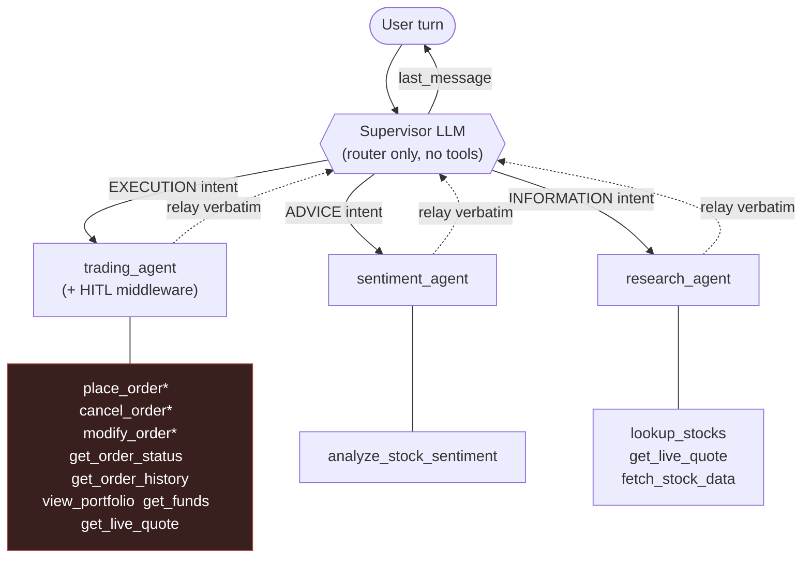
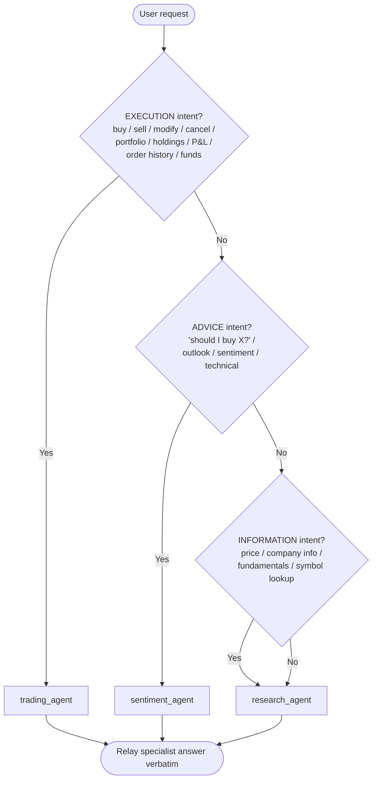
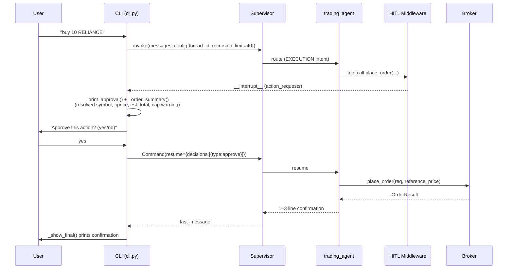
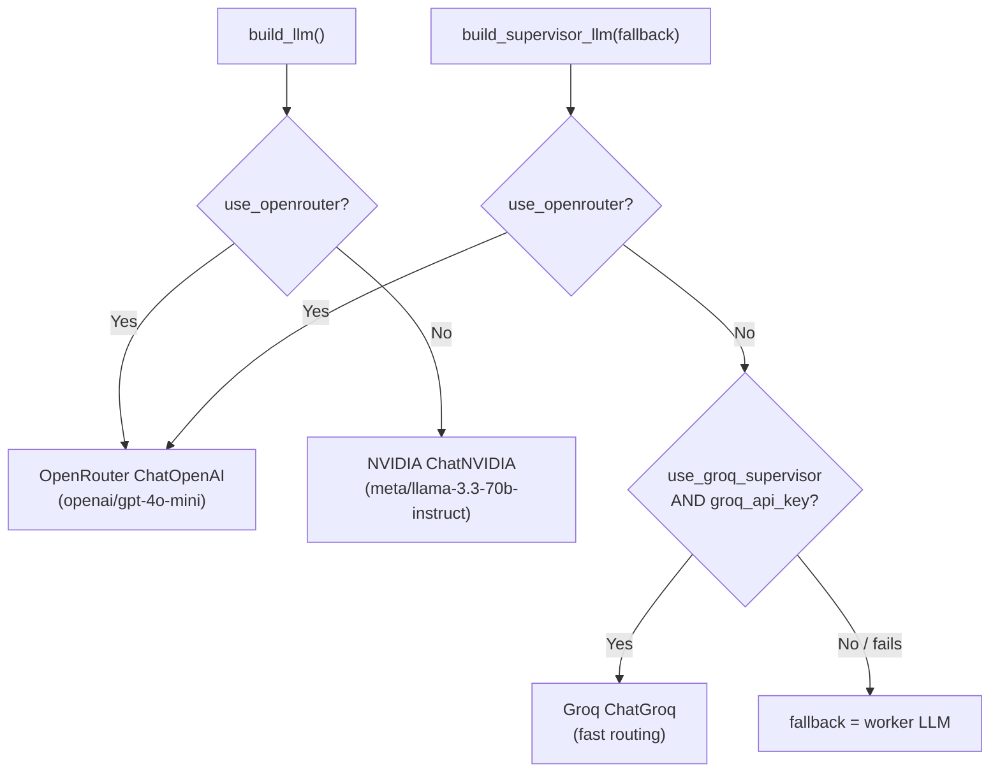
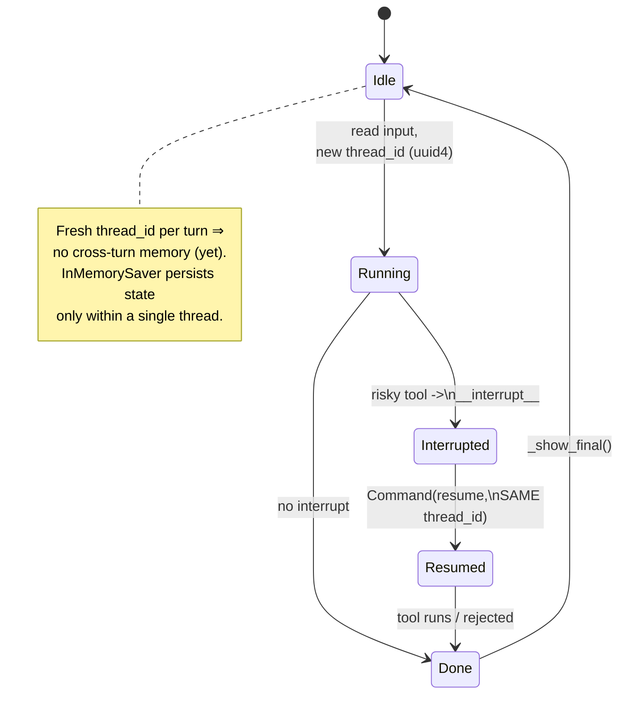

# Multi-Agent Orchestration

> 🔱 **Trinetra Capital AI** — *Multi-Agents. One Market. Zero Missed Moves.*

## Abstract

Trinetra Capital AI is organised as a **hierarchical multi-agent system** built on `langgraph-supervisor`. A single supervisor LLM reads each user request, classifies its *intent*, and routes it to exactly one of three specialist agents — `research_agent`, `sentiment_agent`, or `trading_agent` — then relays that specialist's answer to the user verbatim. The supervisor itself never calls tools; it is a pure router. This document describes the supervisor contract, the intent taxonomy and routing priority, the per-agent role and tool surface, the trading agent's self-sufficiency design, the Human-in-the-Loop (HITL) approval middleware and its interrupt/resume protocol, the multi-provider LLM strategy (NVIDIA NIM worker, Groq supervisor, optional OpenRouter override), the conversation state model (LangGraph `InMemorySaver` with a fresh `thread_id` per turn), and the resilience mechanisms (`recursion_limit=40` with graceful recovery). Every claim below is grounded in `trinetra/agents.py`, `trinetra/cli.py`, and `trinetra/tools.py`. Current limitations — most notably the absence of cross-turn memory — are called out honestly and cross-referenced to the roadmap.

## Table of Contents

1. [The Hierarchical Supervisor Pattern](#1-the-hierarchical-supervisor-pattern)
2. [The Supervisor Contract](#2-the-supervisor-contract)
3. [Intent Taxonomy and Routing Priority](#3-intent-taxonomy-and-routing-priority)
4. [The Three Specialists](#4-the-three-specialists)
5. [Trading Agent Self-Sufficiency](#5-trading-agent-self-sufficiency)
6. [Human-in-the-Loop Middleware](#6-human-in-the-loop-middleware)
7. [LLM Provider Strategy](#7-llm-provider-strategy)
8. [State, Memory, and the Thread Model](#8-state-memory-and-the-thread-model)
9. [Resilience and Graceful Recovery](#9-resilience-and-graceful-recovery)
10. [Prompt-Level Safety Discipline](#10-prompt-level-safety-discipline)
11. [Limitations and Forward References](#11-limitations-and-forward-references)

---

## 1. The Hierarchical Supervisor Pattern

The orchestration core lives in `trinetra/agents.py`. The system uses LangGraph's `create_supervisor` helper (from the `langgraph-supervisor` package) to compose a *supervisor graph* whose children are three independently-constructed specialist agents:

```python
supervisor = create_supervisor(
    agents=[research_agent, trading_agent, sentiment_agent],
    model=supervisor_llm,
    prompt="""You are a stock trading supervisor. ...""",
    output_mode="last_message",
    add_handoff_messages=False,
    add_handoff_back_messages=False,
)
return supervisor.compile(checkpointer=checkpointer or InMemorySaver())
```

A hierarchical supervisor is the right structural choice for this domain for three reasons:

- **Intent in trading is mutually exclusive at the turn level.** A user message is almost always *either* an instruction to execute ("buy 10 RELIANCE"), *or* a request for an opinion ("should I buy RELIANCE?"), *or* a request for a fact ("what's the price of RELIANCE?"). A flat single-agent design would have to carry every tool — research, sentiment, and the risky order tools — in one prompt, inflating the tool-selection search space and increasing the chance the model reaches for an order tool when only a quote was wanted. Splitting concerns lets each specialist hold a small, focused tool set and a tightly-scoped system prompt.
- **Safety isolation.** Only `trading_agent` owns the risky order tools, and only `trading_agent` is wrapped by the HITL middleware. The supervisor and the other two specialists are structurally incapable of placing an order. This containment is a deliberate safety property (see [§6](#6-human-in-the-loop-middleware)).
- **Independent LLM selection.** The supervisor and the workers can run on different models — a fast routing model for the supervisor and a stronger reasoning model for the workers — which is the single biggest latency lever in the system (see [§7](#7-llm-provider-strategy)).

The diagram below shows the static topology.



*Tools marked `*` (`place_order`, `cancel_order`, `modify_order`) are the members of `RISKY_TOOLS` and trigger the HITL interrupt.*

---

## 2. The Supervisor Contract

The supervisor is bound by an explicit prompt contract (verbatim from `agents.py`):

> "You are a stock trading supervisor. You never call tools yourself — you route each request to exactly ONE specialist and then relay their answer."

Four properties define the contract, each backed by a concrete construction parameter:

| Property | Mechanism | Source |
| --- | --- | --- |
| Routes to **exactly one** specialist | Prompt instruction ("route each request to exactly ONE specialist") | `agents.py` supervisor prompt |
| **Never calls tools** | The supervisor agent is created with no tools of its own; only the three child agents carry tools | `agents.py` |
| **Relays the answer verbatim** | Prompt: "relay their answer to the user as-is (especially any pre-formatted tables) without rewriting it" | `agents.py` supervisor prompt |
| Returns only the **specialist's final message** | `output_mode="last_message"` | `create_supervisor(...)` |
| **Suppresses handoff chatter** | `add_handoff_messages=False`, `add_handoff_back_messages=False` | `create_supervisor(...)` |

The `output_mode="last_message"` setting is significant: rather than returning the full internal transcript of the sub-graph, the supervisor surfaces only the last message. This keeps the user-facing output clean and prevents the model's intermediate routing/handoff turns from leaking into the chat. The two `add_handoff_*=False` flags suppress the synthetic "transferring to X" / "transferring back" messages that `langgraph-supervisor` injects by default, so the conversation transcript contains only the human turn and the specialist's answer.

The supervisor prompt closes with a strict no-editorialising rule:

> "After the specialist responds, relay their answer to the user as-is ... Never add your own planning, reasoning, or commentary — output only the final user-facing answer."

This matters because the specialists already produce carefully-formatted, deterministically-rendered output (e.g. portfolio tables from `render.render_portfolio()`). If the supervisor rewrote those tables it could re-introduce hallucinated numbers — exactly the failure mode the deterministic rendering layer exists to prevent (see [§10](#10-prompt-level-safety-discipline)).

---

## 3. Intent Taxonomy and Routing Priority

Routing is driven entirely by the supervisor prompt's three-tier intent taxonomy, applied **in priority order**:

1. **EXECUTION intent** → `trading_agent`. Triggers: buy, sell, place/modify/cancel an order, view portfolio/holdings/P&L, order history, funds/buying power. The prompt adds a critical instruction: *"It fetches the live price itself, so do NOT route a buy/sell to research first. A buy/sell is complete only once trading_agent has placed (or attempted) the order — never stop after merely quoting a price."*
2. **ADVICE intent** → `sentiment_agent`. Triggers: "should I buy X?", "what's your view/outlook on X?", sentiment or technical analysis.
3. **INFORMATION intent** → `research_agent`. Triggers: "what's the price of X?", company info, fundamentals, market cap, symbol lookup.

The ordering resolves natural overlaps. "Buy 10 shares of X" and "what's the price of X?" both mention a price, but the first is execution and must reach `trading_agent`; the priority list makes execution dominate. Likewise, "should I buy X?" is *advice* (it wants a signal and reasoning, not an order), so it goes to `sentiment_agent` even though the verb "buy" appears — the ADVICE tier is checked before any literal keyword match would mis-route it to execution.



A defining design decision is that the supervisor treats *"should I buy?"* (advice) and *"buy"* (execution) as different intents that reach different agents — the system never silently converts an opinion request into a live order, and it never stops an execution request after merely producing a quote.

---

## 4. The Three Specialists

All three specialists are built with LangChain's `create_agent`, each receiving the worker LLM (`build_llm()`), a focused tool list, a `name`, and a domain system prompt.

### 4.1 research_agent — INFORMATION

| Attribute | Value |
| --- | --- |
| Tools (`RESEARCH_TOOLS`) | `lookup_stocks`, `get_live_quote`, `fetch_stock_data` |
| Prompt intent | Stock research for NSE/BSE via Groww |
| Output discipline | "You MUST call your tools to answer — never invent prices or symbols." |

The `RESEARCH_PROMPT` instructs the agent to resolve a company name to a precise trading symbol with `lookup_stocks` first, use `get_live_quote` for the real-time price and day stats, and `fetch_stock_data` for a fuller fundamentals-plus-price snapshot. It closes: *"Report the numbers the tools return; do not estimate."* Each of these tools (in `tools.py`) returns a JSON string, giving the model structured, unambiguous results to summarise.

### 4.2 sentiment_agent — ADVICE

| Attribute | Value |
| --- | --- |
| Tools (`SENTIMENT_TOOLS`) | `analyze_stock_sentiment` |
| Prompt intent | Market sentiment + technical analysis |
| Output discipline | Fixed presentation template (signal, price, RSI/MACD, sentiment, composite score, stop-loss/targets) |

The `SENTIMENT_PROMPT` mandates *"ALWAYS call `analyze_stock_sentiment` for the ticker in question"* and then prescribes an exact output format:

```
📊 SYMBOL - SIGNAL (confidence)
Price: X | RSI: X (signal) | MACD: crossover
Sentiment: label (score, N headlines)
Composite Score: X/100
Stop-loss: X | Target 1: X | Target 2: X
Summary: 2-sentence synthesis.
```

The single underlying tool, `analyze_stock_sentiment`, wraps `market_data.technical_snapshot()` — RSI-14, MACD histogram, Bollinger %B, ATR-14, headline-polarity scoring, a clamped composite score, and an ATR-derived stop-loss/target ladder. (The numerics are documented in the [System Architecture](02-system-architecture.md) and broker/market-data documents.)

### 4.3 trading_agent — EXECUTION

| Attribute | Value |
| --- | --- |
| Tools (`TRADING_TOOLS` + `get_live_quote`) | `place_order`, `cancel_order`, `modify_order`, `get_order_status`, `get_order_history`, `view_portfolio`, `get_funds`, **plus its own `get_live_quote`** |
| Middleware | `HumanInTheLoopMiddleware(interrupt_on={place_order, cancel_order, modify_order})` |
| Prompt | Mode-aware (`_trading_prompt()`); announces PAPER vs LIVE |

The trading agent is the only specialist that mutates state, so its prompt is the most heavily constrained (see [§10](#10-prompt-level-safety-discipline)) and the only one wrapped in approval middleware (see [§6](#6-human-in-the-loop-middleware)). Its prompt is generated dynamically by `_trading_prompt()` so that the very first line states the current mode and a corresponding money warning:

```python
money = (
    "These are REAL orders on the user's live Groww account — real money."
    if settings.is_live
    else "Orders are SIMULATED (paper trading) and logged locally — no real money."
)
```

This means the LLM's own context is honest about whether it is dealing with real money, reinforcing the mode signalling the CLI banner gives the human.

---

## 5. Trading Agent Self-Sufficiency

A subtle but important architectural choice is that `trading_agent` is given **its own copy of `get_live_quote`**, in addition to the seven `TRADING_TOOLS`:

```python
trading_agent = create_agent(
    model=llm, tools=TRADING_TOOLS + [get_live_quote], name="trading_agent",
    system_prompt=_trading_prompt(),
    middleware=[HumanInTheLoopMiddleware(interrupt_on=interrupt_on)],
)
```

The comment in `agents.py` states the rationale directly: *"Give the trading agent its own quote tool so it is self-sufficient for market and budget-based orders (no fragile hop through the research agent)."*

Two execution paths require a live price inside the trading agent:

- **Market orders.** The trading prompt tells the agent to call `place_order` directly with symbol/action/quantity; the `place_order` tool itself fetches a reference LTP internally for the cap check and paper fill. But the agent may still want to confirm a price for the user.
- **Budget orders** (e.g. "buy ₹10,000 of X"). The prompt instructs: *"call `get_live_quote`, compute `floor(budget / price)`, then place that many shares."* Without a local quote tool this would require the supervisor to bounce the turn to `research_agent` and back — an extra hop that adds latency and risks the supervisor stalling after the quote without ever completing the order.

By giving the trading agent direct quote access, a budget order becomes a single self-contained agent run, and the supervisor's instruction — *"never stop after merely quoting a price"* — can be honoured without inter-agent choreography.

---

## 6. Human-in-the-Loop Middleware

Every state-mutating action passes through an explicit human approval gate. This is implemented with LangChain's `HumanInTheLoopMiddleware`, configured to interrupt on exactly the three risky tools:

```python
interrupt_on = {t: True for t in RISKY_TOOLS}
# RISKY_TOOLS = {"place_order", "cancel_order", "modify_order"}  (tools.py)
...
middleware=[HumanInTheLoopMiddleware(interrupt_on=interrupt_on)]
```

When the trading agent decides to call one of these tools, the middleware *pauses* the graph before the tool executes and emits an `__interrupt__` payload instead of running the tool. The CLI loop in `cli.py` drives the interrupt/resume protocol:

1. After `_invoke()`, the CLI reads `result.get("__interrupt__", [])`.
2. `_print_approval()` iterates each interrupt's `action_requests`. For `place_order`, it builds an `_order_summary()` line containing the **resolved** symbol (via `instruments.resolve()`, surfacing e.g. `INFOSYS → INFY`), the expected execution price (limit/trigger price for those order types, otherwise an `≈ market` LTP via `market_data.try_ltp()`), the estimated total, and a warning if that total exceeds `settings.max_order_value`. In LIVE mode it additionally prints `>>> THIS IS A REAL ORDER ON YOUR LIVE GROWW ACCOUNT <<<`.
3. The user is asked `Approve this action? (yes/no)`.
4. The decision is fed back into the **same** graph via `Command(resume={"decisions": [decision]})`, where `decision` is `{"type": "approve"}` or `{"type": "reject"}`.



If the user rejects, the resume carries `{"type": "reject"}` and the order never reaches the broker. Crucially, the approval gate is layered *on top of* the broker's own `guard_order()` cap enforcement — the HITL summary even pre-warns when an order would exceed the cap, but the cap is independently re-enforced in the broker for both paper and live modes (see the [Execution & Broker Layer](04-execution-and-broker-layer.md) document). The CLI also runs an independent LIVE confirmation gate at session start (`_confirm_live()` requires the user to type exactly `I UNDERSTAND`).

---

## 7. LLM Provider Strategy

Trinetra's LLM layer is **pluggable and provider-configurable**, with three construction functions in `agents.py`:

| Function | Role | Default provider | Default model |
| --- | --- | --- | --- |
| `build_llm()` | Worker / specialist LLM | NVIDIA NIM (`ChatNVIDIA`) | `agent_model` = `meta/llama-3.3-70b-instruct` |
| `build_supervisor_llm(fallback)` | Supervisor / router LLM | Groq (`ChatGroq`) | `supervisor_model` = `meta/llama-3.3-70b-instruct` |
| `build_openrouter_llm()` | Optional override for **both** | OpenRouter (`ChatOpenAI`-compatible) | `openrouter_model` = `openai/gpt-4o-mini` |

> **Note on model naming:** the code defaults *both* `agent_model` and `supervisor_model` to `meta/llama-3.3-70b-instruct` (see `trinetra/config.py`). The project README's technology table references an NVIDIA `nemotron-3-super-120b` model; that is aspirational and is *not* the code default. This document follows the code: the LLM layer is provider-configurable via environment variables (`TRINETRA_AGENT_MODEL`, `TRINETRA_SUPERVISOR_MODEL`, `OPENROUTER_MODEL`), and the defaults are as tabulated above.

**Why a separate supervisor model.** The supervisor runs on *every* turn and does nothing but classify intent and route. Reasoning quality matters far less for that than raw latency. `build_supervisor_llm()` therefore prefers Groq, whose LPU-backed inference is optimised for fast tool-calling, and the docstring names this explicitly: *"The supervisor only routes, so prefer a fast tool-calling model (Groq). This is the single biggest latency lever — routing happens on every query."* The workers, which do the heavier research/analysis reasoning, run on the NVIDIA NIM worker model.

**Graceful fallback.** If Groq is not configured (`use_groq_supervisor` is false or `groq_api_key` is missing) or fails to import/initialise, `build_supervisor_llm()` logs a warning and returns the `fallback` — the worker LLM — so the supervisor still functions:

```python
if settings.use_groq_supervisor and settings.groq_api_key:
    try:
        from langchain_groq import ChatGroq
        return ChatGroq(model=settings.supervisor_model, ...)
    except Exception as exc:
        log.warning("Groq supervisor unavailable (%s); using the worker LLM.", exc)
return fallback
```

**OpenRouter override.** When `OPENROUTER_API_KEY` is set and `TRINETRA_USE_OPENROUTER` is true (the default), `settings.use_openrouter` is true and *both* `build_llm()` and `build_supervisor_llm()` short-circuit to `build_openrouter_llm()`, an OpenAI-compatible `ChatOpenAI` client pointed at the OpenRouter base URL. This single switch lets the operator run the entire system on one OpenRouter-hosted model without changing code. The override is clearly demarcated in the source with `# === OPENROUTER PATCH ... === / # === END OPENROUTER PATCH ===` comment fences, so it can be reverted by deleting the fenced lines. All three constructors use `temperature=0` for deterministic, reproducible routing and tool selection.



The NVIDIA worker path raises a clear `RuntimeError` if `NVIDIA_API_KEY` is unset, so a misconfiguration surfaces as an actionable startup error rather than a silent failure.

---

## 8. State, Memory, and the Thread Model

Conversation state is managed by a LangGraph **checkpointer**. `build_supervisor()` compiles the graph with `InMemorySaver` by default:

```python
return supervisor.compile(checkpointer=checkpointer or InMemorySaver())
```

The checkpointer persists the graph's message state *within a thread*, keyed by `thread_id`. This in-thread persistence is exactly what makes the HITL interrupt/resume protocol work: when the graph pauses on an approval, the paused state is checkpointed under the current `thread_id`, and the subsequent `Command(resume=...)` invocation reuses the same `config` (hence same `thread_id`) to continue from precisely where it stopped.

However, the CLI assigns a **new** `thread_id` on every turn:

```python
config = {
    "configurable": {"thread_id": str(uuid.uuid4())},
    "recursion_limit": RECURSION_LIMIT,
}
```

**Honest implication: there is no long-term cross-turn memory yet.** Because each user turn gets a fresh `uuid4` thread, the graph cannot see prior turns' messages. The approve-then-resume cycle works because both calls in a single turn share the same `config` object — but once the loop reads the next input and builds a new `config`, the previous turn's context is gone. Within a turn the agents are fully stateful; across turns they are stateless.

This is a deliberate, conservative choice (it guarantees a clean slate per request and avoids stale context bleeding into a money-handling agent) but it is a genuine limitation. The specialists' prompts compensate by forbidding reliance on conversation history — e.g. `view_portfolio`'s tool docstring says *"do not rely on conversation history,"* and the trading prompt requires `view_portfolio` to be called fresh for any portfolio/P&L question. Persistent, durable memory is on the roadmap as **PostgreSQL-backed `PostgresSaver`**, which would replace `InMemorySaver` and let a stable per-user `thread_id` carry context across turns and process restarts. See [System Architecture](02-system-architecture.md) for the roadmap context.



---

## 9. Resilience and Graceful Recovery

A hierarchical graph can, in rare cases, route back to a worker one extra time before terminating — generating additional text turns even though the actual tool already ran exactly once (and was HITL-gated). To keep this from crashing a turn, the CLI sets a generous step budget and recovers gracefully when it is hit:

```python
RECURSION_LIMIT = 40
...
def _invoke(supervisor, payload, config):
    try:
        return supervisor.invoke(payload, config=config)
    except GraphRecursionError:
        log.warning("Supervisor hit the step limit; recovering the latest result.")
        snapshot = supervisor.get_state(config)
        return {"messages": snapshot.values.get("messages", []), "__interrupt__": []}
```

Rather than surfacing a `GraphRecursionError` to the user, `_invoke()` catches it, reads the latest checkpointed state with `supervisor.get_state(config)`, and returns those messages. Because the order/tool already executed exactly once and is interrupt-gated, the extra hops are purely textual, so recovering the latest message is safe — the user still gets the specialist's answer. The comment in `cli.py` captures the reasoning: *"Those extra hops generate text only ... so on a recursion limit we simply read the latest state and return it rather than failing the turn."*

Output rendering is similarly defensive. `_show_final()` walks the messages in reverse and prints the **last message that actually has text content**, because the supervisor sometimes hands back an empty final message (the specialist already produced the answer). If nothing has text, it falls back to `messages[-1].pretty_print()` so the user is never left with a blank reply. The outer turn loop also wraps each invocation in a `try/except` that prints `❌ Error: ...` and continues, so one bad turn never terminates the session.

---

## 10. Prompt-Level Safety Discipline

Because the LLMs ultimately compose the user-facing text, several safety properties are enforced at the prompt level — and reinforced by the deterministic Python rendering layer so the model is never the source of a number.

**Never invent numbers.** The trading prompt is emphatic:

> "NEVER invent numbers. Every price, quantity, holding, P&L or funds figure you show MUST come from a tool result in this turn. If you don't have it, call the tool or say you don't have it — do not guess."

The research prompt echoes this (*"never invent prices or symbols ... do not estimate"*), and every tool returns a structured JSON string so the model has unambiguous values to quote.

**Relay pre-rendered display tables verbatim.** `view_portfolio` and `get_order_history` attach a `"display"` field built by `render.render_portfolio()` / `render.render_orders()` — deterministic Python formatting, not LLM text. The trading prompt instructs:

> "view_portfolio and get_order_history return a 'display' field with a ready-made markdown table. Output that 'display' value EXACTLY AS-IS. Do NOT rebuild it."

The supervisor's relay-verbatim rule then ensures this clean table reaches the user unmodified. This two-layer arrangement — deterministic rendering plus a verbatim-relay chain — is what guarantees portfolio and order tables can never contain a hallucinated figure.

**Terse, non-leaky confirmations.** After a `place_order` / `cancel_order` / `modify_order`, the prompt restricts the model to *"ONLY a 1–3 line confirmation built from that tool's returned fields"* — no extra portfolio dump, no fabricated UI hints like `type 'portfolio'`, no planning or meta-commentary. This keeps post-trade output minimal and grounded.

---

## 11. Limitations and Forward References

In the spirit of an honest research artefact, the current orchestration layer has these known limitations:

- **No cross-turn memory.** A fresh `uuid4` `thread_id` per turn ([§8](#8-state-memory-and-the-thread-model)) means the agents cannot remember prior turns. Planned remedy: `PostgresSaver` persistent memory with stable per-user threads.
- **Single-message relay.** `output_mode="last_message"` returns only the final message; nuanced multi-step explanations from a specialist are condensed to their last turn by design.
- **Occasional over-routing.** The supervisor can over-loop, which is why `recursion_limit=40` and the `_invoke()` recovery exist ([§9](#9-resilience-and-graceful-recovery)). The recovery is safe but is a mitigation rather than a root-cause fix.
- **Paper-mode order constraints.** Stop-loss (`sl`/`sl_m`) orders are LIVE-only — the trading prompt and `place_order` docstring both flag this, because the paper broker cannot monitor a live trigger. Scope is the equity **CASH** segment (NSE/BSE) in v1; F&O and commodities are roadmap items.
- **Best-effort sentiment.** `analyze_stock_sentiment` depends on headline scraping and yfinance history; it degrades gracefully but is not a guaranteed real-time feed.

For the layers beneath this one, see [System Architecture](02-system-architecture.md) (the overall component map and configuration model) and the [Execution & Broker Layer](04-execution-and-broker-layer.md) (the broker abstraction, the `guard_order()` cap, paper vs. Groww execution, and order normalisation).

---

[← System Architecture](02-system-architecture.md)  |  [↑ Documentation Index](README.md)  |  [Execution & Broker Layer →](04-execution-and-broker-layer.md)
