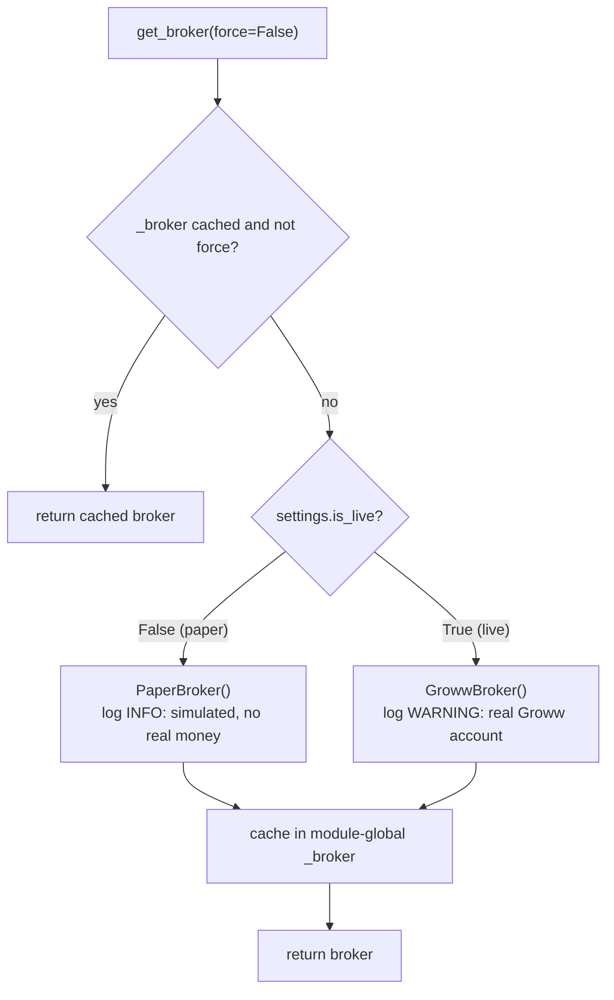
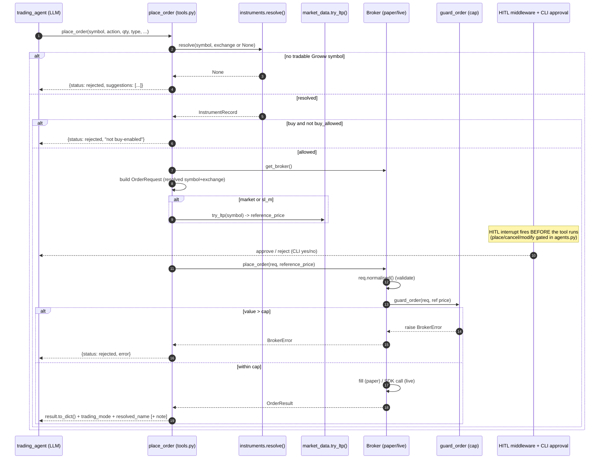
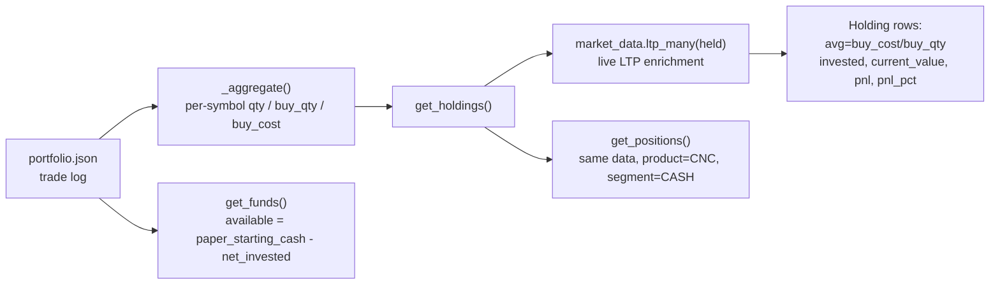
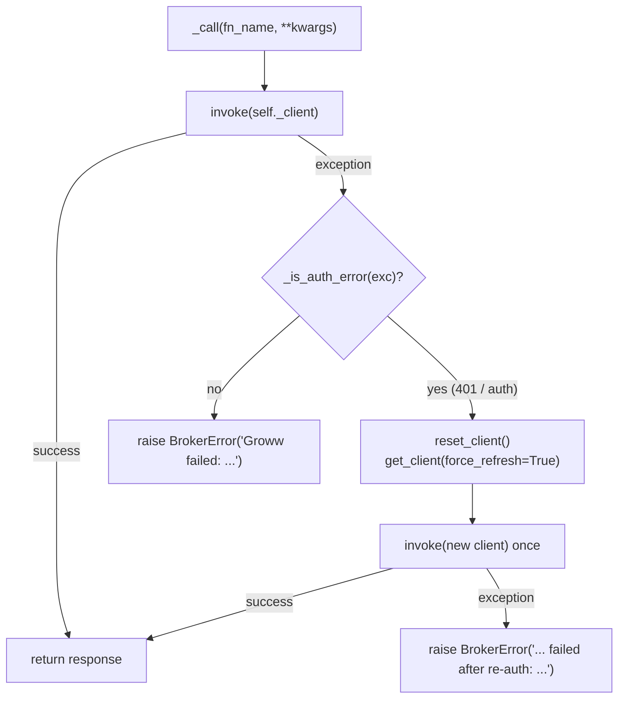
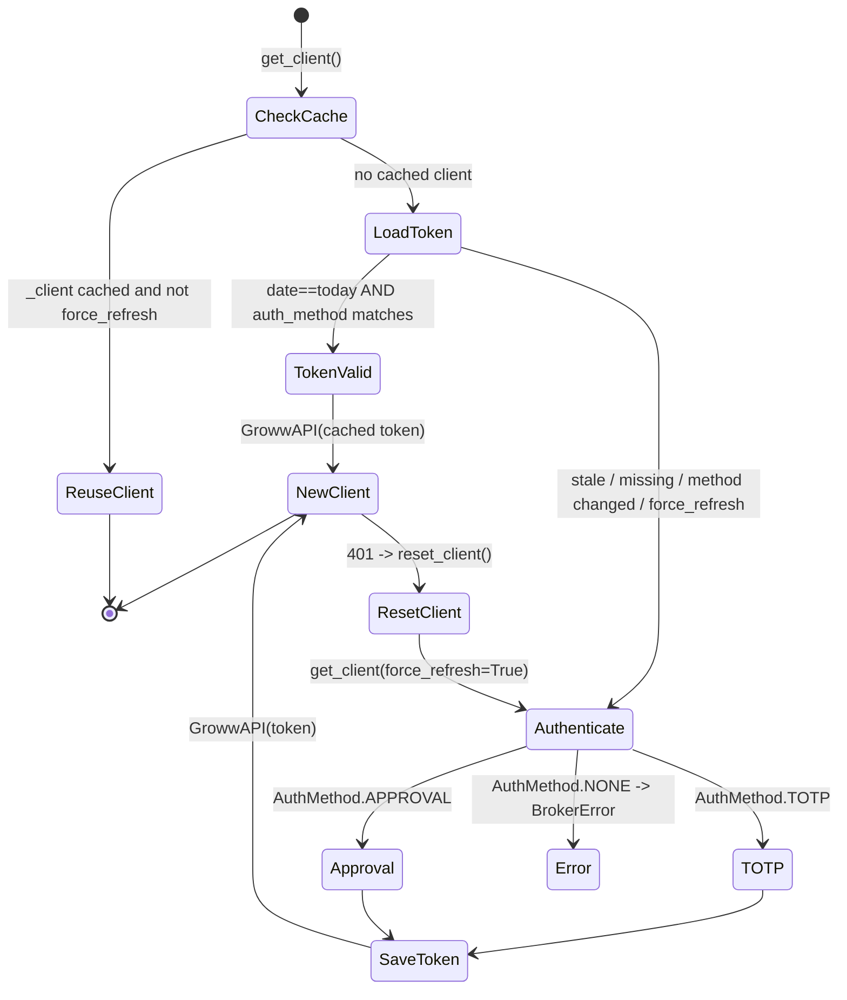

# Execution and Broker Layer

> Part of the **Trinetra Capital AI** 🔱 technical documentation set.

This document specifies the execution and broker layer of Trinetra Capital AI — the subsystem that turns a validated trading intent into a concrete order against either a simulated book or the real Groww Trading API. It describes the polymorphic `Broker` abstraction and its `get_broker()` factory, the normalised domain vocabulary and dataclasses (`OrderRequest`, `OrderResult`, `Holding`, `Position`, `Funds`), the complete order lifecycle from the `place_order` tool down to a normalised result, the `PaperBroker` simulation mechanics, the `GrowwBroker` SDK adapter, and the `GrowwClient` session/token management. Every claim here is grounded in the tracked source under `trinetra/broker/` and `trinetra/tools.py`. The scope of v1 is the **equity cash segment (`CASH`) on NSE/BSE**; derivatives, commodities and other segments are out of scope.

## Table of contents

1. [Design goals](#1-design-goals)
2. [The Broker abstraction and factory](#2-the-broker-abstraction-and-factory)
3. [Normalised domain vocabulary and data types](#3-normalised-domain-vocabulary-and-data-types)
4. [The complete order lifecycle](#4-the-complete-order-lifecycle)
5. [PaperBroker mechanics](#5-paperbroker-mechanics)
6. [GrowwBroker mechanics](#6-growwbroker-mechanics)
7. [GrowwClient session and token management](#7-growwclient-session-and-token-management)
8. [Paper vs live behaviour comparison](#8-paper-vs-live-behaviour-comparison)
9. [Current limitations](#9-current-limitations)

---

## 1. Design goals

The broker layer is built around a single principle: **the agents and tools must never know which broker is active.** Both `PaperBroker` and `GrowwBroker` speak one normalised vocabulary (defined in `trinetra/broker/base.py`), so the LangChain tools in `trinetra/tools.py` issue identical calls regardless of whether the user is paper-trading or trading real money. This isolation has three consequences that matter for a safety-first system:

- **A single safety cap path.** The per-order rupee ceiling is enforced in one place — `Broker.guard_order` — for *both* paper and live orders, so the simulation and the real account share the exact same guard.
- **Swappability.** Adding a future broker (a different Indian broker, or a backtest engine) means implementing the abstract `Broker` interface and extending `get_broker()`; nothing in the agent or tool layer changes.
- **Honest simulation.** `PaperBroker` deliberately refuses to simulate behaviour it cannot faithfully reproduce (notably stop-loss triggers), rather than fabricate fills that would mislead the user before they go live.

---

## 2. The Broker abstraction and factory

### 2.1 The abstract `Broker`

`trinetra/broker/base.py` defines the abstract base class `Broker(ABC)`. It carries two class attributes — `name` and `mode` (`"paper"` by default) — a concrete `guard_order()` method, and seven abstract methods that every implementation must provide:

| Method | Purpose |
| --- | --- |
| `place_order(req, reference_price=None)` | Submit an `OrderRequest`, return an `OrderResult`. |
| `cancel_order(order_id, segment="CASH")` | Cancel a pending order. |
| `modify_order(order_id, quantity, price, trigger_price, order_type, segment)` | Modify a pending order. |
| `get_order_status(order_id, segment="CASH")` | Look up one order's status. |
| `get_order_history(limit=20, segment="CASH")` | Return the recent order book (most-recent first). |
| `get_holdings()` | Return a list of `Holding`. |
| `get_positions(segment=None)` | Return a list of `Position`. |
| `get_funds()` | Return a `Funds` snapshot. |

The only concrete method on the base class is the safety guard:

```python
def guard_order(self, req: OrderRequest, reference_price: float | None = None) -> None:
    value = req.estimated_value(reference_price)
    cap = settings.max_order_value
    if value and value > cap:
        raise BrokerError(
            f"Order value ₹{value:,.2f} exceeds the safety cap of ₹{cap:,.2f} "
            f"(GROWW_MAX_ORDER_VALUE). Reduce quantity or raise the cap."
        )
```

`guard_order` is a **hard ceiling enforced before anything irreversible happens**, and crucially it is invoked by *both* broker implementations inside their own `place_order`. The default cap is `100000.0` INR (`settings.max_order_value`, overridable via `GROWW_MAX_ORDER_VALUE`). Note that the guard only rejects when `value` is truthy and exceeds the cap — if no reference price is available and the order has no explicit limit price, `estimated_value` returns `0.0` and the guard does not fire on that basis; the paper broker independently rejects priceless market orders (see §5).

All recoverable broker problems — validation failures, API errors, missing credentials — are raised as `BrokerError` (defined in `base.py`), giving the tool layer a single exception type to catch and convert into a JSON `"rejected"`/`"error"` payload.

### 2.2 The `get_broker()` factory

`trinetra/broker/__init__.py` exposes a singleton factory:



The factory consults `settings.is_live` (derived from `GROWW_TRADING_MODE`). In paper mode it constructs a `PaperBroker` and logs an INFO line; in live mode it constructs a `GrowwBroker` and logs a WARNING (`"LIVE trading mode active — orders will hit the real Groww account."`). The chosen instance is cached in the module-global `_broker` so the whole process shares one broker; passing `force=True` rebuilds it. The imports of the concrete classes are deferred inside the branches, so importing the package never drags in the Groww SDK unless live mode is actually selected.

---

## 3. Normalised domain vocabulary and data types

`base.py` is the single source of truth for the vocabulary every layer speaks. The `GrowwBroker` maps these onto the SDK's own constants; the `PaperBroker` stores them as-is.

### 3.1 Constants

| Category | Values |
| --- | --- |
| Transaction type | `BUY`, `SELL` |
| Order type | `MARKET`, `LIMIT`, `SL` (stop-loss limit), `SL_M` (stop-loss market); collected in `ORDER_TYPES` |
| Product | `PRODUCT_CNC` = `"CNC"` (delivery), `PRODUCT_MIS` = `"MIS"` (intraday) |
| Segment | `SEGMENT_CASH` = `"CASH"` |
| Validity | `VALIDITY_DAY` = `"DAY"` |

### 3.2 Reference id

`new_reference_id()` returns `"trn-" + uuid.uuid4().hex[:12]` — an alphanumeric id with a hyphen, kept under Groww's 20-character limit. Every `OrderRequest` gets one by default via `field(default_factory=new_reference_id)`, and it is threaded through to the live order as `order_reference_id` and into the paper order id as `PAPER-<reference_id>`.

### 3.3 `OrderRequest` and its validation contract

`OrderRequest` is the canonical inbound order. Its two methods encode the layer's validation and risk arithmetic.

**`normalised()`** returns a validated *copy* (it never mutates in place) and raises `BrokerError` on any bad input. Its rules, in order:

1. The symbol is run through `trinetra.symbols.normalize(self.trading_symbol, self.exchange)` (imported locally to avoid an import cycle), so `"RELIANCE.NS"` → `RELIANCE`@NSE and `"TCS.BO"` → `TCS`@BSE. The normalised instrument's `trading_symbol` and `exchange` replace the raw inputs.
2. `transaction_type` is upper-cased and must be `BUY` or `SELL`.
3. `order_type` is upper-cased, with the SDK-style aliases `STOP_LOSS_MARKET` → `SL_M` and `STOP_LOSS` → `SL` accepted, and must be one of `MARKET`/`LIMIT`/`SL`/`SL_M`.
4. `product` is upper-cased and must be `CNC` or `MIS`.
5. `quantity` is coerced to `int` and must be strictly positive.
6. `LIMIT` and `SL` orders require a positive `price`.
7. `SL` and `SL_M` (stop-loss) orders require a positive `trigger_price`.

**`estimated_value(reference_price=None)`** computes the best-effort notional used by `guard_order`:
- For `LIMIT`/`SL` orders with a price set, it uses the limit `price`.
- For `SL_M`, it uses the `trigger_price`.
- Otherwise (notably `MARKET`) it uses the supplied `reference_price`, or `0.0` if none is available.

The result is `round(quantity * price, 2)`.

### 3.4 Result and portfolio dataclasses

| Dataclass | Key fields | Notes |
| --- | --- | --- |
| `OrderResult` | `status` (`placed`/`filled`/`rejected`/`failed`), `transaction_type`, `trading_symbol`, `quantity`, `order_type`, `product`, `mode`, plus optional `order_id`, `price`, `trigger_price`, `average_price`, `estimated_value`, `reference_id`, `exchange`, `message`, `raw` | `to_dict()` drops the `raw` SDK payload and omits `None` fields, keeping the agent-facing JSON clean. |
| `Holding` | `trading_symbol`, `quantity`, `average_price`, optional `last_price`, `invested`, `current_value`, `pnl`, `pnl_pct` | `to_dict()` omits `None` fields. |
| `Position` | `trading_symbol`, `quantity`, `product`, `segment`, optional `average_price`, `last_price`, `realised_pnl`, `unrealised_pnl` | `to_dict()` omits `None` fields. |
| `Funds` | `available_cash`, `margin_used`, optional `net`, `mode`, `detail` | `to_dict()` rounds money to 2 dp and conditionally includes `net`/`detail`. |

These normalised types are what the tools serialise to JSON, so the agents see identical shapes from both brokers.

---

## 4. The complete order lifecycle

A buy/sell request travels from the LLM-invoked `place_order` tool through symbol resolution, request construction, the safety cap, human approval, the broker, and back as a normalised result. The sequence below traces it end to end.



### 4.1 Step-by-step (per `tools.py::place_order`)

1. **Symbol resolution first.** Before anything else, the tool calls `instruments.resolve(symbol, exchange or None)`. This is a deliberate safety gate: a wrong LLM guess (e.g. `"INFOSYS"`) can never reach the broker because resolution maps it to the authoritative Groww symbol (`INFY`). If resolution returns `None`, the tool returns `{"status": "rejected", ...}` with up to three `instruments.search(...)` suggestions.
2. **Buy-permission check.** If the action is `buy` and the resolved `InstrumentRecord.buy_allowed` is false, the tool rejects with `"<SYM> is not buy-enabled on Groww."`.
3. **Broker selection.** `get_broker()` returns the active broker (paper or live).
4. **Request construction.** An `OrderRequest` is built from the *resolved* `trading_symbol`/`exchange`, the action, quantity, order type, optional price/trigger, and the product (falling back to `settings.default_product`, default `CNC`).
5. **Reference price.** For `market` or `sl_m` order types, the tool fetches a live LTP via `market_data.try_ltp(...)`. This price feeds both the safety-cap arithmetic and the paper fill.
6. **Human-in-the-loop.** `place_order`, `cancel_order` and `modify_order` are listed in `RISKY_TOOLS`. The `trading_agent` wraps a `HumanInTheLoopMiddleware` that interrupts on each of these tools, so in practice approval is requested *before* the broker is touched (see the orchestration document, `03-multi-agent-system.md`, and the CLI document for the `I UNDERSTAND` live gate and the per-order approval prompt).
7. **Broker execution.** `broker.place_order(req, reference_price=...)` first calls `req.normalised()`, then `guard_order(...)`, then performs the fill (paper) or SDK submission (live).
8. **Normalised result.** The returned `OrderResult` is converted with `to_dict()`, then annotated with `trading_mode` (`settings.trading_mode.value`), `resolved_name`, and — when the resolved symbol differs from the user's input — a human-readable `note` (e.g. `"Resolved 'INFOSYS' → INFY (...)."`). Any `BrokerError` becomes `{"status": "rejected", "error": ...}`; any other exception is logged and returned as `{"status": "failed", "error": ...}`.

---

## 5. PaperBroker mechanics

`trinetra/broker/paper_broker.py` is the default broker, so users can exercise the full agent system safely before flipping `GROWW_TRADING_MODE=live`.

### 5.1 Trade-log persistence

`PaperBroker` persists a **flat trade log** to `portfolio.json` (`settings.portfolio_file`), backward-compatible with the original prototype format. `_load()` reads the JSON list defensively — a missing file yields `[]`, and a corrupt/unreadable file logs a warning and yields `[]`. `_save()` writes the list back with `indent=2`. Each appended trade record carries: `timestamp` (ISO), `symbol`, `exchange`, `action` (lower-cased `buy`/`sell`), `product`, `currency` (`"INR"`), `shares`, `price`, `total`, `order_id`, `reference_id`, and `mode` (`"paper"`).

### 5.2 Order placement and the SL rejection rationale

`place_order` first calls `req.normalised()`. It then **rejects `SL`/`SL_M` orders outright**:

> Stop-loss orders aren't simulated in paper mode (there is no live trigger monitoring). Switch to live mode, or use a market/limit order.

This is an intentional honesty constraint: paper mode has no streaming feed to watch a stop trigger, so rather than fake a fill it refuses. For an accepted order, the fill price is the limit price for a `LIMIT` order, otherwise the supplied `reference_price`. If neither is available (a priceless market order), it raises a `BrokerError` instructing the agent to fetch a live quote or use an explicit limit price. Only then does it call `self.guard_order(req, fill_price)` — so the **same per-order cap applies in paper mode**. On success it appends the trade record, logs the fill, and returns an `OrderResult` with `status="filled"`, `order_id="PAPER-<reference_id>"`, and `average_price` equal to the fill price.

`cancel_order` and `modify_order` are no-ops by design: paper orders fill instantly, so they return `not_cancellable` / `not_modifiable` status payloads. `get_order_status` scans the log for the `order_id` and reports `filled` (or `unknown`). `get_order_history` returns the log reversed (most-recent first), truncated to `limit`.

### 5.3 Derived holdings, positions and funds

`PaperBroker` holds no separate position book; everything is *derived* by aggregating the trade log.



- **`_aggregate()`** walks every trade, normalises the symbol, and accumulates `qty` (buys add, sells subtract), `buy_qty`, and `buy_cost`. The average price is `buy_cost / buy_qty`.
- **`get_holdings()`** keeps only symbols with positive net `qty`, batch-fetches live prices via `market_data.ltp_many(held)`, and computes `invested = qty * avg`, `current_value = qty * last`, `pnl`, and `pnl_pct`. When a live price is unavailable, the value/P&L fields are left `None` (and the renderer notes the unpriced symbol).
- **`get_positions()`** reuses the holdings, presenting each as a `CNC`/`CASH` position with `unrealised_pnl` mirroring the holding P&L — there is no separate intraday position book.
- **`get_funds()`** computes `net_invested` as buys minus sells across the log, then `available_cash = settings.paper_starting_cash - net_invested` (default starting cash `1_000_000.0`, overridable via `TRINETRA_PAPER_CASH`). `margin_used` reports `net_invested`; `net` reports the starting cash; `detail` carries `starting_cash`.

This means paper P&L tracks the *real* market through live LTP enrichment, even though the cash and fills are virtual.

---

## 6. GrowwBroker mechanics

`trinetra/broker/groww_broker.py` is the live broker, backed by the Groww Trading API for the equity cash segment (v1). It is constructed eagerly with `groww_client.get_client()` so that missing credentials fail fast and loudly *before* any real trade.

### 6.1 The single 401 re-auth wrapper

Every SDK call goes through `_call(fn_name, **kwargs)`:



`_is_auth_error` inspects the exception type name (`Authentication`/`Authorisation`) and the message for `401`. On an auth error it performs exactly **one** transparent re-authentication retry: it resets the client, forces a fresh token, and re-invokes. A second failure — or any non-auth exception — is wrapped as a `BrokerError`. This keeps unattended sessions resilient to the daily token expiry without masking genuine failures.

### 6.2 Defensive SDK constant mapping

`_const(prefix, value)` resolves a Groww SDK constant defensively: it returns `getattr(self._client, f"{prefix}_{value}", value)`, falling back to the literal string if the SDK names the constant differently. This is applied to `VALIDITY_*`, `EXCHANGE_*`, `SEGMENT_*`, `PRODUCT_*`, `ORDER_TYPE_*` and `TRANSACTION_TYPE_*` so the adapter survives SDK constant renames. The normalised order types are additionally mapped onto Groww's names via an explicit dict: `MARKET`→`MARKET`, `LIMIT`→`LIMIT`, `SL`→`STOP_LOSS`, `SL_M`→`STOP_LOSS_MARKET`.

### 6.3 Order operations

- **`place_order`** normalises the request, enforces `guard_order(req, reference_price)`, builds the SDK `params` (including `price` only for `LIMIT`/`SL`, and `trigger_price` when present), logs a LIVE line, and submits. The response order id is read from `groww_order_id` or `order_id`; status from `order_status`/`status` (default `"placed"`). The full SDK response is retained in `OrderResult.raw` (and stripped from the agent-facing dict).
- **`cancel_order`** calls the SDK `cancel_order` with the order id and segment constant, returning a normalised `{order_id, status, raw}`.
- **`modify_order`** first fetches the current order status to recover the (possibly unchanged) `order_type` and `quantity`, maps `SL`/`SL_M` to the SDK names, and submits only the fields provided.
- **`get_order_status`** returns the raw SDK status payload.
- **`get_order_history`** calls `get_order_list` with `page=0` and `page_size=min(max(limit,1),100)`, extracts the order list defensively, and truncates to `limit`.

### 6.4 Portfolio normalisation and batched LTP

`_ltp_map(instruments, segment="CASH")` batches LTP lookups because **Groww caps `get_ltp` at 50 symbols per call**: it chunks the `exchange_token`s into groups of 50, calls `get_ltp` per chunk, and maps the `"NSE_RELIANCE"`-style keys to floats, skipping unparseable values. A failed batch is logged at debug and treated as non-fatal.

- **`get_holdings()`** calls `get_holdings_for_user`, normalises each `trading_symbol` to an instrument, looks up batched LTP by `exchange_token`, and builds `Holding` rows with `invested`/`current_value`/`pnl`/`pnl_pct` computed defensively (any missing price leaves the dependent fields `None`).
- **`get_positions(segment=None)`** calls `get_positions_for_user`, mapping `net_price`/`credit_price` to `average_price` and `realised_pnl` through.
- **`get_funds()`** calls `get_available_margin_details`, reading `clear_cash` (or CNC/MIS balances) for `available_cash`, `net_margin_used`/equity margin for `margin_used`, and surfacing CNC/MIS/collateral balances in `detail`.

---

## 7. GrowwClient session and token management

`trinetra/broker/groww_client.py` manages the `GrowwAPI` session and the daily access-token cache. Groww access tokens expire daily, so the client caches the token to disk and only re-authenticates when the cache is stale or a call returns 401.

### 7.1 The daily token cache

The cache file is `settings.token_cache_file` (default `.groww_token_cache.json`). `_load_cached_token()` returns the stored token **only if both** the cached `date` equals today *and* the cached `auth_method` equals the current `settings.auth_method.value`; otherwise it returns `None`, forcing a fresh authentication. `_save_cached_token()` writes `access_token`, `date`, `auth_method`, and `created_at`, then makes a **best-effort `chmod(0o600)`** to tighten permissions where the OS supports it (silently ignored on platforms like Windows that raise `NotImplementedError`). Caching is always treated as an optimisation — any write failure is logged at debug and never fatal.



### 7.2 Authentication flows

`generate_access_token()` selects the flow from `settings.auth_method`:

| Flow | Trigger | Inputs | Call |
| --- | --- | --- | --- |
| **TOTP** | `AuthMethod.TOTP` | `GROWW_API_KEY` + `GROWW_TOTP_SECRET` | `pyotp.TOTP(secret).now()` → `GrowwAPI.get_access_token(api_key=..., totp=...)` |
| **Approval** | `AuthMethod.APPROVAL` | `GROWW_API_KEY` + `GROWW_API_SECRET` | `GrowwAPI.get_access_token(api_key=..., secret=...)` |
| **None** | `AuthMethod.NONE` | — | Raises `BrokerError` with guided-setup instructions (`python connect_groww.py`) |

A missing `growwapi` package raises a `BrokerError` instructing the user to `pip install growwapi pyotp`. Any SDK/HTTP failure is normalised into a `BrokerError` (`"Groww authentication failed: ..."`).

### 7.3 Lazy client and reset

`get_client(force_refresh=False)` lazily creates and caches the module-global `_client`. On the first call (or when forced) it loads a cached token (skipped when forcing), generating and saving a new one if none is valid, then constructs `GrowwAPI(token)`. `reset_client()` drops the in-memory client and unlinks the token cache file (`missing_ok=True`), which is exactly what the `GrowwBroker._call` wrapper invokes on a 401 to force a clean re-authentication.

---

## 8. Paper vs live behaviour comparison

| Capability | PaperBroker (`paper`) | GrowwBroker (`live`) |
| --- | --- | --- |
| Selection | `settings.is_live` is `False` (default) | `settings.is_live` is `True` (`GROWW_TRADING_MODE=live`) |
| Credentials needed | None | `GROWW_API_KEY` + TOTP or API secret |
| Market order fill | Instant, at supplied `reference_price` | Submitted to the real exchange via the Groww SDK |
| Limit order fill | Instant, at the limit `price` | Submitted; fills per market |
| SL / SL_M orders | **Rejected** (no live trigger monitoring) | Supported (`STOP_LOSS` / `STOP_LOSS_MARKET`) |
| Priceless market order | Rejected (needs a reference price) | Allowed (exchange determines fill) |
| Per-order safety cap | Enforced via `guard_order` | Enforced via `guard_order` |
| Cancel / modify | No-op (`not_cancellable` / `not_modifiable`) | Real cancel / modify SDK calls |
| Order history | Reversed local trade log | `get_order_list` (paged, capped at 100) |
| Holdings / positions | Derived from `portfolio.json` aggregation | `get_holdings_for_user` / `get_positions_for_user` |
| Live price enrichment | `market_data.ltp_many` (yfinance/Groww fallback) | Batched Groww `get_ltp` (50/call) |
| Funds | `paper_starting_cash - net_invested` | `get_available_margin_details` |
| Persistence | Flat trade log in `portfolio.json` | None local; state lives at Groww |
| 401 handling | N/A | Single transparent re-auth retry |
| Real money at risk | No | **Yes** |

---

## 9. Current limitations

In the interest of intellectual honesty (and to scope v1 clearly):

- **Equity cash only.** Both brokers operate on the `CASH` segment for NSE/BSE. F&O and commodity segments are on the roadmap, not implemented.
- **No simulated stop-loss in paper mode.** Because there is no streaming trigger monitor, `PaperBroker` rejects `SL`/`SL_M` orders rather than fake them. Stop-loss execution is live-only.
- **Paper fills are idealised.** Market/limit orders fill instantly at the reference/limit price; there is no slippage, partial-fill, liquidity, or queue modelling.
- **Derived paper portfolio.** Holdings, positions and funds are reconstructed by aggregating the flat trade log; there is no separate intraday position book, and positions are always reported as `CNC`/`CASH`.
- **`chmod 600` is best-effort.** The token-cache hardening silently no-ops on platforms (e.g. Windows) that do not support POSIX permissions.

For the upstream symbol resolution and instrument master that feed this layer, see `02-data-and-instruments.md` and `05-market-data-and-quant-analytics.md`; for the human-approval gate and the LIVE confirmation flow, see `03-multi-agent-system.md`.

---

[← Multi-Agent Orchestration](03-multi-agent-system.md)  |  [↑ Documentation Index](README.md)  |  [Market Data & Quantitative Analytics →](05-market-data-and-quant-analytics.md)
