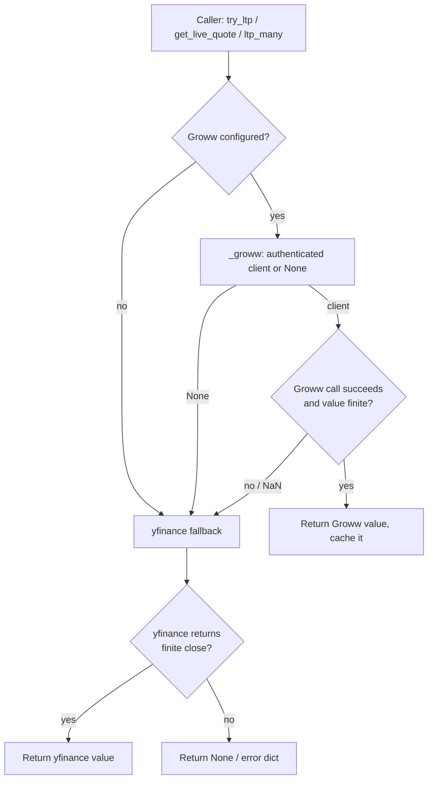
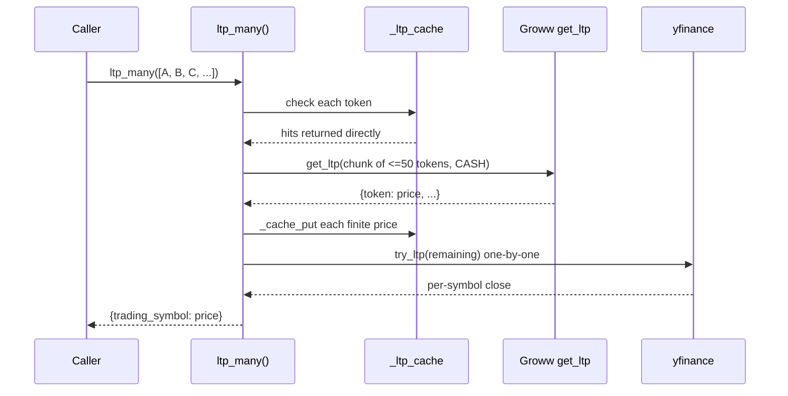
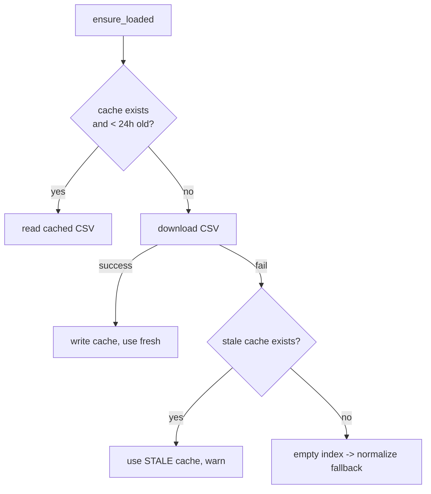
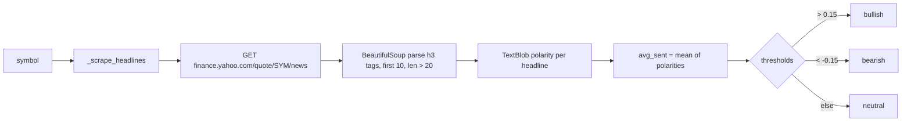
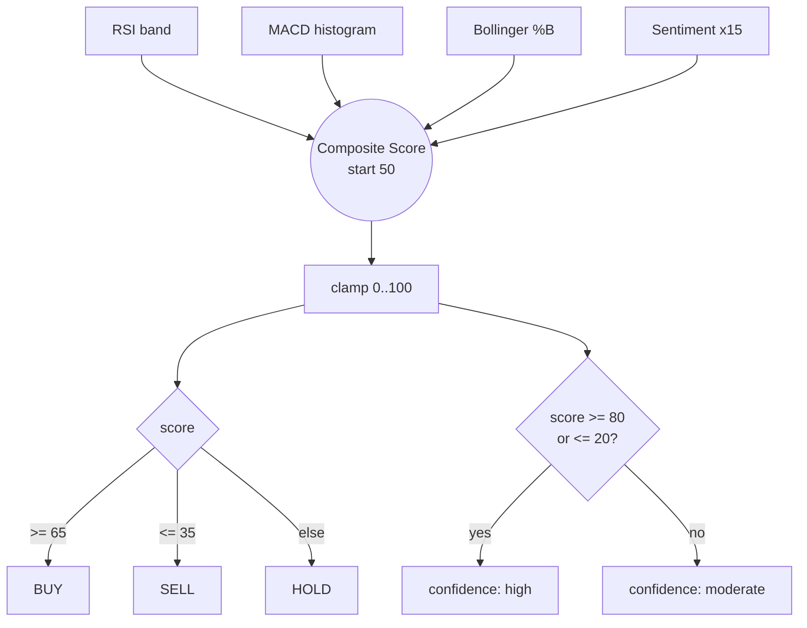

# Market Data & Quantitative Analytics

> 🔱 Trinetra Capital AI — the research eye

**Abstract.** This chapter documents the market-data and quantitative-analytics subsystem of Trinetra Capital AI: how the platform sources live and historical prices, how it resolves a free-form company name or ticker into the exact tradable instrument, and how it converts raw OHLC history into a structured, explainable trading view. The design philosophy throughout is *graceful degradation* — a Groww live feed is preferred when the broker is connected, but every read path falls back to public `yfinance` data so that research and sentiment continue to function before a user has authenticated. We describe the short-lived last-traded-price (LTP) cache, the batched quote pipeline, and the `_finite` NaN/inf guard that protects the LLM from malformed numbers; the authoritative Groww instrument master and its ranked scoring resolver (which eliminates the dead-ticker guessing that plagued naïve `.NS`-suffix construction); and the quantitative methodology in `technical_snapshot()` — RSI-14, MACD (12/26/9), Bollinger %B, ATR-14, a best-effort headline-sentiment pass, and a transparent composite scoring model that maps indicators onto a BUY/SELL/HOLD signal with ATR-derived risk levels. The methodology is presented with the exact formulas, windows, and parameters used in code, a worked scoring example, and explicit caveats: this is an *explainable heuristic*, not a backtested alpha model.

---

## Table of Contents

1. [Scope and Design Goals](#1-scope-and-design-goals)
2. [Data-Sourcing Strategy](#2-data-sourcing-strategy)
3. [The LTP Cache and Batching Model](#3-the-ltp-cache-and-batching-model)
4. [Quote and Fundamentals Pipelines](#4-quote-and-fundamentals-pipelines)
5. [The `_finite` Numeric Guard](#5-the-_finite-numeric-guard)
6. [Symbol Resolution](#6-symbol-resolution)
7. [Quantitative Methodology](#7-quantitative-methodology)
8. [News-Sentiment Pipeline](#8-news-sentiment-pipeline)
9. [Composite Scoring and Signal Generation](#9-composite-scoring-and-signal-generation)
10. [ATR-Based Risk Levels](#10-atr-based-risk-levels)
11. [A Worked Example](#11-a-worked-example)
12. [Methodological Caveats and Limitations](#12-methodological-caveats-and-limitations)
13. [Reference Tables](#13-reference-tables)

---

## 1. Scope and Design Goals

The market-data layer lives in three pure or near-pure modules:

| Module | Responsibility | Network? |
| --- | --- | --- |
| `trinetra/symbols.py` | Pure, network-free normalisation between yfinance and Groww symbol conventions. | No |
| `trinetra/instruments.py` | Authoritative Groww instrument master: download, cache, index, and ranked resolution. | Yes (one public CSV) |
| `trinetra/market_data.py` | Live quotes, LTP, fundamentals, and the `technical_snapshot()` quantitative view. | Yes (Groww + yfinance + Yahoo headlines) |

Four design goals shape the entire subsystem:

1. **Groww-first, fallback-always.** Live prices, when the broker is connected, are pulled from the *same* Groww feed the orders execute against, so quotes and fills agree. When Groww is unavailable, every read path silently falls back to `yfinance`.
2. **Never hard-fail in the data layer.** Every external call is wrapped so that a network error, an empty response, or a malformed number degrades to `None`/fallback rather than crashing the agent loop. The docstring of `_groww()` is explicit: *"data layer must never hard-fail."*
3. **Authoritative instrument resolution.** A free-form name or ticker is resolved against Groww's own published instrument list, not guessed — this is the difference between `INFOSYS.NS` (a dead ticker) and `INFY` (the real one).
4. **Explainability over opacity.** The quantitative snapshot returns every intermediate indicator alongside the final signal, and the composite score is a transparent, fully-specified arithmetic — auditable, not a black box.

---

## 2. Data-Sourcing Strategy

### 2.1 Two tiers, one interface

Every price read in `market_data.py` is structured as a two-tier cascade:



The gate is `settings.groww_configured`. When false, `_groww()` returns `None` immediately and the call proceeds straight to the `yfinance` branch. When true, `_groww()` lazily imports `trinetra.broker.groww_client` and returns an authenticated client; any exception during that import or authentication is caught and logged at `DEBUG`, again yielding `None`. The caller therefore *never* needs to know whether the broker is connected — the same function signature serves both states.

### 2.2 Why degrade gracefully

This matters because of the user journey. A new user can ask *"what is the RSI on Reliance?"* or *"should I buy Infosys?"* **before** they have completed Groww onboarding. Were the research and sentiment agents hard-coupled to a live broker session, the product would be unusable until authentication succeeded. Instead:

- `get_live_quote()`, `try_ltp()`, and `ltp_many()` fall back to `yfinance` history (last close).
- `fetch_fundamentals()` and `technical_snapshot()` are *yfinance-native by design* — Groww exposes no fundamentals or long-history OHLC endpoint, so these always use `yfinance` (with the live Groww LTP layered on top of the technical snapshot when available; see §7).
- `lookup_symbol()` is instrument-master-first with a `yfinance` search fallback.

The cost of this fallback is fidelity: `yfinance` close prices lag the real-time tape and Yahoo occasionally returns empty frames or NaNs, which the `_finite` guard (§5) absorbs.

---

## 3. The LTP Cache and Batching Model

### 3.1 The 10-second TTL cache

Rendering a portfolio view, or answering a multi-symbol question within one conversational turn, can request the same last-traded price several times in quick succession. To avoid hammering the data source, `market_data.py` maintains a process-local cache:

```python
_LTP_TTL = 10.0  # seconds
_ltp_cache: dict[str, tuple[float, float]] = {}  # exchange_token -> (price, ts)
```

The cache is keyed by the **`exchange_token`** (`"NSE_RELIANCE"`, `"BSE_TCS"`, …), which is the canonical, exchange-qualified identifier produced by `Instrument.exchange_token`. Keying on the token rather than the bare symbol prevents an `NSE` and a `BSE` listing of the same ticker from colliding. `_cache_get(token)` returns the cached price only if `time.monotonic() - ts < _LTP_TTL`; `_cache_put(token, price)` stamps the entry with `time.monotonic()`.

Two properties of `time.monotonic()` make it the correct clock here: it is immune to wall-clock adjustments (NTP corrections, DST), and it measures only elapsed time. The semantic contract is deliberately narrow — prices remain *live*, merely **deduplicated within a ten-second window**.

### 3.2 Batched LTP

`ltp_many(symbols)` exists because Groww's `get_ltp` accepts up to **50 instruments per call**. The function:

1. Resolves each input to an `Instrument` and partitions into *cache hits* (served immediately) and *pending*.
2. For the pending set, chunks the `exchange_token`s into slices of 50 and issues one Groww `get_ltp` per chunk, with `segment` resolved defensively via `_seg(client, "CASH")`.
3. For each returned `token -> price`, applies `_finite`, caches the value, and re-derives the bare symbol via `token.split("_", 1)[-1]` (so `"NSE_RELIANCE"` → `RELIANCE`).
4. Any instrument still unresolved after the batch falls back to a per-symbol `try_ltp()` (which itself tries Groww single-LTP, then yfinance).

This is the workhorse behind `view_portfolio()` enrichment in the broker layer (see [Execution & Broker Layer](04-execution-and-broker-layer.md)): a portfolio of 30 holdings becomes a single batched call rather than 30 round-trips.



---

## 4. Quote and Fundamentals Pipelines

### 4.1 `get_live_quote(symbol)`

The richest read path. When Groww is connected it calls `client.get_quote(trading_symbol, exchange, segment=CASH)` and normalises the broker's response into a stable schema, flattening the nested `ohlc` block:

| Output field | Source | Notes |
| --- | --- | --- |
| `source` | literal `"groww"` / `"yfinance"` | provenance for the LLM |
| `last_price` | `q["last_price"]` | real-time LTP |
| `day_change`, `day_change_perc` | `q[...]` | absolute and percentage move |
| `open`, `high`, `low` | `ohlc.open/high/low` | intraday OHLC |
| `prev_close` | `ohlc.close` | prior session close |
| `volume` | `q["volume"]` | traded volume |
| `week_52_high`, `week_52_low` | `q[...]` | 52-week range |
| `upper_circuit`, `lower_circuit` | `q["upper_circuit_limit"]`, `q["lower_circuit_limit"]` | price bands |

On any Groww exception the function falls through to `_yf_quote(inst)`, which pulls a 5-day history, takes the last clean close as `last_price`, the prior close as `prev_close`, computes `day_change`/`day_change_perc`, and reports `high`/`low` over the window. If the frame is empty or the last close is non-finite, `_yf_quote` returns a structured `error` dict rather than throwing — `{"source": "yfinance", "symbol": ..., "error": "no price data available ..."}`.

### 4.2 `fetch_fundamentals(symbol)`

Fundamentals are `yfinance`-only because Groww publishes no fundamentals endpoint in v1. The function reads `yf.Ticker(...).info` and projects a fixed subset: `company_name` (`longName`), `sector`, `industry`, `market_cap` (`marketCap`), `pe_ratio` (`trailingPE`), `52w_high`/`52w_low`. Any exception returns `{"symbol": ..., "error": str(exc)}`.

> **Caveat.** `yf.Ticker(...).info` is the least stable surface in the `yfinance` library; fields are occasionally `None` or absent upstream. Callers (and the research agent's prompt rules) must treat any field as potentially missing.

---

## 5. The `_finite` Numeric Guard

Both Groww and `yfinance` can, on rare occasions, emit `NaN` or `inf` — an empty history window, a halted symbol, an upstream parsing slip. Such a value would (a) serialise to invalid JSON (`NaN` is not legal JSON), and (b) silently poison any downstream arithmetic or LLM reasoning. Every numeric ingress is therefore funnelled through:

```python
def _finite(x):
    try:
        v = float(x)
    except (TypeError, ValueError):
        return None
    return v if math.isfinite(v) else None
```

`_finite` returns a float **only** if the value coerces to a real, finite number; otherwise `None`. It guards `try_ltp` (single and cached writes), every value in the `ltp_many` batch loop, and the last-close check in `_yf_quote`. This is a small but load-bearing piece of the safety model: it is the boundary that keeps malformed numbers out of the agent's reasoning and out of order construction.

---

## 6. Symbol Resolution

Symbol resolution is a two-layer system: a pure normaliser (`symbols.py`) and an authoritative resolver (`instruments.py`) layered on top.

### 6.1 Pure normalisation — `symbols.py`

`Instrument(trading_symbol, exchange)` is a frozen dataclass with two derived properties:

- `yf_symbol` — appends `.BO` for BSE, else `.NS` (yfinance convention).
- `exchange_token` — `f"{exchange}_{trading_symbol}"` (the `"NSE_RELIANCE"` form used by Groww's `get_ltp`/`get_ohlc`).

`normalize(symbol, exchange=None)` is pure and network-free. It maps, in order:

| Input form | Example | Result |
| --- | --- | --- |
| Combined token | `"NSE_INFY"` | `INFY@NSE` |
| yfinance NSE suffix | `"reliance.ns"` | `RELIANCE@NSE` |
| yfinance BSE suffix | `"TCS.BO"` | `TCS@BSE` |
| Bare symbol + explicit exchange | `("WIPRO","BSE")` | `WIPRO@BSE` |
| Bare symbol, no exchange | `"RELIANCE"` | `RELIANCE@`*default* |

A bare symbol with no explicit exchange defaults to `settings.default_exchange` (`NSE`). Because it is pure, `normalize()` is cheap and trivially testable, and it is the graceful-degradation floor: if the instrument master is unavailable, resolution still produces *something*.

### 6.2 The authoritative instrument master — `instruments.py`

Pure normalisation cannot fix the *dead-ticker* problem: a user (or an LLM) may supply `INFOSYS`, but Groww trades it as `INFY`; `PHYSICSWALLAH` is `PWL`. Naïve `.NS`-suffix construction yields `INFOSYS.NS`, which does not exist. The instrument master solves this by consulting Groww's **own published list of tradable instruments**.

**Sourcing and caching.** On first use, `_load_csv_text()` downloads the public CSV at `https://growwapi-assets.groww.in/instruments/instrument.csv` (no authentication). It is cached to `.groww_instruments.csv` (path `PROJECT_ROOT / ".groww_instruments.csv"`) and considered fresh for `MAX_AGE_SECONDS = 86_400` (one day). The fallback logic is deliberately layered:



The build step (`_build()`) parses the CSV, keeping only rows where `segment == "CASH"` and `exchange in {NSE, BSE}`, and constructs an `InstrumentRecord(trading_symbol, exchange, name, series, isin, lot_size, buy_allowed, sell_allowed)`. It builds two indices — `by_symbol` (ticker → records) and `by_name` (normalised name → records) — plus a flat `records` list.

**Name normalisation.** `_norm_name()` lower-cases, strips the noise tokens `ltd|limited|the|of|india`, removes non-alphanumerics, and collapses whitespace, so *"Infosys Limited"* and *"INFOSYS"* converge on the same key.

### 6.3 The ranked scoring resolver

`search(query, limit, exchange)` produces ranked matches. Each candidate's final score is:

```
score = base
      + exchange_bonus
      + series_bonus
      - etf_penalty
      - structured_penalty
```

The **base** is assigned by match tier, with longer matches (`len(sym)` / `len(nm)`) penalised so that the tightest match wins within a tier:

| Tier | Condition | Base score |
| --- | --- | --- |
| Exact ticker | `query` upper == trading symbol | `1000` |
| Exact normalised name | `_norm_name(query)` == indexed name | `950` |
| Ticker prefix | symbol `startswith(query)`, `len(query) >= 2` | `780 - len(sym)` |
| Name prefix | indexed name `startswith(qname)` | `820 - len(nm)` |
| Name substring | `qname in nm` | `680 - len(nm)` |
| Name token-subset | query tokens ⊆ name tokens | `560 - len(nm)` |

The **adjustments** are:

| Adjustment | Rule | Value |
| --- | --- | --- |
| Exchange match bonus | `rec.exchange == requested exchange` | `+8` |
| Default-NSE bonus | `rec.exchange == NSE` (no explicit match) | `+6` |
| Series bonus | `rec.series == "EQ"` | `+3` |
| ETF penalty | ticker/name contains `etf`/`bees`/`ietf` and the **query did not** ask for an ETF | `-200` |
| Structured penalty | candidate ticker contains a digit and the **query had no digits** | `-15` |

The ETF penalty is the largest single adjustment by design. ETFs share `segment=CASH` and `series=EQ` with ordinary equities, so a short ETF name could otherwise outrank a real company on the name-length tie-break; `-200` decisively demotes them — *unless* the user explicitly typed `etf`/`bees`/`ietf`, in which case the penalty is waived. The structured penalty is a gentler nudge: index/structured products often carry digits (`ICICIB22`, `CPSEETF`), so when the user typed a plain word, plain-letter tickers are lightly preferred. It is intentionally too small to override an exact match.

Final ordering breaks ties by `(-score, len(trading_symbol), name)` — highest score, then shortest ticker, then alphabetical.

`resolve(query, exchange)` wraps `search(..., limit=1)` and memoises the result in `_resolve_cache` (keyed by lower-cased query + upper-cased exchange) so repeated resolutions within a session are free. `to_instrument(query, exchange)` is the **drop-in replacement** for `symbols.normalize()`: it tries the master first and falls back to `normalize()` when the master has no match or is unavailable — the graceful path that makes the whole layer robust. This is exactly why `market_data._inst()` calls `instruments.to_instrument()` rather than `normalize()` directly.

> **Why this is load-bearing for safety.** Because order placement resolves the symbol through this same master before anything reaches the broker (and checks `buy_allowed`), the resolver is the first line of defence against an LLM-hallucinated or dead ticker becoming a real order. See [Safety, Risk Management & Security](06-safety-risk-and-security.md).

---

## 7. Quantitative Methodology

`technical_snapshot(symbol)` is the analytical heart of the research/sentiment layer. It computes four classical indicators over a 90-day daily history, blends in a best-effort sentiment read, and emits a single composite signal with risk levels. Every formula below is exactly as implemented.

### 7.1 Data window and cleaning

```python
hist = yf.Ticker(inst.yf_symbol).history(period="90d", interval="1d")
hist = hist.dropna(subset=["Close", "High", "Low"])
if hist.empty or len(hist) < 30:
    return {... "error": "not enough clean price history"}
```

Roughly 90 calendar days of *daily* candles are fetched, then rows with any missing `Close`/`High`/`Low` are dropped. The function refuses to proceed with fewer than **30 clean rows** — a guard against computing 14-period indicators on too little data.

### 7.2 RSI-14 (Wilder, via EWM `com=13`)

The Relative Strength Index over 14 periods, using Wilder's smoothing approximated by an exponentially-weighted mean with centre-of-mass 13 (`com=13` ⇔ `α = 1/14`):

```
delta = Close.diff()
gain  = max(delta, 0).ewm(com=13, min_periods=14).mean()
loss  = max(-delta, 0).ewm(com=13, min_periods=14).mean()
RS    = gain / loss
RSI   = 100 - 100 / (1 + RS)
```

To avoid division by zero, `loss` of exactly `0` is replaced by `NaN` before the ratio. The last value is rounded to 2 decimals. Interpretation bands used downstream: `< 30` oversold, `> 70` overbought, else neutral.

### 7.3 MACD (12 / 26 / 9), histogram only

The Moving Average Convergence Divergence, with the standard 12/26/9 EMA triple (`adjust=False`, the conventional recursive EMA):

```
EMA12  = EMA(Close, span=12)
EMA26  = EMA(Close, span=26)
MACD   = EMA12 - EMA26
Signal = EMA(MACD, span=9)
Histogram = MACD - Signal      # last value, rounded to 4 dp
```

Only the **histogram** (MACD minus its signal line) is retained. A positive histogram is read as a bullish crossover, negative as bearish.

### 7.4 Bollinger %B (20-period, 2σ)

The position of price within its Bollinger band, where the band is a 20-period simple moving average ± 2 standard deviations:

```
SMA20 = SMA(Close, 20)
STD20 = STDEV(Close, 20)
Lower = SMA20 - 2*STD20
Upper = SMA20 + 2*STD20        # band width = 4*STD20
%B = (Close - Lower) / (4*STD20 + 1e-9)   # last value, rounded to 3 dp
```

The `+ 1e-9` term prevents division by zero in a flat (zero-variance) window. `%B = 0` sits on the lower band, `1` on the upper, `0.5` at the mean. Bands used downstream: `< 0.2` (near lower band, potential value) and `> 0.8` (near upper band, potential exhaustion).

### 7.5 ATR-14 (EWM `com=13` of true range)

Average True Range over 14 periods, smoothed the same Wilder-style way as RSI. True range is the per-bar maximum of three spreads:

```
TR = max( High - Low,
          |High - prev Close|,
          |Low  - prev Close| )
ATR = TR.ewm(com=13, min_periods=14).mean()   # last value, rounded to 4 dp
```

ATR is a volatility measure in price units; it is the basis for the stop-loss and target levels in §10.

### 7.6 Reference price

```python
price = try_ltp(symbol) or round(float(close.iloc[-1]), 2)
```

The snapshot prefers the **real Groww live LTP** (via the cached `try_ltp`) and only falls back to the last yfinance close if no live price is available. This means the headline `price`, `stop_loss`, and `target` figures track the live tape while the indicators are computed on settled daily closes — a deliberate, documented mix.

---

## 8. News-Sentiment Pipeline

The sentiment pass is explicitly **best-effort** and lightweight:



`_scrape_headlines(symbol)` issues a single `requests.get` (8-second timeout, browser `User-Agent`) against `https://finance.yahoo.com/quote/{symbol}/news/`, parses with BeautifulSoup, and collects the text of up to the first ten `<h3>` tags whose text exceeds 20 characters. Any exception is swallowed — *sentiment is best-effort* and must never break the snapshot.

Each headline's polarity is scored by `TextBlob(h).sentiment.polarity` (a lexicon score in `[-1, +1]`). If no headlines were scraped, the score list defaults to `[0.0]`. The average (`avg_sent`, 3 dp) is labelled:

| `avg_sent` | Label |
| --- | --- |
| `> 0.15` | bullish |
| `< -0.15` | bearish |
| otherwise | neutral |

The snapshot also reports `headlines_used` so the consumer can judge how much signal underlies the label.

---

## 9. Composite Scoring and Signal Generation

The four indicators and the sentiment read are fused into a single **0–100 composite score** by a fully-specified, additive heuristic. It begins at a neutral `50` and applies exact contributions:

```python
score = 50

# RSI band (mutually exclusive)
score += 20 if rsi < 30 else 10 if rsi < 40 else -20 if rsi > 70 else -10 if rsi > 60 else 0

# MACD histogram (binary)
score += 15 if histogram > 0 else -15

# Bollinger %B band
score += 10 if pct_b < 0.2 else -10 if pct_b > 0.8 else 0

# Sentiment (continuous, scaled)
score += round(avg_sent * 15)

score = max(0, min(100, score))   # clamp to [0, 100]
```

The exact contribution table:

| Component | Condition | Contribution |
| --- | --- | --- |
| Base | always | `+50` |
| RSI | `< 30` (deep oversold) | `+20` |
| RSI | `< 40` (mild oversold) | `+10` |
| RSI | `> 70` (deep overbought) | `-20` |
| RSI | `> 60` (mild overbought) | `-10` |
| RSI | `40–60` | `0` |
| MACD histogram | `> 0` | `+15` |
| MACD histogram | `<= 0` | `-15` |
| Bollinger %B | `< 0.2` | `+10` |
| Bollinger %B | `> 0.8` | `-10` |
| Bollinger %B | `0.2–0.8` | `0` |
| Sentiment | continuous | `round(avg_sent * 15)`, range `[-15, +15]` |

The score is then mapped to a discrete signal and a confidence label:

```
signal     = BUY  if score >= 65
             SELL if score <= 35
             HOLD otherwise

confidence = high     if score >= 80 or score <= 20
             moderate otherwise
```

The RSI logic is contrarian/mean-reverting (oversold ⇒ bullish), while MACD is trend-following (positive momentum ⇒ bullish); the blend intentionally combines a mean-reversion and a momentum view rather than committing to either. Theoretically the score ranges roughly `50 ± (20 + 15 + 10 + 15) = 50 ± 60`, i.e. `-10` to `110` before clamping, hence the explicit `max(0, min(100, …))`.



---

## 10. ATR-Based Risk Levels

Independently of the signal, the snapshot always emits volatility-scaled risk levels anchored on the reference `price` and the ATR:

| Level | Formula | Interpretation |
| --- | --- | --- |
| `stop_loss` | `price - 1.5 * ATR` | exit if price falls ~1.5 ATR below entry |
| `target_1` | `price + 2.0 * ATR` | first profit target (~1.33:1 reward:risk) |
| `target_2` | `price + 3.5 * ATR` | extended target (~2.33:1 reward:risk) |

Using ATR (rather than a fixed percentage) makes the levels self-adjusting: a volatile stock gets wider stops and targets, a quiet one gets tighter ones. The implied reward:risk ratios are `2.0/1.5 ≈ 1.33` and `3.5/1.5 ≈ 2.33`. These are long-biased levels (the snapshot computes targets above and a stop below the price regardless of the signal direction) and should be read as a *reference framing*, not a directional recommendation on their own.

---

## 11. A Worked Example

Consider a hypothetical snapshot with the following computed values:

| Quantity | Value |
| --- | --- |
| `price` (live LTP) | ₹1,420.00 |
| `rsi` | 34.0 |
| `macd_histogram` | +2.10 |
| `bollinger_pct_b` | 0.15 |
| `avg_sent` | +0.20 |
| `atr` | 28.00 |

Scoring proceeds step by step:

```
score  = 50
RSI    : 34 < 40  (and not < 30)   -> +10   => 60
MACD   : 2.10 > 0                  -> +15   => 75
%B     : 0.15 < 0.2                -> +10   => 85
Sent   : round(0.20 * 15) = +3     -> +3    => 88
clamp  : min(100, 88)              ->        88
```

Result: `composite_score = 88` ⇒ `signal = BUY` (≥ 65), `confidence = high` (≥ 80). Risk levels:

```
stop_loss = 1420 - 1.5 * 28 = 1378.00
target_1  = 1420 + 2.0 * 28 = 1476.00
target_2  = 1420 + 3.5 * 28 = 1518.00
```

The snapshot would return these alongside the raw indicators (`rsi_signal: "neutral"`, `macd_crossover: "bullish"`, `sentiment_label: "bullish"`, etc.), so the sentiment agent can present a fully-decomposed rationale rather than a bare verdict.

---

## 12. Methodological Caveats and Limitations

Intellectual honesty about the model's boundaries is part of its credibility:

- **Not a backtested alpha model.** The composite scoring weights (`+20/+10/-20/-10`, `±15`, `±10`, `×15`) are sensible, transparent heuristics chosen for explainability — they have **not** been fitted, cross-validated, or backtested against historical returns. Treat the signal as a structured summary of indicator state, not a validated edge.
- **Best-effort sentiment.** `_scrape_headlines` depends on Yahoo Finance's public HTML, whose structure can change without notice; a layout change, a rate-limit, or a non-resolving symbol simply yields zero headlines and a neutral `0.0` baseline. `TextBlob` is a general-purpose lexicon, not a finance-tuned classifier, so polarity on financial jargon is approximate.
- **Indicators on daily closes, signal on live price.** Indicators use settled daily candles while the headline `price` and risk levels use the live LTP. Within a session this is a feature (live anchoring) but it means the indicators slightly lag an intraday move.
- **Window assumptions.** RSI/ATR/MACD/Bollinger all assume enough clean history; the 30-row floor is a minimum, not an ideal. Newly-listed symbols or thinly-traded names may return the `"not enough clean price history"` error.
- **Equity cash segment only (v1).** The instrument master is filtered to `segment=CASH` on NSE/BSE. F&O, commodities, and other segments are out of scope for this release.
- **Fallback fidelity.** When Groww is not connected, prices come from `yfinance` close data, which lags the real-time tape and can be delayed or occasionally empty (absorbed by `_finite`).
- **No long-history persistence.** The LTP cache is in-process and 10 seconds long; there is no persistent time-series store. Each `technical_snapshot` re-fetches its 90-day window on demand.

---

## 13. Reference Tables

### 13.1 Indicators at a glance

| Indicator | Window | Smoothing / parameters | Output field(s) | Interpretation thresholds |
| --- | --- | --- | --- | --- |
| RSI | 14 | Wilder via `ewm(com=13, min_periods=14)` | `rsi`, `rsi_signal` | `<30` oversold, `>70` overbought |
| MACD histogram | 12 / 26 / 9 | EMAs with `adjust=False` | `macd_histogram`, `macd_crossover` | `>0` bullish, `<=0` bearish |
| Bollinger %B | 20 | SMA ± 2σ; `+1e-9` guard | `bollinger_pct_b` | `<0.2` near lower, `>0.8` near upper |
| ATR | 14 | Wilder via `ewm(com=13, min_periods=14)` of true range | `atr` | volatility unit for stops/targets |
| Sentiment | ≤10 headlines | `TextBlob` polarity, mean | `sentiment_score`, `sentiment_label`, `headlines_used` | `>0.15` bullish, `<-0.15` bearish |

### 13.2 Composite score boundaries

| Score range | Signal | Confidence |
| --- | --- | --- |
| `>= 80` | (BUY) | high |
| `65–79` | BUY | moderate |
| `36–64` | HOLD | moderate |
| `21–35` | SELL | moderate |
| `<= 20` | (SELL) | high |

### 13.3 Key constants

| Constant | Location | Value |
| --- | --- | --- |
| `_LTP_TTL` | `market_data.py` | `10.0` s |
| Groww `get_ltp` batch size | `market_data.ltp_many` | `50` |
| History window | `market_data.technical_snapshot` | `90d`, `1d` interval |
| Minimum clean rows | `market_data.technical_snapshot` | `30` |
| `CSV_URL` | `instruments.py` | `https://growwapi-assets.groww.in/instruments/instrument.csv` |
| `CACHE_FILE` | `instruments.py` | `PROJECT_ROOT / .groww_instruments.csv` |
| `MAX_AGE_SECONDS` | `instruments.py` | `86_400` (1 day) |
| ETF penalty | `instruments._etf_penalty` | `-200` |
| Structured penalty | `instruments._structured_penalty` | `-15` |

### 13.4 Public functions of the layer

| Function | Module | Returns |
| --- | --- | --- |
| `try_ltp(symbol)` | `market_data` | `float \| None` |
| `ltp_many(symbols)` | `market_data` | `dict[symbol, float]` |
| `get_live_quote(symbol)` | `market_data` | quote dict (Groww-first) |
| `fetch_fundamentals(symbol)` | `market_data` | fundamentals dict (yfinance) |
| `lookup_symbol(name)` | `market_data` | best match + alternatives |
| `technical_snapshot(symbol)` | `market_data` | indicators + signal + risk levels |
| `search` / `resolve` / `to_instrument` | `instruments` | ranked records / best record / `Instrument` |
| `normalize` / `to_groww` / `to_yf` | `symbols` | `Instrument` / tuple / yf symbol |

---

[← Execution & Broker Layer](04-execution-and-broker-layer.md)  |  [↑ Documentation Index](README.md)  |  [Safety, Risk Management & Security →](06-safety-risk-and-security.md)
