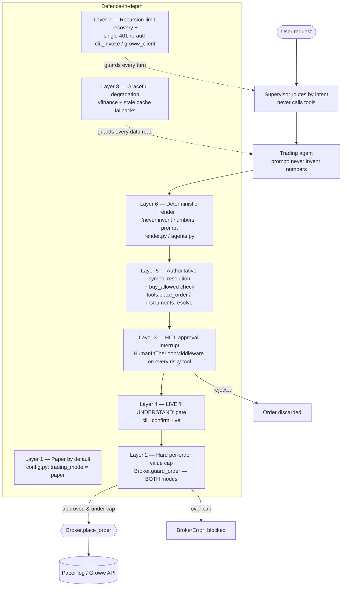

# Safety, Risk Management & Security 🔱

> *"Har decision mein teen nazar — research ki, trading ki, aur insaan ki."*

**Abstract.** Trinetra Capital AI is an autonomous multi-agent system that can place real-money equity orders on NSE/BSE through the Groww Trading API. Any system in which a large language model can move money is, by construction, a high-consequence system: an LLM may hallucinate a symbol, miscompute a quantity, or loop. This document presents the project's **threat model** for an autonomous real-money agent and the **defence-in-depth** strategy that answers it. Every control described here is traced to the exact source file and function that implements it, so the safety claims are auditable rather than aspirational. We then cover the **security posture** (credential handling, the daily token cache, least-data agent payloads, and supply-chain notes) and close with the **regulatory and ethical** framing (SEBI context, the not-investment-advice stance, and operator best-practices). Where the code's behaviour is narrower than the marketing language — for example, stop-loss orders are not simulated in paper mode, and there is no long-term cross-turn memory yet — we say so plainly, because intellectual honesty about limits is itself a safety property.

## Table of contents

1. [Threat and risk model](#1-threat-and-risk-model)
2. [Defence-in-depth: the layered control stack](#2-defence-in-depth-the-layered-control-stack)
3. [Controls in detail (risk → control → code)](#3-controls-in-detail-risk--control--code)
4. [Security: credentials, tokens, and data minimisation](#4-security-credentials-tokens-and-data-minimisation)
5. [Dependency and supply-chain considerations](#5-dependency-and-supply-chain-considerations)
6. [Regulatory and ethical considerations](#6-regulatory-and-ethical-considerations)
7. [Operator best-practices](#7-operator-best-practices)
8. [Known limitations (honest disclosure)](#8-known-limitations-honest-disclosure)

---

## 1. Threat and risk model

An LLM-driven trading agent inherits all the failure modes of a probabilistic text model and couples them to an irreversible side effect (a filled order). We classify the principal risks below; each is the design driver for a corresponding control in Section 2.

| # | Threat | How it manifests | Worst-case impact |
|---|--------|------------------|-------------------|
| T1 | **Hallucinated symbol** | The model invents a ticker that does not exist or maps to the wrong instrument (e.g. `INFOSYS.NS`, `PHYSICSWALLAH`). | An order placed against the wrong security, or a confusing rejection. |
| T2 | **Hallucinated quantity / price** | The model computes a wrong share count for a budget order, or fabricates a figure it never retrieved from a tool. | An oversized order; a user misled by fake numbers. |
| T3 | **Accidental live trading** | The operator runs in `live` mode without realising, or a paper test is mistaken for real. | Real money committed when only simulation was intended. |
| T4 | **Runaway loop** | The supervisor over-routes between workers, or a graph cycles past its step budget. | A crashed turn, or — absent a guard — repeated tool calls. |
| T5 | **Credential leakage** | API keys, secrets, or the cached access token are committed, logged, or world-readable. | Account takeover; unauthorised trading. |
| T6 | **Stale or missing data** | A live quote is unavailable; the instrument master fails to download; the access token expires mid-session. | Decisions on bad prices, or a hard failure mid-turn. |
| T7 | **Over-broad data exposure to the model** | Raw broker payloads (account ids, internal fields) reach the LLM context. | Larger leak surface; prompt-injection leverage. |

A recurring theme is that the LLM is treated as an **untrusted planner**, not a trusted executor. The model proposes; deterministic Python and a human dispose.

---

## 2. Defence-in-depth: the layered control stack

No single control is sufficient, so the system stacks eight independent layers between a user request and an irreversible order. A request must pass through all relevant layers; any one can stop it.



The order of the layers matters. Symbol resolution (L5) runs *before* the broker so a bad ticker never reaches an API; the HITL gate (L3) runs *before* the value cap so the human sees the proposed order; the value cap (L2) is the final, mode-independent backstop that even an approved order must satisfy.

---

## 3. Controls in detail (risk → control → code)

### Control summary table

| Control | Mitigates | Where it lives (code) | Applies in |
|---------|-----------|-----------------------|------------|
| C1 Paper-by-default | T3 | `trinetra/config.py` — `trading_mode` defaults to `TradingMode.PAPER` | Always |
| C2 Hard per-order value cap | T2, T4 | `trinetra/broker/base.py` — `Broker.guard_order()` reads `settings.max_order_value` | Paper **and** live |
| C3 HITL approval interrupt | T1, T2, T3 | `trinetra/agents.py` — `HumanInTheLoopMiddleware(interrupt_on=...)`; surfaced in `trinetra/cli.py` `_print_approval` / `_order_summary` | Always (every risky tool) |
| C4 LIVE "I UNDERSTAND" gate | T3 | `trinetra/cli.py` — `_confirm_live()` | Live only |
| C5 Authoritative symbol resolution + `buy_allowed` | T1 | `trinetra/tools.py` — `place_order()` calls `instruments.resolve()` | Always |
| C6 Deterministic render + "never invent numbers" | T2 | `trinetra/render.py`; prompts in `trinetra/agents.py` | Always |
| C7 Recursion-limit recovery + single re-auth | T4, T6 | `trinetra/cli.py` `_invoke()`; `trinetra/broker/groww_client.py` (401 → re-auth) | Always |
| C8 Graceful degradation | T6 | `market_data` yfinance fallback; `instruments` stale-cache fallback | Always |

### C1 — Paper-by-default

The single most important default in the system. In `trinetra/config.py`, `trading_mode` is constructed from `GROWW_TRADING_MODE` with a literal fallback of `"paper"`:

```python
trading_mode: TradingMode = field(
    default_factory=lambda: TradingMode(
        (_get("GROWW_TRADING_MODE", "paper") or "paper").lower()
    )
)
```

Real orders only reach Groww when the operator *explicitly* sets `GROWW_TRADING_MODE=live`. The broker factory (`get_broker()`) returns a `PaperBroker` whenever `settings.is_live` is false, so the live code path is unreachable by accident. Note that market-data and portfolio *reads* are still served from the real Groww account when credentials exist — only **order placement and the portfolio you mutate** are simulated in paper mode.

### C2 — The hard per-order value cap (both modes)

`Broker.guard_order()` in `trinetra/broker/base.py` is the system's circuit breaker against an oversized order. Crucially, it is defined on the **abstract** `Broker` base class, so it applies identically to `PaperBroker` and `GrowwBroker`:

```python
def guard_order(self, req: OrderRequest, reference_price=None) -> None:
    value = req.estimated_value(reference_price)
    cap = settings.max_order_value
    if value and value > cap:
        raise BrokerError(
            f"Order value ₹{value:,.2f} exceeds the safety cap of ₹{cap:,.2f} "
            f"(GROWW_MAX_ORDER_VALUE). Reduce quantity or raise the cap."
        )
```

The cap defaults to **₹100,000** (`max_order_value` in `config.py`). `estimated_value()` uses the limit/trigger price for `LIMIT`/`SL`/`SL_M` orders and a fetched reference LTP for market orders. Because this guard sits in the broker — below the LLM, below the HITL gate, below the CLI — a hallucinated quantity of, say, 10,000 shares cannot blow up the account: the order is rejected with a `BrokerError` regardless of whether the human approved it. `validate_for_live()` additionally rejects a non-positive cap before live trading begins.

### C3 — Human-in-the-loop approval on every risky tool

`RISKY_TOOLS = {place_order, cancel_order, modify_order}` (in `trinetra/tools.py`) is the explicit allow-list of irreversible actions. In `trinetra/agents.py` the trading agent is wrapped so each of those tools interrupts the graph for approval:

```python
interrupt_on = {t: True for t in RISKY_TOOLS}
trading_agent = create_agent(
    ..., middleware=[HumanInTheLoopMiddleware(interrupt_on=interrupt_on)],
)
```

When the graph interrupts, the CLI does not merely echo raw tool arguments. `_print_approval()` calls `_order_summary()` (in `trinetra/cli.py`), which **re-resolves the symbol**, fetches a live reference price, and computes the estimated total — so the human approves a fully materialised order, not the model's raw text:

```
  → BUY 2 × RELIANCE  (MARKET, CNC)  (resolved 'reliance' → RELIANCE, Reliance Industries)
  → Price: ₹1,328.80 (≈ market)   Estimated total: ₹2,657.60
```

If the estimate exceeds the cap, the summary warns `⚠️ Exceeds safety cap … will be blocked.` *before* the human decides. Approval resumes the graph with `Command(resume={"decisions": [{"type": "approve"}]})`; a rejection sends `{"type": "reject"}` and the order is discarded. This is the layer that catches the residual cases the deterministic layers cannot — a correctly-resolved but *unwanted* trade.

### C4 — The explicit LIVE confirmation gate

Even with `GROWW_TRADING_MODE=live` set, the session refuses to start until the operator types an exact phrase. In `trinetra/cli.py`:

```python
def _confirm_live() -> bool:
    ...
    answer = input("Type 'I UNDERSTAND' to continue (anything else aborts): ").strip()
    return answer == "I UNDERSTAND"
```

`run()` aborts the session if `settings.is_live` and `_confirm_live()` returns false. The banner additionally renders the mode in red for LIVE and green for PAPER, and `_print_approval()` prints `>>> THIS IS A REAL ORDER ON YOUR LIVE GROWW ACCOUNT <<<` at each approval. This control exists specifically to make accidental live trading (T3) require a deliberate, conscious act.

### C5 — Authoritative symbol resolution and `buy_allowed`

A hallucinated ticker must never reach the broker. `place_order()` in `trinetra/tools.py` resolves the model's symbol against the Groww instrument master **first**, before constructing any `OrderRequest`:

```python
rec = instruments.resolve(symbol, exchange or None)
if rec is None:
    suggestions = [m.to_dict() for m in instruments.search(symbol, limit=3)]
    return _json({"status": "rejected", "error": f"Could not find a tradable Groww symbol for {symbol!r}. ...",
                  "suggestions": suggestions})
if not rec.buy_allowed and action.strip().lower() == "buy":
    return _json({"status": "rejected",
                  "error": f"{rec.trading_symbol} is not buy-enabled on Groww."})
```

If no tradable instrument matches, the order is rejected with up to three suggestions (so the model can self-correct on the next turn) and **nothing reaches the broker**. If the resolved instrument is not buy-enabled on Groww, a buy is refused outright. Only the resolved `trading_symbol` and `exchange` from the authoritative `InstrumentRecord` are passed to `OrderRequest`. This is what turns `INFOSYS` into `INFY` and rejects dead tickers.

### C6 — Deterministic rendering and "never invent numbers"

Two complementary mechanisms ensure the user never sees a hallucinated figure:

1. **Deterministic Python rendering.** Portfolio and order-book tables are produced by `trinetra/render.py` (`render_portfolio`, `render_orders`), not by the LLM. The tool result carries a pre-built `"display"` string, and the trading prompt in `trinetra/agents.py` instructs the agent to *"Output that `display` value EXACTLY AS-IS. Do NOT rebuild it."* A formatted table can therefore never contain a number the model invented.

2. **Prompt discipline.** The trading prompt's `OUTPUT RULES` are unambiguous: *"NEVER invent numbers. Every price, quantity, holding, P&L or funds figure you show MUST come from a tool result in this turn."* The research prompt similarly commands *"never invent prices or symbols … do not estimate."* After an order, the agent must emit only a 1–3 line confirmation built strictly from the tool's returned fields.

Defence-in-depth means C6 is backed by C2 and C5: even if a prompt rule is ignored, the value cap and symbol resolution still hold.

### C7 — Recursion-limit recovery and single re-auth

Two resilience controls prevent transient failures from becoming crashes or duplicate side effects.

- **Runaway-loop recovery.** Each turn runs with `recursion_limit=40` (`RECURSION_LIMIT` in `trinetra/cli.py`). If the supervisor over-routes, `_invoke()` catches `GraphRecursionError`, logs a warning, and recovers the latest graph state instead of failing the turn. The extra hops are text-only — the order already ran exactly once and was HITL-gated — so recovery cannot cause a second order.
- **Single transparent re-auth.** Groww access tokens expire daily. `groww_client.py` caches the token to disk; on a 401/auth error the broker performs **one** transparent re-authentication retry (via `reset_client()` which drops the cache and forces a fresh `generate_access_token()`). This is a *single* retry by design — it avoids hammering the auth endpoint or masking a genuine credential failure behind an infinite loop.

### C8 — Graceful degradation

The system is designed to keep working — or to fail safely — when a dependency is unavailable. `market_data` is Groww-first with a `yfinance` fallback, so research and sentiment function even before a broker is connected. The instrument master falls back to a stale local cache if the daily CSV download fails. These fallbacks protect availability without ever upgrading a paper session to live or bypassing the value cap.

---

## 4. Security: credentials, tokens, and data minimisation

### Credential handling

All secrets are read **only** through `trinetra/config.py`. The module docstring states the rule explicitly: *"Nothing else in the codebase should read `os.environ` for trading behaviour — import `settings` instead."* This single choke point makes it auditable that credentials never spread through the codebase ad hoc.

- Secrets (`GROWW_API_KEY`, `GROWW_API_SECRET`, `GROWW_TOTP_SECRET`, `NVIDIA_API_KEY`, `GROQ_API_KEY`, `OPENROUTER_API_KEY`) are loaded from a `.env` file via `python-dotenv` (`load_dotenv(PROJECT_ROOT / ".env")`).
- `.env` is a local, untracked file; only the annotated `.env.example` template is committed. **The `.env` file must never be committed and must be listed in `.gitignore`.** The README's onboarding flow (`cp .env.example .env`) reinforces this separation.
- `_get()` defensively strips stray quotes and whitespace from hand-edited values, reducing the chance of a malformed credential causing a confusing auth failure.

The two supported auth flows are derived in `config.auth_method`: **TOTP flow** (`GROWW_API_KEY` + `GROWW_TOTP_SECRET`, token auto-rotates daily) or **approval flow** (`GROWW_API_KEY` + `GROWW_API_SECRET`). The TOTP secret is used to mint a fresh time-based code on each authentication (`pyotp.TOTP(...).now()` in `groww_client.py`), so a long-lived password is never transmitted.

### The daily access-token cache

`trinetra/broker/groww_client.py` caches the daily Groww access token to `.groww_token_cache.json` to avoid re-authenticating on every call (important for unattended runs). The cache is built defensively:

- **Date-keyed.** `_load_cached_token()` returns `None` if the cached `date` is not today, forcing a daily rotation.
- **Auth-method-keyed.** The cache is also keyed by `auth_method`; switching flows invalidates it.
- **Permission-tightened.** After writing, the file is `chmod 0o600` on a best-effort basis (wrapped to tolerate platforms — e.g. Windows — where POSIX permissions are not enforced).
- **Reset on 401.** `reset_client()` unlinks the cache file (`unlink(missing_ok=True)`) and clears the in-memory client, so an invalidated token is replaced rather than reused.
- **Non-fatal.** Caching is an optimisation; any `OSError` while writing is logged at debug level and swallowed, never crashing a session.

Like `.env`, the token cache (`.groww_token_cache.json`) is a runtime secret and must be excluded from version control.

### Least-data agent-facing payloads

The LLM context is treated as a leak surface, so broker results are minimised before they reach the model. In `trinetra/broker/base.py`, `OrderResult.to_dict()` explicitly drops the raw SDK envelope and elides `None` fields:

```python
def to_dict(self) -> dict[str, Any]:
    d = asdict(self)
    d.pop("raw", None)  # keep the agent-facing payload clean
    return {k: v for k, v in d.items() if v is not None}
```

The other dataclasses (`Holding`, `Position`, `Funds`) similarly emit only their non-`None` normalised fields. Every tool returns a compact JSON string of these normalised values — the model sees a curated, structured view, not the broker's full raw response.

### Network trust boundaries

The instrument master is downloaded over HTTPS from Groww's **public, unauthenticated** asset endpoint (`https://growwapi-assets.groww.in/instruments/instrument.csv`), so no credential is exposed to obtain it, and a download failure degrades to a stale cache rather than blocking trading. Authenticated traffic to the Groww Trading API flows exclusively through the `growwapi` SDK in `groww_client.py` / `groww_broker.py`.

---

## 5. Dependency and supply-chain considerations

The system depends on third-party packages that execute with the operator's credentials, so the supply chain is part of the threat surface (an extension of T5). The principal trust dependencies are:

| Dependency | Role | Trust note |
|------------|------|------------|
| `growwapi` (>= 1.5.0) | Authenticated order/portfolio/funds API | Holds the access token; the highest-trust dependency. |
| `pyotp` | TOTP code generation | Touches the TOTP secret. |
| `langgraph`, `langchain`, `langgraph-supervisor` | Agent orchestration + the HITL middleware that enforces C3 | A regression here weakens the approval gate. |
| `langchain-nvidia-ai-endpoints` / `langchain-groq` / `langchain-openai` | LLM providers (pluggable) | Receive prompt context; a compromised provider sees agent traffic. |
| `yfinance`, `requests`, `beautifulsoup4`, `textblob` | Market data + best-effort headline sentiment | Read-only; lower trust, but `requests`/scraping touch external HTML. |
| `numpy`, `pandas`, `python-dotenv` | Numerics + config loading | Standard ecosystem libraries. |

Recommended supply-chain hygiene: pin versions in `requirements.txt`, build the Docker image (`python:3.12-slim`) from pinned dependencies for reproducibility, and treat any change to the LangGraph/LangChain stack as security-relevant because the HITL interrupt that gates every order is implemented there.

A note on the LLM layer: it is **pluggable and provider-configurable**. The code default for both `agent_model` and `supervisor_model` is `"meta/llama-3.3-70b-instruct"` (NVIDIA NIM worker, optional Groq supervisor), with an OpenRouter override (default `"openai/gpt-4o-mini"`) that powers both roles when `OPENROUTER_API_KEY` is set and `TRINETRA_USE_OPENROUTER` is true (the default). Whichever provider is active, the **safety controls are model-independent**: the value cap, symbol resolution, and HITL gate sit below the LLM and do not trust it.

---

## 6. Regulatory and ethical considerations

### SEBI context and scope

Trinetra operates on Indian listed equities (NSE/BSE), a market regulated by the **Securities and Exchange Board of India (SEBI)**. Two responsible-design choices follow directly:

- **Scope is the equity cash segment only in v1.** The broker layer normalises to `SEGMENT_CASH` and the live broker is documented as equity-CASH only; leveraged and derivative products (F&O, commodities) are explicitly *out of scope* and listed as planned, not implemented. This deliberately limits the financial blast radius.
- **The operator trades their own account.** The system authenticates with the user's own Groww credentials and acts on the user's own account under their explicit, per-order approval. It is a personal-automation tool, not a service that manages third-party funds.

### Not investment advice; user responsibility

The system's analytical output — the `analyze_stock_sentiment` BUY/SELL/HOLD signal and ATR-based stop-loss/target levels — is a **best-effort, mechanical synthesis** of technical indicators and scraped headline sentiment. It is explicitly **not investment advice**. The headline sentiment in particular is best-effort scraping of up to a handful of Yahoo Finance headlines scored with TextBlob, and should be read as a heuristic, not a recommendation.

The project's `README.md` disclaimer states the position the documentation upholds verbatim in spirit: the software *"can place real orders with real money,"* is provided *"without warranty,"* carries *"significant financial risk,"* and *"you are solely responsible for every order it places."* It advises starting in paper mode, keeping the cap conservative, reviewing every HITL prompt, and consulting a **SEBI-registered advisor** before trading. The HITL gate (C3) is what operationalises "user responsibility": no order is ever placed without a deliberate human approval for that specific, fully-priced order.

### Ethical framing

The three-eyed *Trinetra* motif — research, trading, and **the human** — encodes the project's ethical stance directly into its architecture: the third "eye" is the human approval that no automated layer can bypass. The system is engineered so that automation handles tedium (symbol lookup, price fetching, table formatting) while the consequential, irreversible decision remains with a consenting human.

---

## 7. Operator best-practices

For a competition demonstration or any first deployment, the following operating procedure keeps risk minimal:

1. **Start in paper mode.** Leave `GROWW_TRADING_MODE` unset or `paper`. Exercise the full flow — research, sentiment, simulated orders, portfolio — with zero financial risk. Paper fills are logged to `portfolio.json`.
2. **Keep the cap conservative.** Set `GROWW_MAX_ORDER_VALUE` (default ₹100,000) to the smallest ceiling that fits your intended trade size. The cap binds in *both* modes, so it also bounds paper experiments.
3. **Read every approval prompt.** The `_order_summary()` line shows the resolved symbol, the live price, the estimated total, and a cap warning. Confirm the resolved ticker is the one you meant (e.g. that `INFOSYS` resolved to `INFY`) before typing `yes`.
4. **Go live deliberately.** Only set `GROWW_TRADING_MODE=live` when you genuinely intend real orders, and type `I UNDERSTAND` consciously. Watch for the red `LIVE` banner.
5. **Protect secrets.** Confirm `.env` and `.groww_token_cache.json` are git-ignored. Rotate Groww keys if a secret is ever exposed; the token cache will re-mint on the next run.
6. **Prefer the TOTP flow.** It rotates the daily token automatically and avoids holding a long-lived secret in transit.
7. **Verify before trusting analytics.** Treat sentiment/technical signals as one input, not a decision. Cross-check prices with `get_live_quote` and consult a registered advisor for real money.

---

## 8. Known limitations (honest disclosure)

Stating limits is part of the safety contract; a competition reviewer should know exactly what the system does *not* do.

- **No long-term cross-turn memory yet.** Conversation state uses LangGraph's `InMemorySaver`, and `trinetra/cli.py` assigns a **fresh `uuid4` `thread_id` on every turn**. There is therefore no persistent memory across turns within a session, nor across sessions. (Persistent `PostgresSaver` memory is on the roadmap.)
- **Stop-loss orders are not simulated in paper mode.** A paper broker cannot monitor a live trigger, so `SL`/`SL_M` orders are live-only; the paper broker rejects them. The trading prompt and `place_order` docstring state this.
- **Equity cash segment only (v1).** No F&O, no commodities, no leverage beyond MIS intraday product. This is a deliberate scope limit, not an oversight.
- **News sentiment is best-effort.** It scrapes up to ~10 Yahoo Finance headlines and scores them with TextBlob; it is a heuristic signal, not a market-wide sentiment engine.
- **The value cap is per-order, not per-day.** `guard_order` bounds a single order; it does not currently enforce an aggregate daily exposure limit. Operators should keep this in mind when placing several orders in succession.

These are documented openly because a real-money system earns trust by being precise about its boundaries — the same principle that motivates every control in Section 3.

---

[← Market Data & Quantitative Analytics](05-market-data-and-quant-analytics.md)  |  [↑ Documentation Index](README.md)  |  [Configuration Reference →](07-configuration-reference.md)
