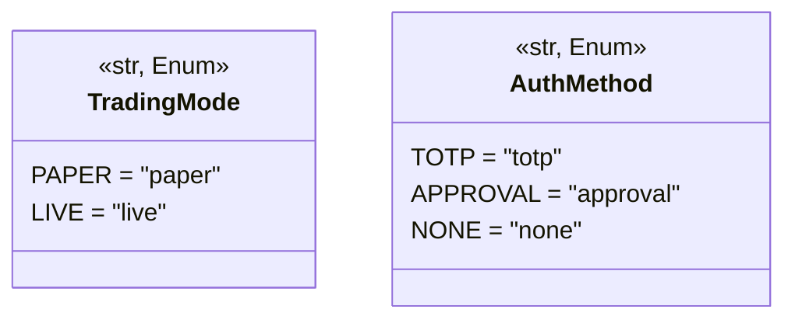
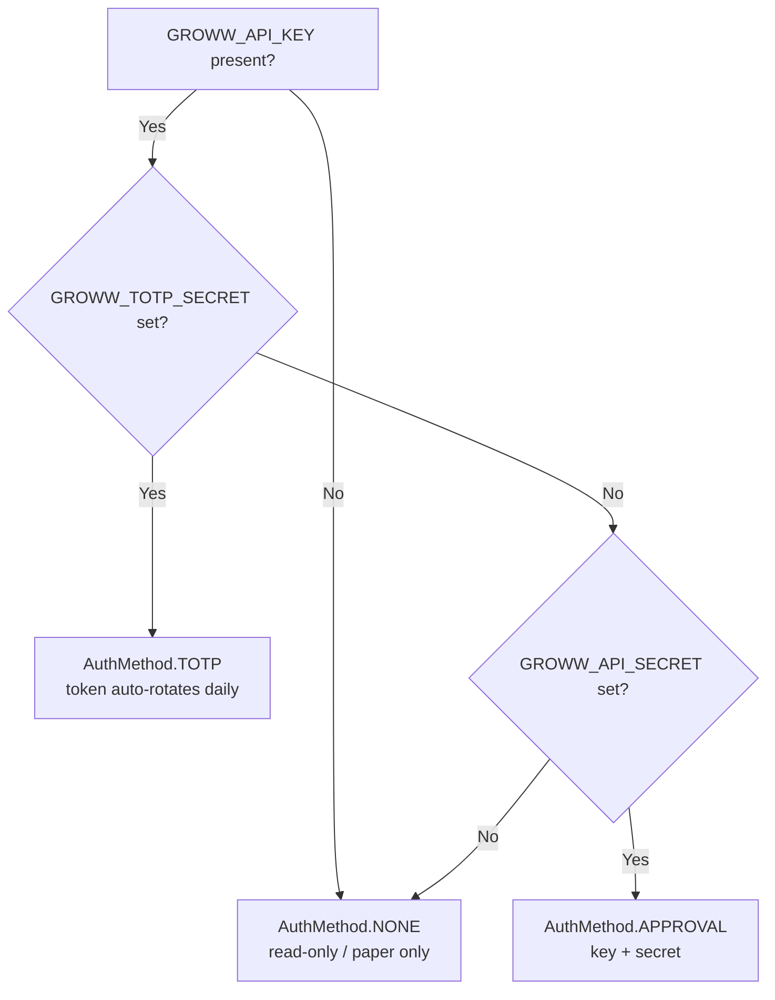

# Configuration Reference

> Part of the **Trinetra Capital AI** documentation set — *Multi-Agents. One Market. Zero Missed Moves.*

## Abstract

This document is the authoritative reference for configuring **Trinetra Capital AI**. The entire runtime is parameterised through a single, immutable configuration object — the `Settings` singleton in `trinetra/config.py` — which is the *only* component that reads the process environment for trading behaviour. Every other module imports `settings` rather than touching `os.environ`, guaranteeing one source of truth and making configuration auditable. This reference documents the configuration philosophy, an exhaustive table of every environment variable (grouped by concern), the derived runtime properties (`is_live`, `auth_method`, `groww_configured`, `use_openrouter`), the `validate_for_live()` pre-flight blockers, the `TradingMode` and `AuthMethod` enums, the two supported Groww authentication flows, annotated `.env` recipes for paper and live operation, the generated/cached files Trinetra writes to disk, and the logging configuration. Every default value cited here is pulled directly from `trinetra/config.py`.

## Contents

1. [Configuration Philosophy](#1-configuration-philosophy)
2. [Parsing Semantics](#2-parsing-semantics)
3. [Environment Variable Reference](#3-environment-variable-reference)
4. [Derived Properties](#4-derived-properties)
5. [Live-Mode Pre-Flight: `validate_for_live()`](#5-live-mode-pre-flight-validate_for_live)
6. [Enums: `TradingMode` and `AuthMethod`](#6-enums-tradingmode-and-authmethod)
7. [Groww Authentication Flows](#7-groww-authentication-flows)
8. [Annotated `.env` Recipes](#8-annotated-env-recipes)
9. [Generated and Cached Files](#9-generated-and-cached-files)
10. [Logging Configuration](#10-logging-configuration)

---

## 1. Configuration Philosophy

Trinetra treats configuration as a **single source of truth**. The frozen dataclass `Settings` is instantiated exactly once at import time as the module-level `settings` singleton (`trinetra/config.py`):

```python
settings = Settings()
```

Three design principles govern the configuration layer:

- **One reader of the environment.** The module docstring states the rule explicitly: *"Nothing else in the codebase should read `os.environ` for trading behaviour — import `settings` instead so there is a single source of truth."* This keeps every tunable in one place, makes the configuration trivially auditable, and prevents a stray `os.getenv` from silently changing trading behaviour somewhere deep in the agent stack.
- **Immutability.** `Settings` is declared `@dataclass(frozen=True)`. Once the process starts, configuration cannot be mutated by application code, eliminating a class of bugs where one code path changes a setting another path depends on.
- **Eager, explicit loading.** At import, `config.py` resolves the project root (`Path(__file__).resolve().parent.parent`) and calls `load_dotenv(PROJECT_ROOT / ".env")`, so the `.env` file is found regardless of the current working directory from which the process is launched. Every field is populated through a `field(default_factory=...)` lambda that reads its environment variable and falls back to a hard-coded default.

The result is that a reviewer can read `config.py` top to bottom and know the complete set of knobs that influence the system, along with their defaults and types — there is no hidden configuration scattered across modules.

## 2. Parsing Semantics

All environment reads route through three small helpers in `config.py`, which makes parsing uniform and tolerant of hand-edited `.env` files:

| Helper | Purpose | Behaviour |
| --- | --- | --- |
| `_get(name, default)` | String reads | Returns `os.getenv(name, default)`; if non-`None`, strips surrounding whitespace **and** stray single/double quotes (`.strip().strip('"').strip("'").strip()`). This forgives entries like `KEY = "value"`. |
| `_get_bool(name, default)` | Boolean reads | `True` only when the (lower-cased) value is one of `"1"`, `"true"`, `"yes"`, `"on"`; otherwise the supplied default (when unset) or `False`. |
| `_get_float(name, default)` | Numeric reads | Parses `float(val)`; an empty/missing value **or** a `ValueError` falls back silently to the default. |

Several string fields additionally normalise case at construction: `default_product` and `default_exchange` are upper-cased, `trading_mode` and `log_level` are lower-/upper-cased respectively before use. This means `GROWW_DEFAULT_EXCHANGE=nse` and `GROWW_TRADING_MODE=PAPER` behave correctly.

## 3. Environment Variable Reference

Every environment variable Trinetra consults is listed below, grouped by concern. "Required?" reflects what is needed for the corresponding subsystem to function; the core agents require an LLM provider, and live trading additionally requires Groww credentials. Defaults are taken verbatim from `trinetra/config.py`.

### LLM (agents + supervisor)

| Variable | Required? | Type | Default | Effect |
| --- | --- | --- | --- | --- |
| `NVIDIA_API_KEY` | Yes (for agents, unless OpenRouter is used) | string | `None` | Credential for the NVIDIA NIM endpoint (`ChatNVIDIA`) that powers the specialist agents. Stored as `nvidia_api_key`. |
| `TRINETRA_AGENT_MODEL` | No | string | `meta/llama-3.3-70b-instruct` | Overrides the worker/agent model id (`agent_model`). |
| `GROQ_API_KEY` | No (recommended) | string | `None` | Credential for the Groq endpoint (`ChatGroq`) used by the supervisor for fast routing. Stored as `groq_api_key`. |
| `TRINETRA_SUPERVISOR_MODEL` | No | string | `meta/llama-3.3-70b-instruct` | Overrides the supervisor model id (`supervisor_model`). |
| `TRINETRA_GROQ_SUPERVISOR` | No | bool | `true` | When `true`, routes via Groq for low latency; when `false`, the supervisor falls back to the agent (NVIDIA) model. Stored as `use_groq_supervisor`. |

### OpenRouter (optional override)

| Variable | Required? | Type | Default | Effect |
| --- | --- | --- | --- | --- |
| `OPENROUTER_API_KEY` | No | string | `None` | When set (and the toggle is on), OpenRouter (an OpenAI-compatible endpoint) powers **both** the supervisor and the agents, overriding NVIDIA/Groq. Stored as `openrouter_api_key`. |
| `OPENROUTER_MODEL` | No | string | `openai/gpt-4o-mini` | OpenRouter model id (`openrouter_model`). |
| `OPENROUTER_BASE_URL` | No | string | `https://openrouter.ai/api/v1` | OpenRouter API base URL (`openrouter_base_url`). |
| `TRINETRA_USE_OPENROUTER` | No | bool | `true` | Master toggle for the OpenRouter override (`use_openrouter_flag`). The override is active only when this is `true` **and** `OPENROUTER_API_KEY` is set. |

### Groww authentication

| Variable | Required? | Type | Default | Effect |
| --- | --- | --- | --- | --- |
| `GROWW_API_KEY` | For Groww access | string | `None` | Groww API key / TOTP token. Required by both auth flows. Stored as `groww_api_key`. |
| `GROWW_TOTP_SECRET` | One of the two | string | `None` | TOTP secret seed; presence (with `GROWW_API_KEY`) selects the **TOTP flow**. Stored as `groww_totp_secret`. |
| `GROWW_API_SECRET` | One of the two | string | `None` | API secret; presence (with `GROWW_API_KEY`, and no TOTP secret) selects the **approval flow**. Stored as `groww_api_secret`. |

### Trading behaviour / safety

| Variable | Required? | Type | Default | Effect |
| --- | --- | --- | --- | --- |
| `GROWW_TRADING_MODE` | No | enum (`paper`/`live`) | `paper` | Selects simulated (`paper`) versus real-money (`live`) order routing. Parsed into `TradingMode`. |
| `GROWW_DEFAULT_PRODUCT` | No | string (`CNC`/`MIS`) | `CNC` | Default product type — `CNC` (delivery) or `MIS` (intraday). Upper-cased. Stored as `default_product`. |
| `GROWW_DEFAULT_EXCHANGE` | No | string (`NSE`/`BSE`) | `NSE` | Default exchange. Upper-cased. Stored as `default_exchange`. |
| `GROWW_MAX_ORDER_VALUE` | No | float | `100000.0` | Hard per-order rupee ceiling enforced before **any** order (paper or live). Stored as `max_order_value`. |
| `GROWW_REQUIRE_CONFIRMATION` | No | bool | `true` | Whether market-order confirmation is required. Stored as `require_market_confirmation`. |
| `TRINETRA_PAPER_CASH` | No | float | `1000000.0` | Virtual starting cash for paper mode. Stored as `paper_starting_cash`. |

### Files

| Variable | Required? | Type | Default | Effect |
| --- | --- | --- | --- | --- |
| `TRINETRA_PORTFOLIO_FILE` | No | string (filename) | `portfolio.json` | Filename (resolved under the project root) for the paper-mode trade log. Stored as `portfolio_file`. |

> Note: the token cache path (`token_cache_file`) is **fixed** at `<project root>/.groww_token_cache.json` and is not environment-configurable — it is a hard-coded `field(default_factory=lambda: PROJECT_ROOT / ".groww_token_cache.json")` in `config.py`.

### Logging

| Variable | Required? | Type | Default | Effect |
| --- | --- | --- | --- | --- |
| `TRINETRA_LOG_LEVEL` | No | string | `INFO` | Root log level for the `trinetra` logger namespace. Upper-cased; resolved via `getattr(logging, level, INFO)`. Stored as `log_level`. |

### Observability (LangSmith — optional)

These are consumed by LangChain/LangSmith directly, not by `Settings`, and are listed in `.env.example` for convenience:

| Variable | Required? | Type | Default | Effect |
| --- | --- | --- | --- | --- |
| `LANGCHAIN_API_KEY` | No | string | — | LangSmith API key for tracing. |
| `LANGCHAIN_TRACING_V2` | No | bool | — | Enables LangSmith tracing when `true`. |
| `LANGCHAIN_PROJECT` | No | string | — | LangSmith project name (e.g. `trinetra-capital-ai`). |

## 4. Derived Properties

`Settings` exposes four computed properties that the rest of the system uses instead of re-deriving logic from raw fields:

| Property | Definition | Meaning |
| --- | --- | --- |
| `is_live` | `trading_mode is TradingMode.LIVE` | `True` only when live trading is active. Drives the broker factory (`get_broker()`) and the CLI's "I UNDERSTAND" gate. |
| `use_openrouter` | `bool(openrouter_api_key) and use_openrouter_flag` | `True` only when an OpenRouter key is present **and** the toggle is on; selects the OpenRouter LLM path for both supervisor and agents. |
| `auth_method` | TOTP if `groww_api_key` + `groww_totp_secret`; else APPROVAL if `groww_api_key` + `groww_api_secret`; else NONE | Resolves which Groww authentication flow is in effect. TOTP takes precedence when both secrets are present. |
| `groww_configured` | `auth_method is not AuthMethod.NONE` | `True` when there are enough credentials to authenticate with Groww. |

The precedence in `auth_method` matters: if a user supplies *both* `GROWW_TOTP_SECRET` and `GROWW_API_SECRET`, the **TOTP flow wins**.

## 5. Live-Mode Pre-Flight: `validate_for_live()`

Before live trading can be trusted, `Settings.validate_for_live()` returns a list of human-readable blockers; an empty list means "good to go." It checks three conditions:

| Blocker condition | Message (abridged) |
| --- | --- |
| `not groww_configured` | *"No Groww credentials found. Set `GROWW_API_KEY` plus either `GROWW_TOTP_SECRET` (TOTP flow) or `GROWW_API_SECRET` (approval flow)."* |
| `default_product` not in `("CNC", "MIS")` | *"`GROWW_DEFAULT_PRODUCT=<value>` is not supported in v1 (use CNC for delivery or MIS for intraday)."* |
| `max_order_value <= 0` | *"`GROWW_MAX_ORDER_VALUE` must be a positive number."* |

This is a defence-in-depth check that complements the runtime safety controls documented in [Safety, Risk Management & Security](06-safety-risk-and-security.md): the per-order rupee cap is meaningless if it is zero or negative, and an unsupported product type would be silently rejected by the broker — so these are caught up front.

## 6. Enums: `TradingMode` and `AuthMethod`

Both enums subclass `str`, so their members compare equal to and serialise as their string values.



- **`TradingMode`** — `PAPER` ("simulated fills logged to `portfolio.json`, no real money") and `LIVE` ("orders are sent to the real Groww account"). The default is `PAPER`; a deliberate `GROWW_TRADING_MODE=live` is the only way to reach `LIVE`.
- **`AuthMethod`** — `TOTP` (`GROWW_API_KEY` + `GROWW_TOTP_SECRET`), `APPROVAL` (`GROWW_API_KEY` + `GROWW_API_SECRET`), and `NONE` (no Groww credentials). This is computed by the `auth_method` property rather than read directly from the environment.

## 7. Groww Authentication Flows

Trinetra supports two mutually compatible ways to authenticate with Groww. The choice is implicit — it is inferred from which secrets you provide, via the `auth_method` property.



- **Flow A — TOTP (recommended).** Set `GROWW_API_KEY` (the TOTP token/key) and `GROWW_TOTP_SECRET`. The session layer derives a time-based one-time password (via `pyotp`) so the access token auto-rotates daily without manual re-approval.
- **Flow B — Approval.** Set `GROWW_API_KEY` and `GROWW_API_SECRET`. Used when TOTP is not configured.

When `auth_method` is `NONE`, Trinetra still runs: research and sentiment fall back to the `yfinance` data path, and trading is confined to paper mode. Live trading requires one of the two flows (enforced by `validate_for_live()`).

## 8. Annotated `.env` Recipes

The repository ships a `.env.example` template; copy it to `.env` and fill in your values. **Never commit your real `.env`.**

### Minimal paper-mode setup

This is the safest possible configuration: an LLM provider so the agents can think, and nothing else. Paper mode is the default, so no Groww credentials are required.

```dotenv
# LLM (agents) — REQUIRED
NVIDIA_API_KEY=your_nvidia_api_key_here

# Supervisor routing (recommended for low latency)
GROQ_API_KEY=your_groq_api_key_here

# Trading mode defaults to paper, so this line is optional but explicit:
GROWW_TRADING_MODE=paper
```

With this `.env`, `is_live` is `False`, `groww_configured` is `False`, and Trinetra serves market data and sentiment from the `yfinance` fallback while logging simulated fills to `portfolio.json`.

### Full live-mode setup

This configuration places **real-money orders**. It supplies Groww credentials (TOTP flow), flips the mode to `live`, and tightens the safety cap. Read [Safety, Risk Management & Security](06-safety-risk-and-security.md) before using this.

```dotenv
# LLM (agents) — REQUIRED
NVIDIA_API_KEY=your_nvidia_api_key_here
GROQ_API_KEY=your_groq_api_key_here

# Groww broker — TOTP flow (token auto-rotates daily)
GROWW_API_KEY=your_totp_token_or_api_key
GROWW_TOTP_SECRET=your_totp_secret

# Trading safety — LIVE places REAL orders on Groww
GROWW_TRADING_MODE=live
GROWW_MAX_ORDER_VALUE=25000        # hard per-order rupee ceiling (paper or live)
GROWW_DEFAULT_PRODUCT=CNC          # CNC (delivery) or MIS (intraday)
GROWW_DEFAULT_EXCHANGE=NSE         # NSE or BSE

# Logging
TRINETRA_LOG_LEVEL=INFO
```

In live mode the CLI additionally requires the operator to type exactly `I UNDERSTAND` before the session begins; `validate_for_live()` must also return an empty list of blockers.

### Optional: OpenRouter override

To route both supervisor and agents through OpenRouter (overriding NVIDIA/Groq), add:

```dotenv
OPENROUTER_API_KEY=your_openrouter_key
# OPENROUTER_MODEL=openai/gpt-4o-mini          # default
# OPENROUTER_BASE_URL=https://openrouter.ai/api/v1  # default
# TRINETRA_USE_OPENROUTER=true                 # default; set false to disable
```

## 9. Generated and Cached Files

Trinetra writes three files to the project root during normal operation. None of them should be committed to version control.

| File | Producer | Purpose | Configurable via |
| --- | --- | --- | --- |
| `portfolio.json` | `PaperBroker` (`trinetra/broker/paper_broker.py`) | Flat, persistent trade log for paper mode; holdings, positions, and funds are derived by aggregating it. | `TRINETRA_PORTFOLIO_FILE` (filename, resolved under project root) |
| `.groww_token_cache.json` | `groww_client.py` | Daily access-token cache keyed by date + auth method; written `chmod 600` (best-effort) so the token is not world-readable. | Not configurable (fixed path) |
| `.groww_instruments.csv` | `trinetra/instruments.py` | Cached copy of the public Groww instrument master CSV; refreshed daily (`MAX_AGE` 86400 s), with stale-cache fallback if the download fails. | Not configurable (fixed path) |

The `portfolio_file` and `token_cache_file` fields are typed as `Path` and resolved relative to `PROJECT_ROOT`, so they live alongside the codebase regardless of the launch directory.

## 10. Logging Configuration

Logging is centralised in `trinetra/logging_setup.py`. It is deliberately dependency-free and configures the root handler exactly once via a module-level `_CONFIGURED` guard, so repeated `get_logger()` calls are idempotent.

Key characteristics:

- **Stream:** a single `logging.StreamHandler(sys.stderr)` — log output goes to **stderr**, keeping it separate from any structured output on stdout.
- **Format:** `"%(asctime)s | %(levelname)-7s | %(name)s | %(message)s"` with `datefmt="%H:%M:%S"`, producing aligned, audit-friendly lines such as `14:03:11 | INFO    | trinetra.cli | ...`.
- **Level:** taken from `settings.log_level` via `getattr(logging, settings.log_level, logging.INFO)`, so an unrecognised level falls back safely to `INFO`.
- **Namespace isolation:** the root logger is `logging.getLogger("trinetra")` with `propagate = False`, and `get_logger(name)` returns `logging.getLogger(f"trinetra.{name.split('.')[-1]}")`. Namespacing everything under `trinetra` keeps noisy third-party libraries from inheriting this handler.

The module docstring states the operating principle: *"Trade-relevant events should be logged at INFO so there is always an audit trail of what the agents did."* The default level is therefore `INFO`, ensuring order placements, approvals, and broker calls are recorded out of the box.

---

[← Safety, Risk Management & Security](06-safety-risk-and-security.md)  |  [↑ Documentation Index](README.md)  |  [Installation & Deployment →](08-installation-and-deployment.md)
