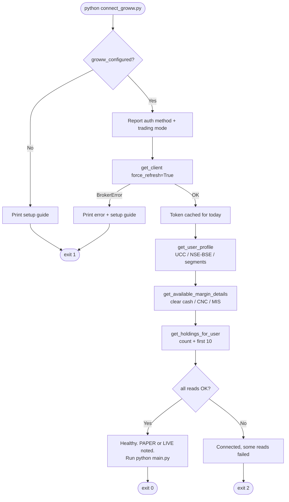

# Installation & Deployment

> 🔱 **Trinetra Capital AI** — operator guide for getting the system running locally, in Docker, and connected to a live Groww account.

This guide takes you from a clean machine to an interactive, multi-agent trading session. It covers prerequisites, a local virtual-environment install, configuring the environment file, the read-only Groww onboarding flow (`connect_groww.py`), the first interactive run via `main.py`, containerised deployment with Docker Compose, and a troubleshooting reference grounded in the actual failure paths in the code. Throughout, the guiding principle is the project's safety model: **the system starts in paper mode by default, and a single environment variable — `GROWW_TRADING_MODE` — is the only thing that flips it to real-money orders.** Nothing in the onboarding flow places an order.

## Table of Contents

1. [Prerequisites](#1-prerequisites)
2. [Local installation](#2-local-installation)
3. [Dependency overview](#3-dependency-overview)
4. [Configuring `.env`](#4-configuring-env)
5. [Obtaining Groww API credentials](#5-obtaining-groww-api-credentials)
6. [Groww onboarding & health check (`connect_groww.py`)](#6-groww-onboarding--health-check-connect_growwpy)
7. [First run (`python main.py`)](#7-first-run-python-mainpy)
8. [The legacy entrypoint](#8-the-legacy-entrypoint)
9. [Docker & Docker Compose](#9-docker--docker-compose)
10. [Troubleshooting](#10-troubleshooting)

---

## 1. Prerequisites

| Requirement | Detail |
|---|---|
| **Python 3.12** | The container image is pinned to `python:3.12-slim` (see `Dockerfile`). Use a matching local interpreter to avoid dependency-resolution surprises. |
| **pip / venv** | Standard library `venv` is sufficient; no Poetry/Conda is assumed by the repo. |
| **An LLM API key** | At least one model provider must be configured. The agents default to NVIDIA NIM (`NVIDIA_API_KEY`), with Groq (`GROQ_API_KEY`) recommended for fast supervisor routing. An optional OpenRouter key can override both. See [Configuration Reference](07-configuration-reference.md). |
| **A Groww account + API credentials** | *Optional for research/paper use.* Required only to read your real portfolio or place live orders. The system runs without Groww keys — research and sentiment fall back to `yfinance`, and orders are paper-traded. |
| **Internet access** | The instrument master, market data, and news headlines are fetched over HTTP at runtime. |
| **(Optional) Docker** | For containerised deployment via the provided `Dockerfile` and `docker-compose.yml`. |

You do **not** need Groww credentials to evaluate the system. Without them, `get_broker()` returns the `PaperBroker`, market data is served from `yfinance`, and the full multi-agent loop is exercisable end to end.

## 2. Local installation

Clone the repository, create an isolated virtual environment, and install the dependencies:

```bash
git clone <your-fork-or-repo-url> "Trinetra-Capital-AI"
cd "Trinetra-Capital-AI"

# Create and activate a virtual environment
python -m venv .venv

# Linux / macOS
source .venv/bin/activate
# Windows (PowerShell)
.venv\Scripts\Activate.ps1

# Install all dependencies (broker SDK, LLM clients, market data, analytics)
pip install -r requirements.txt
```

`requirements.txt` is intentionally un-pinned beyond the one hard floor that matters for the broker integration, `growwapi>=1.5.0`. For reproducible deployments you may pin exact versions in a fork; the Docker image installs the same file with `--no-cache-dir`.

## 3. Dependency overview

The dependencies declared in `requirements.txt`, grouped by purpose:

| Group | Packages | Role in Trinetra |
|---|---|---|
| **Agent framework** | `langchain`, `langchain-core`, `langgraph`, `langgraph-supervisor` | The graph runtime, agent construction (`create_agent`), and the hierarchical `create_supervisor` pattern that routes each request to one specialist. |
| **LLM providers** | `langchain-nvidia-ai-endpoints`, `langchain-groq`, `langchain-ollama` | Provider clients. `ChatNVIDIA` powers the worker agents by default; `ChatGroq` powers the fast supervisor; `langchain-ollama` is available for local-model experimentation. An OpenRouter (OpenAI-compatible) override can replace both when configured. |
| **Groww broker** | `growwapi>=1.5.0`, `pyotp` | The live trading SDK and the TOTP generator used by the TOTP auth flow. |
| **Market data** | `yfinance` | Fallback quote/fundamentals/history source so research and sentiment work even before a broker is connected. |
| **Technical & sentiment analysis** | `numpy`, `pandas`, `requests`, `beautifulsoup4`, `textblob` | Indicator math (RSI/MACD/Bollinger/ATR), Yahoo Finance headline scraping, and polarity scoring. |
| **Config** | `python-dotenv` | Loads `.env` into the process so `trinetra/config.py` can build its frozen `Settings` singleton. |

> **Note on the LLM layer:** the model layer is *pluggable / provider-configurable*. The README tech table names an NVIDIA `nemotron-3-super-120b` model, but `trinetra/config.py` defaults both `agent_model` and `supervisor_model` to `meta/llama-3.3-70b-instruct`, with an OpenRouter default of `openai/gpt-4o-mini`. Treat the provider/model as configuration, not a hard requirement — see [Configuration Reference](07-configuration-reference.md).

## 4. Configuring `.env`

Configuration is read once at import time by `trinetra/config.py`, which calls `load_dotenv(PROJECT_ROOT / ".env")` and assembles a frozen `Settings` singleton. Nothing else in the codebase reads `os.environ` directly for trading behaviour — `settings` is the single source of truth.

Copy the annotated template and edit it:

```bash
cp .env.example .env
```

At minimum, set an LLM key. The annotated `.env.example` covers the LLM, Groww, and safety variables you will use most:

```env
# LLM (agents) — at least one provider key
NVIDIA_API_KEY=your_nvidia_api_key_here
GROQ_API_KEY=your_groq_api_key_here        # fast supervisor routing (recommended)

# Groww broker (optional — omit to stay fully paper/yfinance)
GROWW_API_KEY=your_totp_token_or_api_key
GROWW_TOTP_SECRET=your_totp_secret         # TOTP flow

# Trading safety
GROWW_TRADING_MODE=paper                   # paper (default) | live
GROWW_MAX_ORDER_VALUE=100000               # hard per-order rupee ceiling
GROWW_DEFAULT_PRODUCT=CNC                   # CNC delivery | MIS intraday
GROWW_DEFAULT_EXCHANGE=NSE                  # NSE | BSE
TRINETRA_PAPER_CASH=1000000                 # virtual cash in paper mode
```

The `_get()` helper trims stray surrounding whitespace and quotes, so `KEY = "value"` parses correctly. For the full annotated variable catalogue — including the OpenRouter override (`OPENROUTER_API_KEY`, `OPENROUTER_MODEL`, `OPENROUTER_BASE_URL`, `TRINETRA_USE_OPENROUTER`) and the optional LangSmith tracing variables — see the [Configuration Reference](07-configuration-reference.md).

> **Documentation note:** the OpenRouter variables are honoured by `config.py` but are **not** listed in the shipped `.env.example`. If you want OpenRouter to drive the models, add `OPENROUTER_API_KEY` to your `.env` manually. When set (and `TRINETRA_USE_OPENROUTER` is true, the default), OpenRouter powers both the supervisor and the agents.

Never commit your real `.env` — it holds broker and LLM secrets.

## 5. Obtaining Groww API credentials

Groww credentials are only needed to read your real account or place live orders. There are two mutually exclusive flows, both selected automatically by `settings.auth_method` based on which variables you set:

1. Open <https://groww.in/trade-api/docs> and log in to your Groww account.
2. Go to the **Groww Cloud / API Keys** page and click **Generate API Key**.
3. Pick one flow:

   **A) TOTP flow (recommended — the daily access token auto-rotates):**
   ```env
   GROWW_API_KEY=your_totp_token
   GROWW_TOTP_SECRET=your_totp_secret
   ```
   Internally, `generate_access_token()` derives a one-time code with `pyotp.TOTP(GROWW_TOTP_SECRET)` and exchanges it (with `GROWW_API_KEY`) for a daily access token. `settings.auth_method` resolves to `TOTP` whenever both `GROWW_API_KEY` and `GROWW_TOTP_SECRET` are present.

   **B) Approval flow (API key + secret):**
   ```env
   GROWW_API_KEY=your_api_key
   GROWW_API_SECRET=your_api_secret
   ```
   `auth_method` resolves to `APPROVAL` when `GROWW_API_KEY` and `GROWW_API_SECRET` are present (and no TOTP secret is set).

If neither pairing is complete, `auth_method` is `NONE`, `settings.groww_configured` is `False`, and the system stays on the paper broker with `yfinance` data.

## 6. Groww onboarding & health check (`connect_groww.py`)

`connect_groww.py` is the one-stop setup and connection verifier. **It is strictly read-only and places no orders** — safe to run anytime to confirm the link is healthy. It authenticates, caches a daily access token, and reads back your profile, funds, and holdings.

```bash
python connect_groww.py
```

Step by step, the script:

1. Checks `settings.groww_configured`. If no credentials are found, it prints the embedded setup guide (the same credential instructions as above) and exits with code `1`.
2. Reports the detected auth method (`TOTP` or `API key + secret`) and the current trading mode.
3. Forces a fresh authentication via `groww_client.get_client(force_refresh=True)`. The SDK is imported lazily inside `try`, so a missing `growwapi` package surfaces as a clean `BrokerError` rather than a traceback. On success it confirms the token is cached for today.
4. Reads and prints a **read-only health check** of three account sections, each guarded independently so one failure does not abort the others:
   - **Account** — `get_user_profile()`: UCC, NSE/BSE enabled flags, active segments.
   - **Funds** — `get_available_margin_details()`: clear cash, CNC- and MIS-available balances.
   - **Holdings** — `get_holdings_for_user()`: instrument count and the first ten holdings (symbol, quantity, average price).
5. Prints a final verdict. If all reads succeeded it reports the connection is healthy, states whether you are in PAPER or LIVE mode, and points you to `python main.py`. Exit codes: `0` healthy, `2` connected but some reads failed, `1` not configured / auth failed.



Authentication artefacts: the daily access token is cached to `.groww_token_cache.json`, keyed by date and auth method (with a best-effort `chmod 600`), so subsequent runs reuse it until the day rolls over.

## 7. First run (`python main.py`)

`main.py` is a thin entrypoint that calls `trinetra.cli.run()`:

```bash
python main.py
```

On startup the CLI prints a **banner** summarising the operating context: the trading mode (PAPER or LIVE), the Groww connection status and auth method, the per-order safety cap (`max_order_value`), and the default product. It then warms the Groww instrument master so symbol resolution is ready before the first request.

In **LIVE** mode there is an explicit safety gate: the user must type exactly `I UNDERSTAND` before the session starts. This is the human acknowledgement that agent-initiated orders will use real money.

Once running, each turn reads your input, builds an invocation config with a fresh `uuid4` thread id and `recursion_limit=40`, and invokes the supervisor, which routes the request to exactly one specialist (research, sentiment, or trading). For any `place_order` / `cancel_order` / `modify_order`, the trading agent's human-in-the-loop middleware raises an interrupt; the CLI prints the pending tool and an order summary (resolved symbol, approximate price, estimated total, and a warning if it exceeds the cap), then asks yes/no before resuming.

> **Current limitation (honest disclosure):** conversation state uses LangGraph's `InMemorySaver`, and the CLI assigns a **new** `thread_id` per turn — so there is no long-term, cross-turn memory yet. Each request is effectively self-contained. Persistent memory via `PostgresSaver` is on the roadmap. For interaction patterns, see the [Usage Guide](09-usage-guide.md).

## 8. The legacy entrypoint

`Human_in_Loop/prebuilt_HITL.py` is a legacy compatibility shim retained for older invocation habits. It simply launches the same modern CLI:

```bash
python Human_in_Loop/prebuilt_HITL.py   # legacy path → identical to python main.py
```

Prefer `python main.py`; the legacy path exists only so existing scripts and muscle memory keep working.

## 9. Docker & Docker Compose

The repository ships a minimal `Dockerfile` (based on `python:3.12-slim`) and a `docker-compose.yml` for the interactive service.

**Dockerfile** — sets `WORKDIR /app`, copies `requirements.txt` and installs it with `--no-cache-dir`, copies the project, and defaults to `CMD ["python", "main.py"]`.

**Build the image:**

```bash
docker-compose build
```

**Run the interactive CLI:**

```bash
docker-compose run trading-agent      # runs python main.py inside the container
```

The `trading-agent` service is configured so the interactive loop works correctly:

| Compose setting | Purpose |
|---|---|
| `build: .` | Builds from the local `Dockerfile`. |
| `env_file: - .env` | Injects your `.env` (LLM keys, Groww creds, trading mode, safety caps) into the container environment. |
| `volumes: - ./portfolio.json:/app/portfolio.json` | Bind-mounts the paper-trading ledger so simulated trades persist across container runs on the host. |
| `stdin_open: true` + `tty: true` | Keep STDIN open and allocate a TTY so the human-in-the-loop yes/no prompts and the `I UNDERSTAND` gate function interactively. |

> **Tip:** `portfolio.json` must exist on the host before the bind mount works as a file (an empty `portfolio.json`, or one created by a prior paper run, is fine). If Docker creates it as a directory, remove that directory and create an empty file first. In LIVE mode this volume is unused for order state, since live orders and portfolio come from Groww — but mounting it is harmless.

Because secrets and trading mode are injected from `.env`, the same image runs paper or live depending solely on the host `.env`. Keep `GROWW_TRADING_MODE=paper` in any shared or CI environment.

## 10. Troubleshooting

| Symptom | Cause & resolution |
|---|---|
| **Agents fail / no LLM** | No usable model provider is configured. Set `NVIDIA_API_KEY` (default agent provider) and ideally `GROQ_API_KEY` for the supervisor. Alternatively configure the OpenRouter override (`OPENROUTER_API_KEY`). The model layer is pluggable — see [Configuration Reference](07-configuration-reference.md). |
| **`growwapi` not installed / `BrokerError` on connect** | The Groww SDK is imported lazily; a missing package surfaces as a clean `BrokerError` from `connect_groww.py`. Reinstall dependencies: `pip install -r requirements.txt` (which pulls `growwapi>=1.5.0`). |
| **Groww authentication fails** | Verify credentials match exactly one flow: TOTP (`GROWW_API_KEY` + `GROWW_TOTP_SECRET`) **or** approval (`GROWW_API_KEY` + `GROWW_API_SECRET`). Re-run `python connect_groww.py`; it forces a fresh token. The broker performs **one** transparent re-auth retry on a `401`/auth error, and `reset_client()` drops the cached token to force a clean re-auth. Stale token? Delete `.groww_token_cache.json`. |
| **No live market data / quotes look like a fallback** | This is by design: market data is Groww-first with a `yfinance` fallback, so research and sentiment work even before a broker is connected. If Groww is unauthenticated or a quote call fails, `get_live_quote()` / `ltp_many()` transparently fall back to `yfinance`. Connect Groww (Section 6) for native live quotes. |
| **Instrument master unavailable** | `trinetra/instruments.py` downloads the public CSV (`https://growwapi-assets.groww.in/instruments/instrument.csv`, no auth) and caches it to `.groww_instruments.csv`, refreshing daily. If the download fails, it falls back to the stale cache; if there is no cache at all, symbol resolution is degraded. Check connectivity, then delete the cache file to force a fresh download. |
| **Order rejected before reaching the broker** | The per-order rupee cap (`Broker.guard_order`, enforced in **both** paper and live) blocks any order whose estimated value exceeds `GROWW_MAX_ORDER_VALUE`. Symbol resolution can also reject an unknown ticker (with suggestions) or a non-`buy_allowed` instrument. Adjust the cap or the symbol/quantity. |
| **Stop-loss order rejected in paper mode** | The `PaperBroker` cannot monitor a live trigger, so it rejects `SL`/`SL_M` orders by design. Stop-loss is a LIVE-only capability in v1. |
| **`portfolio.json` not persisting in Docker** | Ensure `portfolio.json` exists as a **file** on the host before `docker-compose run`, so the bind mount in `docker-compose.yml` works (see Section 9). |
| **LIVE mode won't start** | You must type exactly `I UNDERSTAND` at the confirmation gate. Also run `settings.validate_for_live()` logic mentally: missing Groww creds, an unsupported `GROWW_DEFAULT_PRODUCT` (only `CNC`/`MIS`), or a non-positive cap will block live trading. |

---

[← Configuration Reference](07-configuration-reference.md)  |  [↑ Documentation Index](README.md)  |  [Usage Guide & Interaction Catalogue →](09-usage-guide.md)
