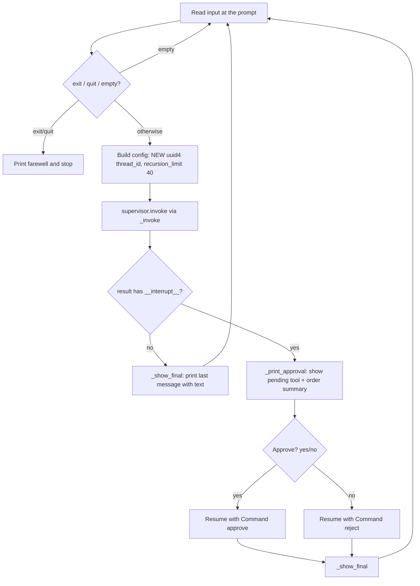
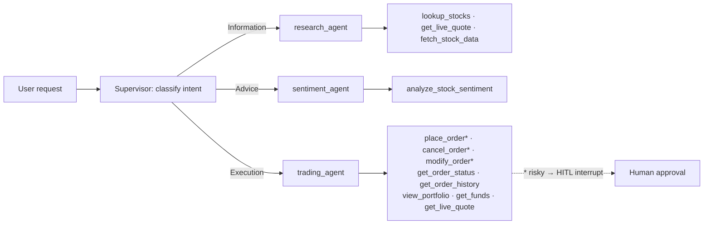
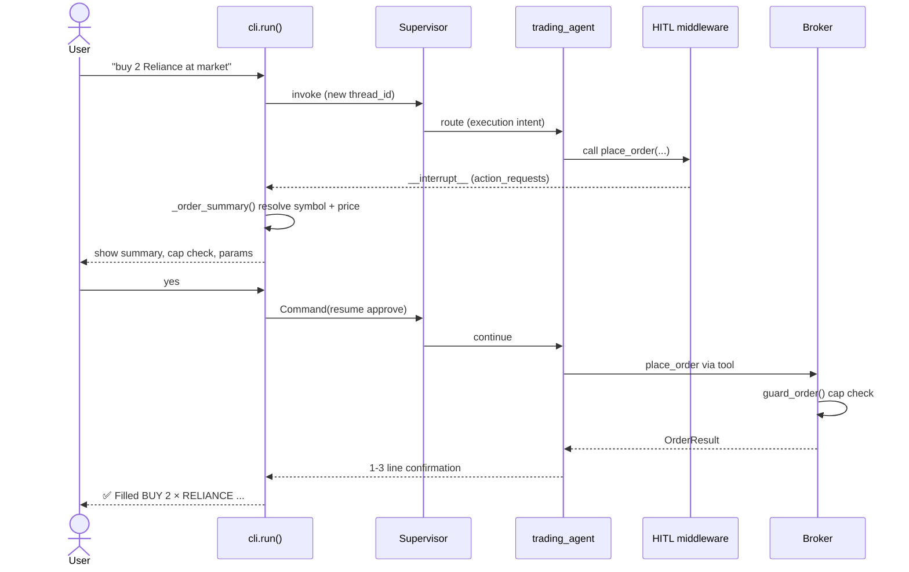

# 🔱 Usage Guide & Interaction Catalogue

This guide is the operator-facing companion to the Trinetra Capital AI documentation set. It explains how to launch the interactive command-line interface, how to read its startup banner, and how the conversational loop turns a plain-English request into an agent action. The bulk of the document is a catalogue of supported interaction patterns  grouped by the three intents the supervisor recognises (information, advice, execution) — with an example prompt, the agent-and-tool path each prompt triggers, and a representative (illustrative) response. It closes with a detailed walkthrough of the order-approval experience, the differences a user will observe between paper and live modes, and a set of practical tips. Every behaviour described here is grounded in `trinetra/cli.py`, `trinetra/agents.py` and `trinetra/tools.py`. All sample prices, P&L figures and order IDs are illustrative placeholders, not live data.

## Table of Contents

1. [Launching the CLI and Reading the Banner](#1-launching-the-cli-and-reading-the-banner)
2. [The Conversational Interaction Loop](#2-the-conversational-interaction-loop)
3. [How Intent Maps to an Agent](#3-how-intent-maps-to-an-agent)
4. [Interaction Catalogue](#4-interaction-catalogue)
   - [4.1 Information Intent](#41-information-intent--research_agent)
   - [4.2 Advice Intent](#42-advice-intent--sentiment_agent)
   - [4.3 Execution Intent](#43-execution-intent--trading_agent)
5. [The Order Approval Experience](#5-the-order-approval-experience)
6. [Paper vs Live: What the User Observes](#6-paper-vs-live-what-the-user-observes)
7. [Tips and Conventions](#7-tips-and-conventions)

---

## 1. Launching the CLI and Reading the Banner

The interactive session is launched from the repository root:

```bash
python main.py
```

`main.py` delegates to `trinetra.cli.run()`. (A legacy entrypoint, `Human_in_Loop/prebuilt_HITL.py`, is a shim that launches the same CLI; see [Installation & Deployment](08-installation-and-deployment.md).)

On startup, `run()` calls `_banner()`, which prints a 64-character ruled box summarising the runtime posture. The banner is assembled entirely from the singleton `settings` object and reports four facts:

| Banner line | Source | Meaning |
|---|---|---|
| `MODE: PAPER` / `MODE: LIVE` | `settings.is_live` | Whether approved orders are simulated or sent to your real Groww account. PAPER renders green, LIVE renders red. |
| `Groww: configured (...)` / `Groww: NOT connected` | `settings.groww_configured`, `settings.auth_method` | Whether broker credentials are present, and the auth method (`TOTP` or `API key + secret`). |
| `Safety cap: ₹...` | `settings.max_order_value` | The hard per-order rupee ceiling enforced for both modes (default ₹100,000). |
| `Default product: ...` | `settings.default_product` | `CNC` (delivery) or `MIS` (intraday) applied when an order does not specify one. |

A representative paper-mode banner (illustrative):

```
================================================================
  🔱  TRINETRA CAPITAL AI  —  Multi-Agent Trading (Groww)
================================================================
  MODE: PAPER — orders are simulated (no real money).
  Groww: configured (TOTP). Market data & portfolio are live.
  Safety cap: ₹100,000 per order  |  Default product: CNC
================================================================
```

If Groww is not connected, the banner instead notes that the system is *"using yfinance data + paper portfolio"* and points you to `python connect_groww.py`. Crucially, research and sentiment still work without a broker, because market data falls back to yfinance.

**The live-mode confirmation gate.** When `settings.is_live` is true, `run()` will not start the session until the user passes `_confirm_live()`. The CLI prints a red `⚠️ LIVE TRADING MODE` warning and requires the user to type the exact string `I UNDERSTAND` (case-sensitive, verbatim). Anything else aborts with a hint to set `GROWW_TRADING_MODE=paper`. This gate is the first of the system's defence-in-depth controls described in [Safety, Risk & Security](06-safety-risk-and-security.md).

**Instrument warm-up.** Before building the agents, the CLI calls `instruments.ensure_loaded()` to warm the Groww instrument master (the authoritative symbol table). It prints `✓ Instruments ready.` on success, or a warning that fallback symbol matching will be used if the download is unavailable. This front-loads the one-time CSV download so the first query is not stalled and symbol resolution is instant.

After warm-up, `build_supervisor()` compiles the agent graph. Any import or construction error is caught and reported as `❌ Failed to start agents: ...` rather than crashing. On success the CLI prints a ready prompt and waits for input.

---

## 2. The Conversational Interaction Loop

Each turn follows a fixed lifecycle implemented in `run()`:



A few details from the code matter to users:

- **The prompt string** is literally `yes sir! what's on your mind:`. Typing `exit` or `quit` (any case) ends the session with `Jai Mahakal! 🔱`; the same farewell prints on `Ctrl+C` / `EOF`. Empty input is ignored and re-prompts.
- **A fresh `thread_id` per turn.** `config` is rebuilt every loop with `thread_id = str(uuid.uuid4())` and `recursion_limit = 40`. This is an intentional, honest limitation: because each turn gets a new LangGraph checkpoint thread, the system does **not** carry conversational memory across turns. Asking *"and what about its P&L?"* without naming the stock will not resolve from the previous turn. Persistent cross-turn memory (via `PostgresSaver`) is on the roadmap, not yet implemented.
- **Recursion recovery.** `_invoke()` wraps `supervisor.invoke()` and catches `GraphRecursionError`. The supervisor can occasionally route back to a worker one extra time after the real work is already done; rather than crashing the turn, `_invoke()` reads the latest graph state and returns it. Because every order is HITL-gated and runs exactly once, this recovery never causes a duplicate order.
- **Final-message selection.** `_show_final()` walks the message list in reverse and prints the last message that actually contains text. The supervisor sometimes hands back an empty terminal message (the specialist already produced the answer), so this guarantees the user sees the specialist's clean, pre-rendered output.

---

## 3. How Intent Maps to an Agent

The supervisor (built in `build_supervisor()`) **never calls tools itself**. It reads the user's intent and routes the request to exactly one specialist, then relays that specialist's answer verbatim — preserving pre-formatted tables and adding no commentary. Routing follows a strict priority order defined in the supervisor prompt:

| Priority | Intent | Trigger examples | Routed to |
|---|---|---|---|
| 1 | **Execution** | buy, sell, modify/cancel an order, portfolio/holdings/P&L, order history, funds/buying power | `trading_agent` |
| 2 | **Advice** | "should I buy X?", "what's your outlook on X?", sentiment / technical analysis | `sentiment_agent` |
| 3 | **Information** | "what's the price of X?", company info, fundamentals, market cap, symbol lookup | `research_agent` |

The execution-first ordering is deliberate: the supervisor prompt instructs that a buy/sell is complete only once `trading_agent` has placed (or attempted) the order, and that it must **not** route a trade to research merely to quote a price first. The trading agent is given its own copy of `get_live_quote` precisely so it can self-serve market and budget orders without a fragile hop to another agent.



The three specialists are configured in `agents.py` as follows:

- **`research_agent`** — tools `lookup_stocks`, `get_live_quote`, `fetch_stock_data`. Prompt forbids inventing prices or symbols; it must call a tool.
- **`sentiment_agent`** — tool `analyze_stock_sentiment`. Prompt mandates calling the tool and formatting the result into a fixed signal block.
- **`trading_agent`** — tools `place_order`, `cancel_order`, `modify_order`, `get_order_status`, `get_order_history`, `view_portfolio`, `get_funds`, plus its own `get_live_quote`. Its risky tools are wrapped by `HumanInTheLoopMiddleware(interrupt_on={place_order, cancel_order, modify_order})`. Its prompt is mode-aware and enforces strict output rules (never invent numbers; show the pre-rendered `display` table verbatim; after an order, reply with only a 1–3 line confirmation).

---

## 4. Interaction Catalogue

Each pattern below lists an example prompt, the agent-and-tool path it triggers, and a representative output. **All numbers, symbols and order IDs in the outputs are illustrative.**

### 4.1 Information Intent → `research_agent`

**Live price of a stock.**
- Prompt: `what's the price of Reliance?`
- Path: supervisor → `research_agent` → `get_live_quote` (Groww live feed, yfinance fallback).
- Illustrative output:
  ```
  RELIANCE (NSE): ₹1,328.80  (+1.67%, +₹21.80)
  Open ₹1,310.00 | High ₹1,332.40 | Low ₹1,308.20 | Prev close ₹1,307.00
  52-week range: ₹1,114.85 – ₹1,608.95
  ```

**Company information / fundamentals.**
- Prompt: `tell me about TCS` or `what's the market cap and P/E of Infosys?`
- Path: supervisor → `research_agent` → `fetch_stock_data` (merges Groww live quote with yfinance fundamentals: company name, sector, industry, market cap, P/E, 52-week range).
- Illustrative output:
  ```
  Tata Consultancy Services (TCS, NSE) — IT Services
  Price ₹3,512.40 (+0.42%) | Market cap ₹12.7L cr | P/E 28.3
  52-week: ₹3,060.10 – ₹4,254.75
  ```

**Symbol lookup.**
- Prompt: `what's the trading symbol for Physics Wallah?`
- Path: supervisor → `research_agent` → `lookup_stocks` (instrument-master search, yfinance fallback).
- Illustrative output: `PHYSICSWALLAH resolves to PWL (NSE) — Physicswallah Ltd.`

### 4.2 Advice Intent → `sentiment_agent`

**Should I buy / outlook / sentiment.**
- Prompts: `should I buy Infosys?` · `what's the outlook for HDFC Bank?` · `what's the sentiment on TCS?`
- Path: supervisor → `sentiment_agent` → `analyze_stock_sentiment`. This computes RSI-14, MACD histogram, Bollinger %B and ATR-14 from ~90 days of history, scrapes up to 10 Yahoo Finance headlines and scores their polarity with TextBlob, then derives a composite 0–100 score with a BUY/SELL/HOLD signal and ATR-based stop-loss and targets (see [Market Data & Quantitative Analytics](05-market-data-and-quant-analytics.md) for the exact formulae).
- Illustrative output (the prompt enforces this format):
  ```
  📊 INFY - BUY (moderate)
  Price: ₹1,842.30 | RSI: 38.4 (oversold-ish) | MACD: bullish crossover
  Sentiment: bullish (0.21, 8 headlines)
  Composite Score: 72/100
  Stop-loss: ₹1,795.10 | Target 1: ₹1,920.50 | Target 2: ₹1,990.80
  Summary: Technicals lean constructive with a positive MACD and a not-stretched
  RSI; recent headlines are mildly positive. A buy bias with disciplined stops.
  ```

The advice intent is analysis only — it never places an order. News sentiment is best-effort headline scraping and should be read as a soft signal, not a guarantee.

### 4.3 Execution Intent → `trading_agent`

All execution prompts route to `trading_agent`. The three risky tools (`place_order`, `cancel_order`, `modify_order`) pause for human approval before they run (see §5). The read-only execution tools (`view_portfolio`, `get_funds`, `get_order_status`, `get_order_history`) run without an approval interrupt.

**Market buy / sell.**
- Prompt: `buy 2 shares of Reliance at market`
- Path: `trading_agent` → `place_order(symbol="Reliance", action="buy", quantity=2, order_type="market")`. The tool resolves the symbol via `instruments.resolve()`, checks `buy_allowed`, fetches a reference LTP for the value cap and paper fill, then calls the broker. **Approval interrupt fires first.**
- Illustrative post-approval confirmation: `✅ Filled BUY 2 × RELIANCE @ ₹1,328.80 (market) — est. ₹2,657.60. Order trn-a1b2c3d4e5f6 (paper).`

**Limit order.**
- Prompt: `buy 5 TCS at limit 3500`
- Path: `place_order(symbol="TCS", action="buy", quantity=5, order_type="limit", price=3500)`. → approval → fill (paper) or live order placement.

**Budget order ("buy ₹X of …").**
- Prompt: `buy ₹10,000 worth of TCS`
- Path: `trading_agent` first calls its own `get_live_quote`, computes `floor(budget / price)`, then calls `place_order` with that quantity. → approval.
- Illustrative reasoning: at ₹3,512.40, `floor(10000 / 3512.40) = 2` shares → `place_order(TCS, buy, 2, market)`.

**Stop-loss (LIVE only).**
- Prompt: `set a stop-loss sell on 5 TCS at trigger 3800`
- Path: `place_order(order_type="sl_m", trigger_price=3800)` (or `sl` with both `price` + `trigger_price`). → approval.
- Note: stop-loss orders are **not simulated in paper mode** — the paper broker rejects `sl`/`sl_m` because it cannot monitor a live trigger. Use a live session for stop-loss orders.

**Modify / cancel a pending order (LIVE).**
- Prompts: `modify order trn-... to quantity 10` · `cancel order trn-...`
- Path: `modify_order(order_id, ...)` / `cancel_order(order_id)`. Both are risky → approval. These are meaningful for pending live orders; paper orders fill instantly, so there is nothing to modify or cancel.

**Portfolio / holdings / P&L.**
- Prompt: `show my portfolio` · `what are my holdings?` · `what's my P&L?`
- Path: `trading_agent` → `view_portfolio` (read-only, no interrupt). The tool aggregates holdings, positions, funds and a summary, and builds a deterministic `display` table via `render.render_portfolio()`. The agent is instructed to print this `display` value exactly as-is.
- Illustrative output:
  ```
  Holdings (PAPER)
  | Symbol   | Qty | Avg    | LTP     | Value     | P&L      |
  |----------|-----|--------|---------|-----------|----------|
  | RELIANCE |   2 | 1,310  | 1,328.8 | 2,657.60  | +37.60   |
  | TCS      |   2 | 3,500  | 3,512.4 | 7,024.80  | +24.80   |
  Invested ₹13,820.00 | Value ₹9,682.40 | Total P&L +₹62.40 | Holdings 2
  ```

**Order history.**
- Prompt: `show my orders today` · `order history`
- Path: `get_order_history(limit=20)` (read-only). Builds an order-book table via `render.render_orders()`.

**Funds / buying power.**
- Prompt: `how much buying power do I have?`
- Path: `get_funds` (read-only). In paper mode this is `paper_starting_cash` minus net invested; in live mode it is the real Groww available margin.
- Illustrative output: `Available funds: ₹9,86,180.00 (paper).`

---

## 5. The Order Approval Experience

Every `place_order`, `cancel_order` and `modify_order` is wrapped by the Human-in-the-Loop middleware. When the trading agent calls one, the graph **interrupts** before the tool runs, and the result returned to the CLI carries an `__interrupt__` payload. The CLI handles this in `_print_approval()` and the approval branch of `run()`.

**What the approval screen shows.** `_print_approval()` prints `--- ⚠️ Approval needed ---`, the tool name, and — for `place_order` specifically — a human-readable order summary built by `_order_summary()`. That summary independently re-resolves the symbol and re-fetches a price so the user sees exactly what they are approving:

| Summary field | Detail |
|---|---|
| Side / quantity / symbol | e.g. `→ BUY 2 × RELIANCE (MARKET, CNC)` |
| Resolved-symbol note | If the input symbol differs from the resolved Groww symbol, e.g. `(resolved 'INFOSYS' → INFY, Infosys Ltd.)` |
| Price + label | `limit` / `trigger` price for limit/SL orders, else `≈ market` from a live LTP fetch |
| Estimated total | `quantity × price` when both are numeric |
| Cap warning | If the estimated total exceeds `settings.max_order_value`, a `⚠️ Exceeds safety cap ... — will be blocked.` line |

After the summary, `_print_approval()` lists the raw tool parameters, and in LIVE mode adds a red `>>> THIS IS A REAL ORDER ON YOUR LIVE GROWW ACCOUNT <<<` banner.

The CLI then asks `⚠️ Approve this action? (yes/no):`. A `yes`/`y` resumes the graph with `Command(resume={"decisions": [{"type": "approve"}]})` and prints `✅ Approved. Executing…`; anything else resumes with a `reject` decision and prints `❌ Rejected.`. After the resume, `_show_final()` prints the trading agent's confirmation line (or, on rejection, the agent's acknowledgement that the order was not placed).

Note that the cap warning shown at approval is advisory — the *enforcement* happens unconditionally inside the broker's `guard_order()` against `settings.max_order_value` for both paper and live, so even an approved over-cap order is blocked at the broker.



---

## 6. Paper vs Live: What the User Observes

| Aspect | PAPER (default) | LIVE |
|---|---|---|
| Banner mode line | Green `MODE: PAPER` | Red `MODE: LIVE` |
| Startup gate | None | Must type `I UNDERSTAND` verbatim |
| Order destination | Simulated fill, logged to `portfolio.json` | Sent to your real Groww account |
| Order fills | Market/limit fill instantly | Subject to real exchange execution |
| Stop-loss (`sl`/`sl_m`) | Rejected (cannot monitor a trigger) | Supported |
| Modify / cancel | Not meaningful (instant fills) | Operate on pending live orders |
| Portfolio / funds | Aggregated from the paper log; funds = `paper_starting_cash` − net invested | Real Groww holdings, positions and margin |
| Approval banner | Standard | Adds the red real-order warning line |
| Per-order cap | Enforced | Enforced |
| Market data (quotes/prices) | Live (Groww or yfinance) | Live (Groww or yfinance) |

The key invariant: **market data is always real in both modes** — only order execution and the portfolio view differ. Switching modes is one line in `.env` (`GROWW_TRADING_MODE`) plus a restart; see [Configuration](07-configuration-reference.md).

---

## 7. Tips and Conventions

- **Symbol resolution is forgiving.** You can name a company informally — "Reliance", "Infosys", "Physics Wallah" — or use `.NS`/`.BO` suffixes. The instrument master resolves these to the correct tradable Groww symbol before any order reaches the broker (`INFOSYS → INFY`, `PHYSICSWALLAH → PWL`). If no tradable symbol is found, `place_order` returns a rejection with up to three suggestions rather than guessing.
- **CNC vs MIS.** The default product is `CNC` (delivery). Say "intraday" to get `MIS`. You can also set the default with `GROWW_DEFAULT_EXCHANGE`/`GROWW_DEFAULT_PRODUCT` in `.env`.
- **No price needed for market orders.** For a market buy/sell, just give the side, quantity and stock — the trading agent fetches the live price itself. Do not pre-quote.
- **Budget orders.** Phrase them as "buy ₹10,000 of X"; the agent converts the rupee budget into a whole-share quantity via `floor(budget / price)`.
- **Read-only is instant.** Portfolio, funds, order status and order history never trigger an approval prompt — only `place_order`, `cancel_order` and `modify_order` do.
- **One question at a time.** Because each turn gets a fresh `thread_id`, name the stock explicitly in every request; the system does not yet remember the previous turn's subject.
- **Exit cleanly.** Type `exit` or `quit` (or press `Ctrl+C`) to end the session.

---

[← Installation & Deployment](08-installation-and-deployment.md)  |  [↑ Documentation Index](README.md)  |  [API & Module Reference →](10-api-reference.md)