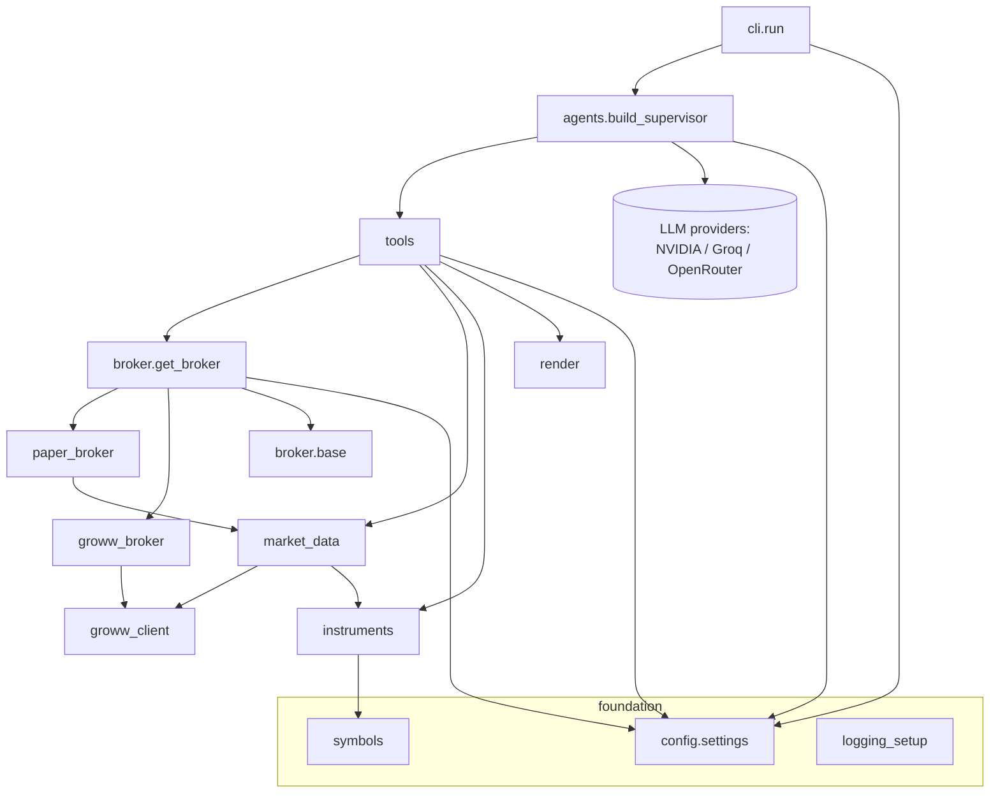

# Trinetra Capital AI — API & Module Reference 🔱

This document is the developer-facing reference for the public surface of the `trinetra` Python package (`__version__ = "1.0.0"`, `trinetra/__init__.py`). It catalogues, module by module, the classes, dataclasses, functions, and constants that make up the codebase, with accurate signatures, default values, return types, and the exceptions each layer raises. Every signature here is transcribed directly from the tracked source; where the README is aspirational (for example its tech table names an NVIDIA `nemotron-3-super-120b` model), this reference follows the code, whose default for both `agent_model` and `supervisor_model` is `"meta/llama-3.3-70b-instruct"` and whose LLM layer is provider-configurable. For conceptual narrative on each subsystem see the sibling documents `02-system-architecture.md`, `03-multi-agent-system.md`, `04-execution-and-broker-layer.md`, `05-market-data-and-quant-analytics.md`, and `06-safety-risk-and-security.md`.

## Table of Contents

1. [Conventions](#1-conventions)
2. [`trinetra.config`](#2-trinetraconfig)
3. [`trinetra.symbols`](#3-trinetrasymbols)
4. [`trinetra.instruments`](#4-trinetrainstruments)
5. [`trinetra.market_data`](#5-trinetramarket_data)
6. [`trinetra.render`](#6-trinetrarender)
7. [`trinetra.logging_setup`](#7-trinetralogging_setup)
8. [`trinetra.broker.base`](#8-trinetrabrokerbase)
9. [`trinetra.broker` (factory)](#9-trinetrabroker-factory)
10. [`trinetra.broker.paper_broker`](#10-trinetrabrokerpaper_broker)
11. [`trinetra.broker.groww_broker`](#11-trinetrabrokergroww_broker)
12. [`trinetra.broker.groww_client`](#12-trinetrabrokergroww_client)
13. [`trinetra.tools`](#13-trinetratools)
14. [`trinetra.agents`](#14-trinetraagents)
15. [`trinetra.cli`](#15-trinetracli)
16. [Module dependency overview](#16-module-dependency-overview)

---

## 1. Conventions

- All money values are in INR. All public tool functions return a **JSON string** (`trinetra.tools`); the layers beneath them return native Python objects (dataclasses, dicts, floats).
- A leading underscore marks a private/module-internal helper. These are documented only where they shape observable behaviour.
- Two custom exception types exist: `ValueError` (raised by `symbols.normalize` on empty input) and `trinetra.broker.base.BrokerError` (every recoverable broker/validation/API failure). The data layer is engineered to never hard-fail: market-data calls catch and degrade to fallbacks rather than raise.
- The package docstring documents the canonical entry points, each imported from its own submodule (e.g. `from trinetra.config import settings`, `from trinetra.broker import get_broker`, `from trinetra.agents import build_supervisor`, `from trinetra.cli import run`). `trinetra/__init__.py` itself only defines `__version__`.

---

## 2. `trinetra.config`

**Purpose.** Single source of truth for every tunable, loaded once from `.env` at import time. Nothing else in the codebase reads `os.environ` for trading behaviour.

### Enums

| Enum | Members (value) |
|:-----|:----------------|
| `TradingMode(str, Enum)` | `PAPER = "paper"`, `LIVE = "live"` |
| `AuthMethod(str, Enum)` | `TOTP = "totp"`, `APPROVAL = "approval"`, `NONE = "none"` |

### Module-level helpers

| Function | Signature | Behaviour |
|:---------|:----------|:----------|
| `_get` | `(name, default=None) -> str \| None` | Reads an env var and strips surrounding whitespace and stray single/double quotes (tolerates hand-edited `.env` lines like `KEY = "value"`). Returns `None` if unset and no default. |
| `_get_bool` | `(name, default=False) -> bool` | True iff the cleaned value lowercases to one of `1`, `true`, `yes`, `on`. |
| `_get_float` | `(name, default) -> float` | Parses to `float`; returns `default` on empty or `ValueError`. |

`PROJECT_ROOT: Path` is the repo root (parent of the package dir); `load_dotenv(PROJECT_ROOT / ".env")` runs at import.

### `Settings` (frozen dataclass)

Each field is populated via a `default_factory` reading the corresponding env var. The complete field set:

| Field | Type | Default (env var) |
|:------|:-----|:------------------|
| `groww_api_key` | `str \| None` | `GROWW_API_KEY` |
| `groww_api_secret` | `str \| None` | `GROWW_API_SECRET` |
| `groww_totp_secret` | `str \| None` | `GROWW_TOTP_SECRET` |
| `trading_mode` | `TradingMode` | `GROWW_TRADING_MODE` → `PAPER` |
| `default_product` | `str` | `GROWW_DEFAULT_PRODUCT` → `"CNC"` (upper-cased) |
| `default_exchange` | `str` | `GROWW_DEFAULT_EXCHANGE` → `"NSE"` (upper-cased) |
| `max_order_value` | `float` | `GROWW_MAX_ORDER_VALUE` → `100_000.0` |
| `require_market_confirmation` | `bool` | `GROWW_REQUIRE_CONFIRMATION` → `True` |
| `nvidia_api_key` | `str \| None` | `NVIDIA_API_KEY` |
| `groq_api_key` | `str \| None` | `GROQ_API_KEY` |
| `agent_model` | `str` | `TRINETRA_AGENT_MODEL` → `"meta/llama-3.3-70b-instruct"` |
| `supervisor_model` | `str` | `TRINETRA_SUPERVISOR_MODEL` → `"meta/llama-3.3-70b-instruct"` |
| `use_groq_supervisor` | `bool` | `TRINETRA_GROQ_SUPERVISOR` → `True` |
| `openrouter_api_key` | `str \| None` | `OPENROUTER_API_KEY` |
| `openrouter_model` | `str` | `OPENROUTER_MODEL` → `"openai/gpt-4o-mini"` |
| `openrouter_base_url` | `str` | `OPENROUTER_BASE_URL` → `"https://openrouter.ai/api/v1"` |
| `use_openrouter_flag` | `bool` | `TRINETRA_USE_OPENROUTER` → `True` |
| `portfolio_file` | `Path` | `PROJECT_ROOT / (TRINETRA_PORTFOLIO_FILE or "portfolio.json")` |
| `token_cache_file` | `Path` | `PROJECT_ROOT / ".groww_token_cache.json"` |
| `paper_starting_cash` | `float` | `TRINETRA_PAPER_CASH` → `1_000_000.0` |
| `log_level` | `str` | `TRINETRA_LOG_LEVEL` → `"INFO"` (upper-cased) |

**Properties**

| Property | Returns | Meaning |
|:---------|:--------|:--------|
| `is_live` | `bool` | `trading_mode is TradingMode.LIVE`. |
| `use_openrouter` | `bool` | `bool(openrouter_api_key) and use_openrouter_flag`. When true, OpenRouter powers **both** supervisor and agents. |
| `auth_method` | `AuthMethod` | `TOTP` if key+TOTP secret; else `APPROVAL` if key+API secret; else `NONE`. |
| `groww_configured` | `bool` | `auth_method is not AuthMethod.NONE`. |

**Methods**

`validate_for_live(self) -> list[str]` — returns a list of human-readable blockers for live trading (empty ⇒ ready). Checks: credentials present (`groww_configured`); `default_product` in `("CNC", "MIS")`; `max_order_value > 0`.

**Singleton.** `settings = Settings()` — import this everywhere; do not instantiate again.

---

## 3. `trinetra.symbols`

**Purpose.** Pure, network-free symbol normalisation between yfinance suffix style and Groww bare-symbol style. Module constants `NSE = "NSE"`, `BSE = "BSE"`.

### `Instrument` (frozen dataclass)

| Member | Type / kind | Description |
|:-------|:------------|:------------|
| `trading_symbol` | `str` field | Bare Groww/NSE symbol, e.g. `"RELIANCE"`. |
| `exchange` | `str` field | `"NSE"` or `"BSE"`. |
| `yf_symbol` | `@property -> str` | Appends `.NS` (NSE) or `.BO` (BSE). |
| `exchange_token` | `@property -> str` | The `"NSE_RELIANCE"` token used by Groww `get_ltp`/`get_ohlc`. |
| `__str__` | `-> str` | `"RELIANCE@NSE"`. |

### Functions

| Function | Signature | Notes |
|:---------|:----------|:------|
| `normalize` | `(symbol, exchange=None) -> Instrument` | Accepts `"RELIANCE"`, `"reliance.ns"`, `"TCS.BO"`, `"NSE_INFY"`, or `("WIPRO","BSE")`. Bare symbols use the explicit `exchange` or `settings.default_exchange`. **Raises `ValueError`** on an empty symbol. |
| `to_groww` | `(symbol, exchange=None) -> tuple[str, str]` | Convenience: `(trading_symbol, exchange)`. |
| `to_yf` | `(symbol, exchange=None) -> str` | Convenience: the yfinance-suffixed symbol. |

---

## 4. `trinetra.instruments`

**Purpose.** Authoritative symbol resolution against the Groww instrument master. Downloads the public CSV `https://growwapi-assets.groww.in/instruments/instrument.csv` (no auth), caches to `.groww_instruments.csv` (`CACHE_FILE`), refreshes daily (`MAX_AGE_SECONDS = 86_400`), and falls back to a stale cache if the download fails. Only `segment == CASH` rows on `NSE`/`BSE` are indexed.

### `InstrumentRecord` (frozen dataclass)

| Field | Type | | Field | Type |
|:------|:-----|--|:------|:-----|
| `trading_symbol` | `str` | | `isin` | `str` |
| `exchange` | `str` | | `lot_size` | `int` |
| `name` | `str` | | `buy_allowed` | `bool` |
| `series` | `str` | | `sell_allowed` | `bool` |

- `instrument` — `@property -> Instrument` (`symbols.Instrument` view).
- `to_dict() -> dict` — `{trading_symbol, exchange, name, isin|None, lot_size, tradable}` where `tradable = buy_allowed and sell_allowed`.

### Functions

| Function | Signature | Returns / behaviour |
|:---------|:----------|:--------------------|
| `ensure_loaded` | `() -> bool` | Builds the index on first call; `True` if any instruments are available. |
| `available` | `() -> bool` | `True` if the index is built and non-empty (does **not** trigger a build). |
| `search` | `(query, limit=8, exchange=None) -> list[InstrumentRecord]` | Ranked matches, best first. Returns `[]` if the master is unavailable. |
| `resolve` | `(query, exchange=None) -> InstrumentRecord \| None` | Single best match (memoised in `_resolve_cache`). |
| `to_instrument` | `(query, exchange=None) -> Instrument` | Drop-in for `symbols.normalize`: consults the master, else falls back to `normalize` (never raises). |

**Ranking model (`search`).** Base scores by match class: exact ticker `1000`; exact normalised name `950`; ticker prefix `780 − len`; name prefix `820 − len`; name substring `680 − len`; token-subset `560 − len`. Bonuses: exchange match `+8`, NSE listing `+6`, series `EQ` `+3`. Penalties: ETF/index hint (`etf`/`bees`/`ietf`) `−200` unless the query itself asks for an ETF; a `−15` tie-break nudge demoting digit-bearing tickers when the query has no digits. Ties broken by shorter ticker then name. `_norm_name` lower-cases and strips `ltd`, `limited`, `the`, `of`, `india` and punctuation before name matching.

---

## 5. `trinetra.market_data`

**Purpose.** Groww-first market data with a yfinance fallback so research/sentiment work even before a broker is connected. A short-lived LTP cache (`_LTP_TTL = 10.0` s, keyed by `exchange_token`) deduplicates calls within a turn. `_finite(x)` returns a float only if real and finite (rejects `NaN`/`inf`), guarding JSON serialisation.

### Public functions

| Function | Signature | Returns |
|:---------|:----------|:--------|
| `try_ltp` | `(symbol) -> float \| None` | Cheapest last-traded-price lookup. Cache → Groww `get_ltp` → yfinance 5-day close. `None` if all fail. |
| `ltp_many` | `(symbols: list[str]) -> dict[str, float]` | Batch LTP keyed by **bare** trading symbol. Groww batches up to 50 tokens/call; remaining symbols fall back to per-symbol `try_ltp`. |
| `get_live_quote` | `(symbol) -> dict[str, Any]` | Real-time quote. Groww `get_quote` → normalized fields (`source`, `symbol`, `exchange`, `last_price`, `day_change`, `day_change_perc`, `open`, `high`, `low`, `prev_close`, `volume`, `week_52_high`, `week_52_low`, `upper_circuit`, `lower_circuit`). On failure `_yf_quote` returns a reduced field set or `{source, symbol, error}`. |
| `fetch_fundamentals` | `(symbol) -> dict[str, Any]` | yfinance `.info`: `company_name`, `sector`, `industry`, `market_cap`, `pe_ratio`, `52w_high`, `52w_low`. Returns `{symbol, error}` on failure (Groww has no fundamentals endpoint). |
| `lookup_symbol` | `(company_name) -> dict[str, Any]` | Authoritative resolution via `instruments.search` (best + up to 4 `alternatives`, `source="groww_instruments"`). Parses `NSE`/`BSE` hints out of the query. Falls back to a yfinance `Search` (`source="yfinance_fallback"`) only when the master is unavailable. |
| `technical_snapshot` | `(symbol) -> dict[str, Any]` | Full technical + news-sentiment snapshot (below). |

**`technical_snapshot` internals.** Pulls 90 days of daily history; requires ≥ 30 clean rows (else `{symbol, error}`). Computes **RSI-14** (Wilder smoothing via `ewm(com=13, min_periods=14)`), **MACD histogram** (EMA12 − EMA26, minus signal EMA9), **Bollinger %B** (SMA20 with 2σ bands), **ATR-14** (`ewm(com=13)` of true range). `price` is the live Groww LTP (`try_ltp`) or the last close. Scrapes up to 10 Yahoo Finance headlines (`_scrape_headlines`, best-effort) scored with `TextBlob` polarity → `sentiment_score` (avg) and `sentiment_label` (`bullish > 0.15`, `bearish < −0.15`, else `neutral`). Composite `score` starts at `50`, then: RSI `+20`(<30)/`+10`(<40)/`−20`(>70)/`−10`(>60); MACD `+15` if histogram `> 0` else `−15`; %B `+10`(<0.2)/`−10`(>0.8); `+ round(avg_sent * 15)`; clamped to `0..100`. `signal` = `BUY` if `score ≥ 65`, `SELL` if `≤ 35`, else `HOLD`; `confidence` = `high` if `score ≥ 80` or `≤ 20` else `moderate`. Risk levels: `stop_loss = price − 1.5·ATR`, `target_1 = price + 2.0·ATR`, `target_2 = price + 3.5·ATR`.

---

## 6. `trinetra.render`

**Purpose.** Deterministic Python (not LLM) table formatting, so portfolio/order tables are always clean and never hallucinated. The agent is instructed to relay the `display` string verbatim. Internal helpers `_money`, `_num`, `_signed_money`, `_signed_pct` all return `"—"` for `None`/unparseable input.

| Function | Signature | Returns |
|:---------|:----------|:--------|
| `render_portfolio` | `(data: dict[str, Any]) -> str` | Markdown report from the `view_portfolio` payload: a holdings table (`# / Symbol / Qty / Avg / LTP / Invested / Value / P&L / P&L %`), an invested/value/total-P&L/holdings summary line, and an unpriced-symbol note. Handles the empty-holdings and available-cash cases. |
| `render_orders` | `(orders: list[dict[str, Any]], mode="paper") -> str` | Markdown order-book table (`When / Symbol / Side / Qty / Price / Type / Status`), tolerant of differing key names across paper/live payloads. `"_No orders found._"` when empty. |

---

## 7. `trinetra.logging_setup`

**Purpose.** Minimal, dependency-free structured logging for the whole app.

`get_logger(name: str) -> logging.Logger` — on first call configures a single `StreamHandler(sys.stderr)` with format `"%(asctime)s | %(levelname)-7s | %(name)s | %(message)s"` (datefmt `"%H:%M:%S"`), level from `settings.log_level`, on a non-propagating root logger named `"trinetra"`. Returns a child logger `trinetra.<last-dotted-segment-of-name>`. Configuration is idempotent (guarded by the module-level `_CONFIGURED` flag).

---

## 8. `trinetra.broker.base`

**Purpose.** The normalised broker interface and data types that both broker implementations speak, so tools/agents never know which broker is active.

### Exception & constants

- `BrokerError(Exception)` — every recoverable broker problem (validation, API error).
- Normalised vocabulary: `BUY`, `SELL`; `MARKET`, `LIMIT`, `SL`, `SL_M` (`ORDER_TYPES` is their tuple); `PRODUCT_CNC = "CNC"`, `PRODUCT_MIS = "MIS"`; `SEGMENT_CASH = "CASH"`; `VALIDITY_DAY = "DAY"`.
- `new_reference_id() -> str` — `"trn-" + uuid4().hex[:12]` (alphanumeric, ≤ 20 chars, as Groww requires).

### `OrderRequest` (dataclass)

| Field | Type | Default |
|:------|:-----|:--------|
| `trading_symbol` | `str` | — |
| `transaction_type` | `str` | — (`BUY`/`SELL`) |
| `quantity` | `int` | — |
| `exchange` | `str` | `"NSE"` |
| `segment` | `str` | `SEGMENT_CASH` |
| `product` | `str` | `PRODUCT_CNC` |
| `order_type` | `str` | `MARKET` |
| `price` | `float` | `0.0` |
| `trigger_price` | `float \| None` | `None` |
| `validity` | `str` | `VALIDITY_DAY` |
| `reference_id` | `str` | `new_reference_id()` (factory) |

- `normalised() -> OrderRequest` — returns a validated copy with a bare trading symbol and resolved exchange (via `symbols.normalize`). Upper-cases and validates `transaction_type` (must be `BUY`/`SELL`), `order_type` (maps `STOP_LOSS_MARKET`→`SL_M`, `STOP_LOSS`→`SL`; must be in `ORDER_TYPES`), `product` (`CNC`/`MIS`), positive integer `quantity`, a positive limit price for `LIMIT`/`SL`, and a positive trigger for `SL`/`SL_M`. **Raises `BrokerError`** on any violation.
- `estimated_value(reference_price=None) -> float` — best-effort notional for the cap check: uses `price` for `LIMIT`/`SL`, `trigger_price` for `SL_M`, else `reference_price`.

### Result / portfolio dataclasses

Each has a `to_dict()` that drops `None` (and `raw`) keys for a clean agent-facing payload.

- **`OrderResult`** — `status`, `transaction_type`, `trading_symbol`, `quantity`, `order_type`, `product`, `mode`; optional `order_id`, `price`, `trigger_price`, `average_price`, `estimated_value`, `reference_id`, `exchange`, `message`, `raw`. `to_dict()` additionally pops `raw`.
- **`Holding`** — `trading_symbol`, `quantity`, `average_price`; optional `last_price`, `invested`, `current_value`, `pnl`, `pnl_pct`.
- **`Position`** — `trading_symbol`, `quantity`, `product`, `segment`; optional `average_price`, `last_price`, `realised_pnl`, `unrealised_pnl`.
- **`Funds`** — `available_cash`; optional `margin_used` (`0.0`), `net`, `mode` (`"paper"`), `detail`. `to_dict()` rounds money to 2 dp and includes `net`/`detail` only when present.

### `Broker` (ABC)

Class attributes `name = "broker"`, `mode = "paper"`.

| Method | Signature | Notes |
|:-------|:----------|:------|
| `guard_order` | `(req, reference_price=None) -> None` | **Concrete.** Hard per-order rupee ceiling enforced for **both** paper and live. **Raises `BrokerError`** if `estimated_value > settings.max_order_value`. |
| `place_order` | `(req, reference_price=None) -> OrderResult` | abstract |
| `cancel_order` | `(order_id, segment="CASH") -> dict` | abstract |
| `modify_order` | `(order_id, quantity=None, price=None, trigger_price=None, order_type=None, segment="CASH") -> dict` | abstract |
| `get_order_status` | `(order_id, segment="CASH") -> dict` | abstract |
| `get_order_history` | `(limit=20, segment="CASH") -> list[dict]` | abstract |
| `get_holdings` | `() -> list[Holding]` | abstract |
| `get_positions` | `(segment=None) -> list[Position]` | abstract |
| `get_funds` | `() -> Funds` | abstract |

---

## 9. `trinetra.broker` (factory)

**Purpose.** Singleton broker selection by trading mode.

`get_broker(force: bool = False) -> Broker` — returns the cached broker, or constructs one: `PaperBroker` when `settings.is_live` is `False`, else `GrowwBroker` (logged as a warning, since live orders will hit the real account). `force=True` rebuilds. The package re-exports `Broker`, `BrokerError`, `OrderRequest`, `OrderResult`, `Holding`, `Position`, `Funds` for convenience (`__all__`).

---

## 10. `trinetra.broker.paper_broker`

**Purpose.** Simulated broker (the default). Fills are instant and appended to a flat trade log persisted at `settings.portfolio_file` (`portfolio.json`). Holdings/positions/funds are **derived** from that log and enriched with live LTP. Class attributes `name = mode = "paper"`.

| Method | Behaviour |
|:-------|:----------|
| `place_order(req, reference_price=None) -> OrderResult` | Normalises the request, then **rejects `SL`/`SL_M`** (paper has no live trigger monitoring — `BrokerError`). A `LIMIT` order fills at its limit; a `MARKET` order needs `reference_price` (else `BrokerError`). Runs `guard_order`, appends a trade record (timestamp, symbol, action, qty, price, total, `order_id = "PAPER-" + reference_id`, `mode="paper"`), saves, and returns a `filled` `OrderResult`. |
| `cancel_order(order_id, segment="CASH") -> dict` | Returns `status="not_cancellable"` (paper fills are instant). |
| `modify_order(...) -> dict` | Returns `status="not_modifiable"`. |
| `get_order_status(order_id, segment="CASH") -> dict` | Looks the id up in the log (`status="filled"`) else `"unknown"`. |
| `get_order_history(limit=20, segment="CASH") -> list[dict]` | Most-recent-first slice of the log. |
| `get_holdings() -> list[Holding]` | Aggregates BUY/SELL net quantity and average buy cost per symbol (`_aggregate`); prices held symbols via `market_data.ltp_many`; computes `invested`, `current_value`, `pnl`, `pnl_pct`. |
| `get_positions(segment=None) -> list[Position]` | Maps each holding to a `CNC`/`CASH` position (paper has no intraday book). |
| `get_funds() -> Funds` | `available_cash = settings.paper_starting_cash − net_invested`; `margin_used = net_invested`; `net = starting_cash`. |

Private helpers: `_load`/`_save` (JSON persistence, tolerant of a missing/corrupt file) and `_aggregate` (`symbol -> {qty, buy_qty, buy_cost}`).

---

## 11. `trinetra.broker.groww_broker`

**Purpose.** Live broker backed by the `growwapi` `GrowwAPI` SDK (equity CASH segment, v1). Maps the normalised vocabulary onto the SDK and normalises responses back into the dataclasses. Class attributes `name = "groww"`, `mode = "live"`. The constructor eagerly authenticates (`groww_client.get_client()`) so missing credentials fail fast.

**Resilience.** `_call(fn_name, **kwargs)` invokes the SDK method and, on an auth error (`_is_auth_error`: type name contains `Authentication`/`Authorisation`, or `"401"` in the message), performs **exactly one** transparent re-auth retry (`reset_client` → `get_client(force_refresh=True)`); any failure is re-raised as `BrokerError`. `_const(prefix, value)` resolves SDK constants like `EXCHANGE_NSE` defensively, falling back to the literal.

| Method | Behaviour |
|:-------|:----------|
| `place_order(req, reference_price=None) -> OrderResult` | Normalises, `guard_order`, maps order type (`SL`→`STOP_LOSS`, `SL_M`→`STOP_LOSS_MARKET`), builds SDK params (price only for `LIMIT`/`SL`; `trigger_price` when set; `order_reference_id`), calls `place_order`, and normalises the response (`groww_order_id`/`order_id`, `order_status`/`status`). |
| `cancel_order(order_id, segment="CASH") -> dict` | SDK `cancel_order(groww_order_id=...)`; returns `{order_id, status, raw}`. |
| `modify_order(order_id, quantity=None, price=None, trigger_price=None, order_type=None, segment="CASH") -> dict` | First reads current status to supply Groww's required (possibly unchanged) `order_type` + `quantity`, then `modify_order`. |
| `get_order_status(order_id, segment="CASH") -> dict` | Raw SDK status payload. |
| `get_order_history(limit=20, segment="CASH") -> list[dict]` | SDK `get_order_list(page=0, page_size=clamp(limit,1,100))`, sliced to `limit`. |
| `get_holdings() -> list[Holding]` | `get_holdings_for_user`, enriched with batched LTP (`_ltp_map`, ≤ 50/call) and computed P&L. |
| `get_positions(segment=None) -> list[Position]` | `get_positions_for_user`. |
| `get_funds() -> Funds` | `get_available_margin_details` → `available_cash`/`margin_used`/`net` with a `detail` dict (CNC/MIS balances, collateral). |

---

## 12. `trinetra.broker.groww_client`

**Purpose.** Groww SDK session management with daily access-token caching. Tokens are cached to `settings.token_cache_file` (`.groww_token_cache.json`) keyed by calendar date **and** `auth_method`, so unattended runs don't re-authenticate every call while still rotating daily. The `GrowwAPI` instance is created lazily and reused (module-level `_client`).

| Function | Signature | Behaviour |
|:---------|:----------|:----------|
| `generate_access_token` | `() -> str` | Authenticates and returns a fresh token. TOTP flow (`pyotp.TOTP(groww_totp_secret).now()` + `groww_api_key`) or approval flow (`groww_api_key` + `groww_api_secret`), chosen by `settings.auth_method`. **Raises `BrokerError`** if `growwapi` is missing, no credentials are configured (`AuthMethod.NONE`), or the SDK call fails. |
| `get_client` | `(force_refresh=False)` | Returns a ready, authenticated `GrowwAPI` (cached). Reuses a same-day cached token unless `force_refresh`; otherwise generates and caches a new one (best-effort `chmod 0o600`). **Raises `BrokerError`** if `growwapi` is not installed. |
| `reset_client` | `() -> None` | Drops the cached client and deletes the token cache file, forcing a re-auth on next `get_client`. |

Private helpers: `_today`, `_load_cached_token` (validates date + auth method), `_save_cached_token`.

---

## 13. `trinetra.tools`

**Purpose.** The only surface the LLMs touch. Each `@tool` is a thin wrapper over the broker + market-data layers and always returns a **JSON string** (`_json` uses `json.dumps(..., indent=2, default=str)`).

### Research tools (`RESEARCH_TOOLS`)

| Tool | Signature | Returns |
|:-----|:----------|:--------|
| `lookup_stocks` | `(company_name: str) -> str` | `market_data.lookup_symbol` result: resolved `trading_symbol`, `exchange`, `name`, alternatives. |
| `get_live_quote` | `(symbol: str) -> str` | `market_data.get_live_quote` (last price, day stats, OHLC, 52-week, circuits). |
| `fetch_stock_data` | `(symbol: str) -> str` | Merged `fetch_fundamentals` + non-null `get_live_quote` fields. |

### Sentiment tool (`SENTIMENT_TOOLS`)

| Tool | Signature | Returns |
|:-----|:----------|:--------|
| `analyze_stock_sentiment` | `(symbol: str) -> str` | `market_data.technical_snapshot`: RSI/MACD/%B/ATR, sentiment, composite score, BUY/SELL/HOLD signal, stop-loss + targets. |

### Trading tools (`TRADING_TOOLS`)

| Tool | Signature |
|:-----|:----------|
| `place_order` | `(symbol, action, quantity, order_type="market", price=0.0, trigger_price=0.0, product="", exchange="") -> str` |
| `modify_order` | `(order_id, quantity=0, price=0.0, trigger_price=0.0, segment="CASH") -> str` |
| `get_order_history` | `(limit=20) -> str` |
| `cancel_order` | `(order_id, segment="CASH") -> str` |
| `get_order_status` | `(order_id, segment="CASH") -> str` |
| `view_portfolio` | `() -> str` |
| `get_funds` | `() -> str` |

**`place_order` flow.** Resolves `symbol` against the instrument master **first** (`instruments.resolve`); on no match returns `status="rejected"` with `suggestions` from `instruments.search(..., limit=3)`; rejects a `buy` when `not buy_allowed`. Builds an `OrderRequest`, fetches a reference LTP for `market`/`sl_m` orders, and calls `broker.place_order`. The returned payload is annotated with `trading_mode`, `resolved_name`, and a `note` when the resolved symbol differs from the input. `BrokerError` → `{status:"rejected", error}`; any other exception → `{status:"failed", error}` (logged via `log.exception`).

**`view_portfolio` / `get_order_history`** assemble structured payloads and attach a pre-rendered `display` string (`render.render_portfolio` / `render.render_orders`) that the agent is told to output verbatim.

### Tool groupings

```python
RISKY_TOOLS    = {"place_order", "cancel_order", "modify_order"}   # HITL-gated
RESEARCH_TOOLS = [lookup_stocks, get_live_quote, fetch_stock_data]
SENTIMENT_TOOLS = [analyze_stock_sentiment]
TRADING_TOOLS  = [place_order, cancel_order, modify_order,
                  get_order_status, get_order_history, view_portfolio, get_funds]
```

---

## 14. `trinetra.agents`

**Purpose.** Constructs the three specialist agents and the LangGraph supervisor that routes between them.

### LLM builders

| Function | Signature | Behaviour |
|:---------|:----------|:----------|
| `build_openrouter_llm` | `(model=None) -> BaseChatModel` | OpenAI-compatible `ChatOpenAI` pointed at `settings.openrouter_base_url`, `temperature=0`, model from `settings.openrouter_model`. |
| `build_llm` | `() -> BaseChatModel` | The worker/agent LLM. Returns OpenRouter when `settings.use_openrouter`; otherwise `ChatNVIDIA(model=settings.agent_model, temperature=0)`. **Raises `RuntimeError`** if `NVIDIA_API_KEY` is unset in the NVIDIA path. |
| `build_supervisor_llm` | `(fallback: BaseChatModel) -> BaseChatModel` | OpenRouter when enabled; else fast `ChatGroq(model=settings.supervisor_model)` when `use_groq_supervisor` and `groq_api_key` are present; else the `fallback` worker LLM. |

### Prompt builders

- `RESEARCH_PROMPT` / `SENTIMENT_PROMPT` — module-level constant prompts enforcing "always call tools, never invent prices/symbols" and (for sentiment) a fixed output template.
- `_trading_prompt() -> str` — **mode-aware**: announces `PAPER`/`LIVE`, lists tools, and enforces strict output rules (never invent numbers; output the `display` table verbatim; after an order reply with only a 1–3 line confirmation built from returned fields).

### Graph construction

`build_supervisor(checkpointer=None)` — builds `build_llm()` and `build_supervisor_llm(fallback=llm)`, then three `langchain.agents.create_agent` specialists:

- `research_agent` — `RESEARCH_TOOLS`.
- `sentiment_agent` — `SENTIMENT_TOOLS`.
- `trading_agent` — `TRADING_TOOLS + [get_live_quote]` (its own quote tool, so market/budget orders need no hop to research), wrapped with `HumanInTheLoopMiddleware(interrupt_on={t: True for t in RISKY_TOOLS})`.

These are coordinated by `create_supervisor(agents=[...], model=supervisor_llm, prompt=<routing prompt>, output_mode="last_message", add_handoff_messages=False, add_handoff_back_messages=False)`. The supervisor routes by INTENT to exactly one specialist (EXECUTION → `trading_agent`; ADVICE → `sentiment_agent`; INFORMATION → `research_agent`) and relays the answer verbatim without calling tools itself. Returns the graph compiled with `checkpointer or InMemorySaver()`.

---

## 15. `trinetra.cli`

**Purpose.** The interactive REPL with the HITL approval gate (`python main.py` → `run()`). `RECURSION_LIMIT = 40`.

### `run() -> None`

Prints the banner; in LIVE mode requires an exact `"I UNDERSTAND"` confirmation (else aborts); warms the instrument master; builds the supervisor lazily (clean error on failure); then loops. Per turn it builds `config = {"configurable": {"thread_id": str(uuid.uuid4())}, "recursion_limit": RECURSION_LIMIT}` — **a fresh `thread_id` each turn**, so the `InMemorySaver` checkpointer provides no long-term cross-turn memory in v1 — invokes the graph, and on an `__interrupt__` prints the approval prompt and resumes with `Command(resume={"decisions": [{"type": "approve"|"reject"}]})`.

### Key helpers

| Helper | Signature | Role |
|:-------|:----------|:-----|
| `_invoke` | `(supervisor, payload, config) -> dict` | Invokes the graph; **catches `GraphRecursionError`** and recovers the latest state (`get_state`) instead of crashing the turn. |
| `_show_final` | `(result) -> None` | Prints the last message that actually has text content (the specialist's clean output), since the supervisor may hand back an empty final message. |
| `_banner` | `() -> None` | Prints mode (PAPER/LIVE), Groww connection + auth method, the per-order safety cap, and default product. |
| `_confirm_live` | `() -> bool` | The `"I UNDERSTAND"` gate. |
| `_order_summary` | `(args: dict) -> str \| None` | Resolves the symbol, looks up an approximate price, computes the estimated total, and warns if it exceeds the cap. |
| `_print_approval` | `(interrupts) -> None` | Renders each pending tool + args; for `place_order` shows `_order_summary`; flags live orders in red. |

---

## 16. Module dependency overview



Every module imports `config.settings` (the single source of truth) and `logging_setup.get_logger`; `symbols` is the pure foundation that `instruments`, `market_data`, and `broker.base` build on; and the `tools` layer is the sole bridge from the LLM agents into the broker, market-data, instrument, and render subsystems.

---

[← Usage Guide & Interaction Catalogue](09-usage-guide.md)  |  [↑ Documentation Index](README.md)  |  [Testing & Validation →](11-testing-and-validation.md)
