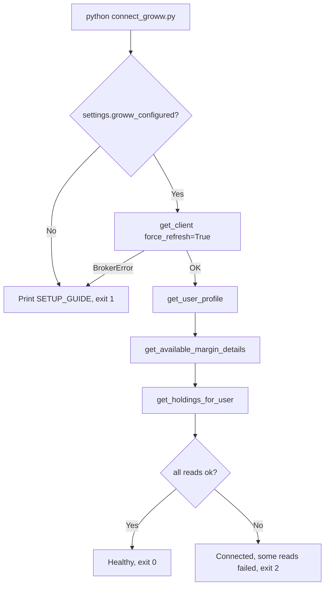
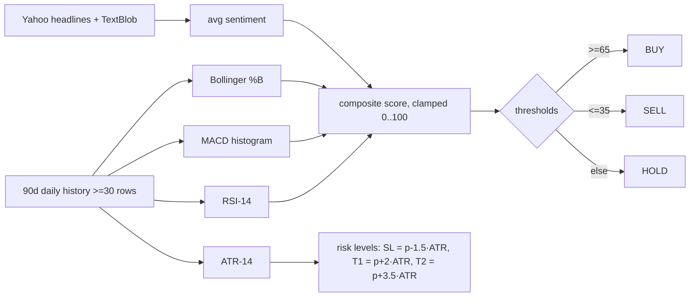

# Testing and Validation

This document defines a validation strategy for **Trinetra Capital AI**, an autonomous multi-agent trading system that can place real-money orders on the Indian equity cash segment through the Groww Trading API. Because the system is safety-critical — a single hallucinated quantity or symbol could move real capital — validation is treated as a first-class engineering concern rather than an afterthought. The guidance below is grounded entirely in the tracked source code. It covers the validation philosophy (verify in paper mode first), the `connect_groww.py` read-only connectivity harness, a manual test matrix that exercises routing, the per-order safety cap, the human-in-the-loop (HITL) approval paths and the live confirmation gate, a recommended set of automated unit tests for the pure and deterministic units (`trinetra/symbols.py`, `trinetra/instruments.py`, `trinetra/broker/base.py`, the paper broker, the render formatters and the quantitative scoring in `trinetra/market_data.py`), sanity bounds for the technical indicators, and the role of structured logging as an audit trail. This is framed as a foundation the maintainer can grow into a real, executable test suite; at the time of writing the repository ships no automated tests, so everything below is a forward-looking specification.

## Table of contents

1. [Validation philosophy](#1-validation-philosophy)
2. [Connectivity validation: the `connect_groww.py` harness](#2-connectivity-validation-the-connect_growwpy-harness)
3. [Manual test matrix](#3-manual-test-matrix)
4. [Recommended automated unit tests](#4-recommended-automated-unit-tests)
5. [Validating the quantitative indicators](#5-validating-the-quantitative-indicators)
6. [Observability and the logging audit trail](#6-observability-and-the-logging-audit-trail)
7. [Growing this into a real test suite](#7-growing-this-into-a-real-test-suite)

---

## 1. Validation philosophy

The system is designed around a layered safety model (see [Safety, Risk and Security](06-safety-risk-and-security.md)), and the validation philosophy mirrors that layering: **prove correctness in the cheapest, most reversible environment first, then promote.**

1. **Paper mode is the proving ground.** `trinetra/config.py` defaults `trading_mode` to `TradingMode.PAPER`, and `get_broker()` returns a `PaperBroker` whenever `settings.is_live` is `False`. The full agent stack — supervisor routing, tool calls, the HITL interrupt, symbol resolution, the order-value cap — runs identically in paper mode, except that `PaperBroker.place_order()` writes a simulated fill to `portfolio.json` instead of contacting Groww. This means every behaviour except the final broker round-trip can be validated without risking capital.
2. **Determinism over LLM judgement wherever money is involved.** Numbers shown to the user are produced by deterministic Python (`trinetra/render.py`, `OrderRequest.estimated_value()`, the paper broker's fill maths), not by the language model. Validation therefore concentrates on these deterministic units, where inputs map to exact, assertable outputs.
3. **Defence in depth is independently testable.** Each safety control — the rupee cap in `Broker.guard_order()`, the HITL approval interrupt, the buy-allowed check during symbol resolution, the `I UNDERSTAND` live gate — is a separate mechanism that can be tested in isolation. A test suite should assert each one fires on its own, so the failure of any single layer is caught.
4. **Honest about current limits.** Validation should confirm that the system behaves correctly *within its declared scope* and *fails honestly outside it*. Concretely: conversation state uses LangGraph's `InMemorySaver` and the CLI assigns a fresh `thread_id` per turn, so there is no long-term cross-turn memory to test yet; stop-loss orders are not simulated in paper mode (the paper broker rejects `SL`/`SL_M` by design); scope is the equity cash segment on NSE/BSE only in v1; and news sentiment is best-effort headline scraping. Tests should pin these as *expected* behaviours, not treat them as defects.

---

## 2. Connectivity validation: the `connect_groww.py` harness

`connect_groww.py` is the project's connectivity validation harness. Its docstring states the contract explicitly: *"Nothing here places an order — it is read-only and safe to run anytime to confirm the connection is healthy."* It is the first thing a maintainer should run after configuring credentials and the canonical way to answer "is my Groww link actually working?" before any agent touches the market.

What it asserts, in order:

| Step | Call | Asserted condition | Failure handling |
|------|------|--------------------|------------------|
| Credential presence | `settings.groww_configured` | At least one valid auth flow is configured | Prints the `SETUP_GUIDE` and returns exit code `1` |
| Authentication | `groww_client.get_client(force_refresh=True)` | A fresh access token can be minted and cached for today | Catches `BrokerError`, prints the guide, returns `1` |
| Profile read | `client.get_user_profile()` | UCC, NSE/BSE enablement and active segments are readable | Sets `ok = False`, prints a warning |
| Funds read | `client.get_available_margin_details()` | Clear cash and CNC/MIS balances are readable | Prints a warning (does not flip `ok`) |
| Holdings read | `client.get_holdings_for_user()` | Holdings list is readable; prints first 10 | Prints a warning (does not flip `ok`) |

The method is auth-aware: it reports `TOTP` versus `API key + secret` from `settings.auth_method`, and it echoes the current `trading_mode`. The exit-code contract makes it usable as an automated smoke check in CI or a pre-flight script: `0` = connected and healthy, `2` = connected but some reads failed (a permissions or segment-entitlement problem), `1` = not configured or authentication failed. Crucially, every read is wrapped in its own `try/except`, so a single failing endpoint degrades to a warning rather than aborting the whole check — the harness gathers as much diagnostic signal as it can in one run.

Because it forces `force_refresh=True`, running `connect_groww.py` also validates the token-cache path in `groww_client` (the daily access-token cache keyed by date and auth method). It is the natural place to catch a stale or chmod-denied cache file before the live CLI does.



---

## 3. Manual test matrix

Until the automated suite exists, the following manual matrix is the acceptance checklist for a release. Run it end-to-end in **paper mode** first (`GROWW_TRADING_MODE=paper`), then repeat the read-only and routing rows against a connected account. Each scenario lists the operator steps and the expected result grounded in the code.

| # | Scenario | Steps | Expected result |
|---|----------|-------|-----------------|
| 1 | **Symbol resolution (dead-ticker fix)** | Ask "what is the price of Infosys?" | The instrument master resolves `infosys` to `INFY @ NSE` via `instruments.resolve()` (exact normalised-name / prefix ranking), not the dead `INFOSYS.NS`. The research agent returns a live quote for `INFY`. |
| 2 | **Information routing** | Ask "What is the price of Reliance?" | Supervisor routes to **research_agent** (INFORMATION intent). `get_live_quote` returns Groww-first data with a yfinance fallback; the answer is relayed verbatim. |
| 3 | **Advice routing** | Ask "Should I buy TCS?" | Supervisor routes to **sentiment_agent** (ADVICE intent). `analyze_stock_sentiment` -> `technical_snapshot` returns RSI/MACD/%B/ATR, a composite score, a BUY/SELL/HOLD signal and ATR-based risk levels. |
| 4 | **Execution routing** | Say "Buy 10 shares of Wipro" | Supervisor routes to **trading_agent** (EXECUTION intent). The trading agent self-serves a quote via its own `get_live_quote` and proposes a `place_order`. |
| 5 | **Per-order cap rejection** | In a default config (`max_order_value` = ₹100,000) attempt a buy whose `quantity x price` exceeds the cap (e.g. 1000 shares of a ₹2,500 stock = ₹2,500,000) | `Broker.guard_order()` raises `BrokerError` *before* any fill: "Order value ₹2,500,000.00 exceeds the safety cap of ₹100,000.00 (GROWW_MAX_ORDER_VALUE)…". No trade is logged. |
| 6 | **HITL approve path** | Place a within-cap buy; when the approval prompt appears, answer **yes** | `_print_approval()` shows the pending tool and `_order_summary()` (resolved symbol, approx price, estimated total). Answering yes resumes the graph with `Command(resume={"decisions":[{"type":"approve"}]})`; the paper broker logs a `filled` order to `portfolio.json` and the agent replies with a 1–3 line confirmation built only from returned fields. |
| 7 | **HITL reject path** | Place a within-cap buy; answer **no** at the prompt | The graph resumes with `{"type":"reject"}`; no order is placed, nothing is appended to `portfolio.json`, and the session continues. |
| 8 | **Paper stop-loss rejection** | In paper mode, attempt an `SL` or `SL_M` order | `PaperBroker.place_order()` raises `BrokerError`: stop-loss orders "aren't simulated in paper mode (there is no live trigger monitoring)". Suggests switching to live or using a market/limit order. |
| 9 | **Budget-order math** | Say "Invest ₹50,000 in HDFC Bank" | The trading agent fetches a live LTP, computes an integer quantity from the budget, and proposes an order whose `estimated_value()` is ≤ the budget *and* ≤ the cap. The displayed total equals `quantity x reference_price` (deterministic, from `render`/`estimated_value`), never an invented figure. |
| 10 | **Live confirmation gate** | Set `GROWW_TRADING_MODE=live` with valid creds and start `python main.py` | The CLI banner announces **LIVE** mode and the user must type exactly `I UNDERSTAND` before the session starts. Any other input aborts. The trading prompt is mode-aware and announces LIVE. |
| 11 | **Paper market order needs a price** | Force a paper market order with no reference price available | `PaperBroker.place_order()` raises `BrokerError` asking for a reference price (or a LIMIT order with an explicit price). |
| 12 | **Buy-allowed guard** | Attempt to buy a symbol whose `buy_allowed` is false in the instrument master | `place_order` (in `trinetra/tools.py`) rejects the buy during `instruments.resolve()`, returning suggestions rather than building an `OrderRequest`. |
| 13 | **Graceful data degradation** | Run a research query with no Groww credentials configured | `market_data` falls back to yfinance for quotes and to the stale instrument cache for resolution; research/sentiment still answer. |

> Rows 1–4, 6–9 and 11–13 are fully exercisable in paper mode with zero financial risk. Row 10 is the only one that requires touching the live gate; verify it but answer the prompt deliberately.

---

## 4. Recommended automated unit tests

The highest-leverage automated tests target the **pure, network-free, deterministic** units. These have no external dependencies, run in milliseconds, and protect exactly the logic that turns a user request into a financial action. The snippets below are illustrative `pytest` cases the maintainer can drop into a `tests/` directory.

### 4.1 `symbols.normalize` — canonical instrument parsing

`trinetra/symbols.py` is intentionally pure (no network), making it ideal for table-driven tests. It must map combined tokens, yfinance suffixes and bare symbols onto a canonical `Instrument`.

```python
import pytest
from trinetra.symbols import normalize, Instrument

@pytest.mark.parametrize("raw, expected", [
    ("RELIANCE",   Instrument("RELIANCE", "NSE")),  # bare -> default exchange
    ("reliance.ns", Instrument("RELIANCE", "NSE")),  # yfinance .NS suffix, case-fold
    ("TCS.BO",     Instrument("TCS", "BSE")),        # yfinance .BO suffix
    ("NSE_INFY",   Instrument("INFY", "NSE")),       # combined token
])
def test_normalize(raw, expected):
    assert normalize(raw) == expected

def test_normalize_explicit_exchange():
    assert normalize("WIPRO", "bse") == Instrument("WIPRO", "BSE")

def test_normalize_empty_raises():
    with pytest.raises(ValueError):
        normalize("")
```

Also assert the derived properties: `normalize("RELIANCE").yf_symbol == "RELIANCE.NS"`, `normalize("TCS.BO").yf_symbol == "TCS.BO"`, and `normalize("INFY").exchange_token == "NSE_INFY"`. Note that the bare-symbol default depends on `settings.default_exchange`; pin it (default `NSE`) so the test is deterministic.

### 4.2 `instruments.search` — ranking correctness

`trinetra/instruments.search()` is the dead-ticker fix, and its ranking is the most subtle deterministic logic in the codebase. Because it depends on the downloaded CSV, inject a small fixture index rather than hitting the network (e.g. by populating the module-level `_index` with a handful of `InstrumentRecord`s, or by monkeypatching `_load_csv_text`). Then assert the documented ranking priorities:

```python
from trinetra import instruments
from trinetra.instruments import InstrumentRecord

def _rec(ts, name, series="EQ", exch="NSE", buy=True, sell=True):
    return InstrumentRecord(ts, exch, name, series, "", 1, buy, sell)

def test_exact_ticker_beats_prefix(monkeypatch):
    idx = {"by_symbol": {}, "by_name": {}, "records": []}
    for r in [_rec("INFY", "Infosys"), _rec("INFYBEES", "Infy ETF")]:
        idx["records"].append(r)
        idx["by_symbol"].setdefault(r.trading_symbol, []).append(r)
        idx["by_name"].setdefault(instruments._norm_name(r.name), []).append(r)
    monkeypatch.setattr(instruments, "_index", idx)
    assert instruments.search("INFY")[0].trading_symbol == "INFY"

def test_etf_demoted_for_company_query(monkeypatch):
    # "ICICI Bank" must outrank a short ETF ticker because of the -200 ETF penalty
    ...
```

Key assertions to encode: an exact ticker (base 1000) outranks an exact name (950) which outranks a ticker prefix (`780 - len`); the ETF penalty (`-200`) demotes `*ETF`/`*BEES`/`*IETF` symbols unless the query itself contains an ETF hint; the NSE bonus (`+6`) and exact-exchange bonus (`+8`) break ties; and `resolve("infosys")` returns the single best record and caches it in `_resolve_cache`.

### 4.3 `OrderRequest.normalised()` — validation gate

`trinetra/broker/base.py` centralises order validation. This is the single most security-relevant pure function: it is the last deterministic check before an `OrderRequest` reaches a broker.

```python
import pytest
from trinetra.broker.base import OrderRequest, BrokerError

def test_normalised_resolves_suffix_and_uppercases():
    req = OrderRequest("reliance.ns", "buy", 5).normalised()
    assert req.trading_symbol == "RELIANCE"
    assert req.exchange == "NSE"
    assert req.transaction_type == "BUY"

@pytest.mark.parametrize("kwargs", [
    {"transaction_type": "HOLD"},          # not BUY/SELL
    {"order_type": "FOO"},                  # not MARKET/LIMIT/SL/SL_M
    {"product": "NRML"},                    # not CNC/MIS
    {"quantity": 0},                        # non-positive
    {"order_type": "LIMIT", "price": 0},    # LIMIT needs a price
    {"order_type": "SL_M"},                 # SL_M needs trigger_price
])
def test_normalised_rejects_bad_input(kwargs):
    base = dict(trading_symbol="INFY", transaction_type="BUY", quantity=1)
    base.update(kwargs)
    with pytest.raises(BrokerError):
        OrderRequest(**base).normalised()

def test_stop_loss_alias_mapping():
    req = OrderRequest("INFY", "SELL", 1, order_type="STOP_LOSS_MARKET",
                       trigger_price=100).normalised()
    assert req.order_type == "SL_M"
```

### 4.4 `OrderRequest.estimated_value()` and `Broker.guard_order()` — the cap

The rupee cap is the hard backstop against a hallucinated quantity. Test `estimated_value()` for each order type, then test that `guard_order()` raises exactly when the value exceeds `settings.max_order_value`.

```python
from trinetra.broker.base import OrderRequest

def test_estimated_value_market_uses_reference_price():
    req = OrderRequest("INFY", "BUY", 10)               # MARKET
    assert req.estimated_value(reference_price=1500) == 15000.0

def test_estimated_value_limit_uses_limit_price():
    req = OrderRequest("INFY", "BUY", 10, order_type="LIMIT", price=1450)
    assert req.estimated_value() == 14500.0

def test_guard_order_rejects_over_cap(monkeypatch):
    from trinetra.broker import base
    monkeypatch.setattr(base.settings, "max_order_value", 100_000.0)
    broker = SomeConcreteBroker()  # or a minimal stub subclass
    req = OrderRequest("INFY", "BUY", 1000)
    with pytest.raises(base.BrokerError):
        broker.guard_order(req, reference_price=2500)   # 2,500,000 > cap
```

A boundary case is worth pinning: `guard_order()` only raises when `value` is truthy *and* strictly greater than the cap, so an order whose estimated value is exactly the cap passes, and an order with an unknown price (`value == 0`) is *not* blocked by the cap alone (it is blocked later by the paper broker's "needs a reference price" check). Encode both so the boundary semantics never drift silently.

### 4.5 `PaperBroker` fill maths and derived portfolio

The paper broker is deterministic given a fixed `portfolio.json`. Point `settings.portfolio_file` at a temp file and assert:

- A market buy with a `reference_price` produces an `OrderResult(status="filled")` whose `estimated_value == round(quantity * fill_price, 2)` and appends one trade with `mode="paper"`.
- `SL`/`SL_M` raises `BrokerError` (paper has no trigger monitoring).
- A market order with no `reference_price` (and not a priced LIMIT) raises `BrokerError`.
- `get_funds()` returns `available_cash == paper_starting_cash - net_invested`, where `net_invested` sums buy totals minus sell totals.
- `_aggregate()` nets buys against sells per symbol; a fully exited symbol (qty 0) disappears from `get_holdings()`.

Holdings enrichment (`get_holdings()` calling `market_data.ltp_many`) hits the network, so monkeypatch `ltp_many` to a fixed dict to keep the test pure and assert the P&L arithmetic (`pnl = current_value - invested`, `pnl_pct = pnl / invested * 100`).

### 4.6 Render formatters

`trinetra/render.py` produces the user-facing tables deterministically. Feed `render_portfolio()` a fixed list of `Holding` objects and a known funds figure, then assert the output Markdown contains the expected rows, the invested/value/total-P&L summary line, and the unpriced-symbol note when a holding has `last_price=None`. Likewise feed `render_orders()` a fixed order book and assert column presence and that `None` fields render via the money/number/signed helpers without raising. These tests lock in the "never hallucinate a number" guarantee at the formatting boundary.

---

## 5. Validating the quantitative indicators

`technical_snapshot()` in `trinetra/market_data.py` is the analytical core behind the sentiment agent. It pulls 90 days of daily history (requiring at least 30 clean rows) and computes RSI-14 (Wilder smoothing via `ewm(com=13)`), a MACD histogram (EMA12 − EMA26 minus the EMA9 signal), Bollinger %B (SMA20 with 2-sigma bands), and ATR-14. Because these are stochastic with respect to live market data, validation should focus on **invariants and sanity bounds** rather than exact values, ideally driven by a fixed synthetic price series fed through a monkeypatched `yf.Ticker(...).history`.

Bounds and invariants worth asserting:

| Quantity | Invariant to assert |
|----------|---------------------|
| `rsi` | In `[0, 100]` for any input series |
| `composite_score` | Clamped to `[0, 100]` — the code applies `max(0, min(100, score))` |
| `signal` | `BUY` iff `score >= 65`; `SELL` iff `score <= 35`; else `HOLD` |
| `confidence` | `high` iff `score >= 80` or `score <= 20`; else `moderate` |
| `stop_loss` | Strictly below `price` (`price - 1.5 * atr`, with `atr >= 0`) |
| `target_1`, `target_2` | Strictly above `price`, and `target_2 > target_1` (`+3.5 ATR` vs `+2.0 ATR`) |
| `sentiment_label` | `bullish` if `avg_sent > 0.15`, `bearish` if `< -0.15`, else `neutral` |
| `< 30` clean rows | Returns `{"error": "not enough clean price history"}` rather than a snapshot |

The composite-scoring thresholds are deterministic functions of the four indicators plus sentiment, so they are directly testable by constructing inputs that force each band. For example: a deeply oversold series (RSI < 30 contributes `+20`, a positive MACD histogram `+15`, %B < 0.2 `+10`) starting from a base of 50 should push the score toward the `BUY` region; the reverse (RSI > 70 `-20`, negative histogram `-15`, %B > 0.8 `-10`) toward `SELL`. The sentiment contribution is `round(avg_sent * 15)`, so with headline scraping monkeypatched to return a fixed list, the sentiment term is fully determined. A good test strategy is to monkeypatch `_scrape_headlines` to `[]` (forcing `avg_sent = 0.0`, sentiment term 0) so the score depends only on the technicals, then assert each band boundary.

The `_finite()` helper, which rejects `NaN`/`inf`, is a small but worthwhile target: it underpins every JSON payload the LLM consumes, and a regression there would let invalid numbers reach the model. Assert `_finite(float("nan")) is None`, `_finite("12.5") == 12.5`, and `_finite(None) is None`.



---

## 6. Observability and the logging audit trail

`trinetra/logging_setup.py` configures a single stderr handler under the `trinetra` namespace, with the level taken from `settings.log_level` (default `INFO`) and the format `%(asctime)s | %(levelname)-7s | %(name)s | %(message)s`. This structured, timestamped, module-namespaced output is the system's audit trail and a primary validation surface.

For a trading system, the log doubles as evidence of what the agent actually did:

- **Fills are logged.** `PaperBroker.place_order()` emits `PAPER fill → BUY INFY x10 @ ₹1500.00 (₹15000.00)` on every simulated fill, so a test or a human can reconcile the log line against the `portfolio.json` trade entry and the on-screen confirmation. The live `GrowwBroker` similarly logs through the same namespace.
- **Degradation is logged, not silent.** Instrument-master download failures, use of a stale cache, Groww LTP/quote fallbacks to yfinance, and unreadable `portfolio.json` all emit `WARNING`/`DEBUG` lines. During validation, asserting that the expected warning appears (e.g. "Using stale instrument master cache") is how you confirm a graceful-degradation path was actually taken rather than masked by a coincidentally-working network.
- **Auditability for review.** Raising the level to `TRINETRA_LOG_LEVEL=DEBUG` exposes the per-symbol data-source decisions and cache hits, which is the recommended setting when running the manual test matrix so each row's behaviour is traceable.

A pragmatic automated technique is `pytest`'s `caplog` fixture: place a within-cap paper order and assert that exactly one `PAPER fill` record at `INFO` is emitted, or place an over-cap order and assert that *no* fill record appears (the `BrokerError` fires first). This turns the audit trail itself into a tested invariant.

---

## 7. Growing this into a real test suite

The maintainer can stage the suite in order of value-to-effort:

1. **Pure units first** (`symbols`, `OrderRequest.normalised`/`estimated_value`, `guard_order`, render formatters, `_finite`). Zero external dependencies; these alone cover the most safety-critical logic.
2. **Fixture-driven units** (`instruments.search` ranking against a small injected index; `technical_snapshot` band boundaries against a synthetic series with scraping and history monkeypatched).
3. **Stateful units with temp files** (`PaperBroker` fill maths and derived portfolio against a temporary `portfolio.json`).
4. **Integration smoke** — keep `connect_groww.py` as the read-only connectivity gate and wire its exit code into CI for any environment that has credentials.
5. **Manual matrix** (Section 3) as the human acceptance checklist for each release, always run in paper mode before live.

Two structural notes for testability. First, `settings` is a frozen singleton built once at import; tests that need a different `max_order_value`, `portfolio_file` or `default_exchange` should `monkeypatch.setattr` the attribute on the imported `settings` object rather than re-instantiating `Settings`. Second, the network-touching helpers (`_groww`, `ltp_many`, `yf.Ticker(...).history`, `_scrape_headlines`, `instruments._load_csv_text`) are the seams to monkeypatch; everything reachable through them is otherwise deterministic and cheaply testable. Building out this suite is the single highest-credibility investment the project can make: it converts the carefully-layered safety model from *designed-in* to *continuously-verified*.

---

[← API & Module Reference](10-api-reference.md)  |  [↑ Documentation Index](README.md)  |  [Roadmap & Future Work →](12-roadmap-and-future-work.md)
