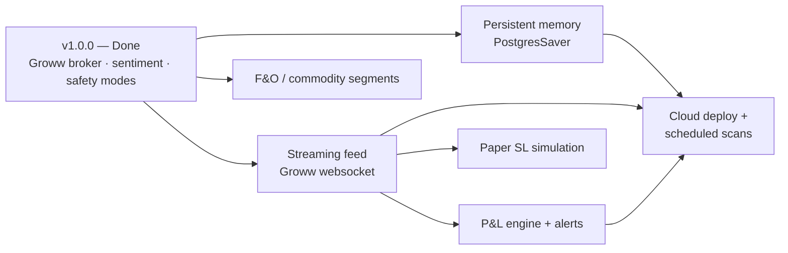

# 🔱 Roadmap & Future Work

> *Trinetra Capital AI — "Multi-Agents. One Market. Zero Missed Moves."*

This document records the honest state of **Trinetra Capital AI v1.0.0**: what is shipped and working, where the system is deliberately or unavoidably bounded today, and where it is headed. It is written from the tracked source code rather than aspiration — every limitation cited below is traceable to a specific module — so that a research reviewer can audit each claim. The intent is twofold: to give a credible account of current capability, and to lay out a prioritised, technically-grounded plan for the next phase, including research directions that are appropriate for an academic competition. Where the README and the code diverge, the code is treated as ground truth.

## Table of Contents

1. [Current Capability Status](#1-current-capability-status)
2. [Current Limitations (Honestly Stated)](#2-current-limitations-honestly-stated)
3. [Planned Roadmap](#3-planned-roadmap)
   - [3.1 Persistent Memory via `PostgresSaver`](#31-persistent-memory-via-postgressaver)
   - [3.2 Groww Live WebSocket Streaming Feed](#32-groww-live-websocket-streaming-feed)
   - [3.3 Portfolio P&L Engine + Alerts](#33-portfolio-pl-engine--alerts)
   - [3.4 F&O / Commodity Segments](#34-fo--commodity-segments)
   - [3.5 Cloud Deployment + Scheduled Scans](#35-cloud-deployment--scheduled-scans)
4. [Research Directions](#4-research-directions)
5. [Prioritised Roadmap Table](#5-prioritised-roadmap-table)

---

## 1. Current Capability Status

The following capabilities are implemented and exercised by the live code paths described in the sibling architecture documents (see [02-system-architecture.md](02-system-architecture.md) and [03-multi-agent-system.md](03-multi-agent-system.md)). The README's roadmap table marks each as **Done**, and the code confirms it.

| Capability | Status | Evidence in code |
|---|---|---|
| **Real broker integration (Groww)** — live orders, portfolio, funds, market data | ✅ Done | `trinetra/broker/groww_broker.py` implements `place_order` / `cancel_order` / `modify_order` / `get_order_status` / `get_order_history` (via `get_order_list`) and `get_holdings` / `get_positions` / `get_funds`, mapping the app's normalised vocabulary onto the `growwapi` SDK with one transparent 401 re-auth retry. |
| **News sentiment analysis** | ✅ Done | `market_data.technical_snapshot()` scrapes up to 10 Yahoo Finance headlines (`_scrape_headlines`), scores polarity with `TextBlob`, and folds the average into a composite 0–100 score that drives a BUY/SELL/HOLD signal. |
| **Paper / live safety modes + per-order cap** | ✅ Done | `Broker.guard_order()` enforces `settings.max_order_value` (default ₹100,000) for **both** modes before any order; `get_broker()` returns `PaperBroker` unless `settings.is_live`; the CLI requires an explicit `I UNDERSTAND` gate in LIVE mode and HITL approval (`HumanInTheLoopMiddleware`) on every risky tool. |

Supporting these three headline capabilities is a layered foundation that is also complete: authoritative symbol resolution against the Groww instrument master (`trinetra/instruments.py`), deterministic Python rendering of tables (`trinetra/render.py`), a Groww-first market-data layer with a yfinance fallback (`trinetra/market_data.py`), and a hierarchical supervisor that routes each request to exactly one of three specialists (`trinetra/agents.py`).

---

## 2. Current Limitations (Honestly Stated)

Intellectual honesty about boundaries is a credibility asset in research review. None of the following are defects to hide; they are scoped decisions or known gaps in v1, each tied to concrete code.

### 2.1 No durable cross-turn memory yet

Conversation state is held by LangGraph's **`InMemorySaver`**. In `agents.py`, `build_supervisor()` compiles the graph with `checkpointer=checkpointer or InMemorySaver()`. The CLI compounds this by assigning a **fresh `uuid4` thread_id per turn** (see [03-multi-agent-system.md](03-multi-agent-system.md) and [09-usage-guide.md](09-usage-guide.md)). The practical consequence is that the system has no persistent long-term memory across turns or sessions: each user request is effectively self-contained, and nothing survives a process restart. This is acceptable for a stateless question-and-answer trading desk, but it precludes follow-up references like "sell *the* Reliance I bought earlier" relying on remembered context. Addressing this is the top roadmap item (Section 3.1).

### 2.2 Equity cash segment, NSE/BSE only

`groww_broker.py` is documented and built as "equity cash segment, v1". The instrument master is filtered to `segment=CASH` and `exchange ∈ {NSE, BSE}`, and market-data calls pass `segment="CASH"` throughout (`_seg(client, "CASH")` in `market_data.py`). There is no support for futures, options, currency, or commodity instruments. Any symbol outside the cash equity universe is simply not resolvable and therefore not tradable.

### 2.3 Polling quotes, no streaming feed

All prices are fetched on demand. `market_data.try_ltp()`, `ltp_many()`, and `get_live_quote()` issue request/response calls to Groww (`get_ltp` / `get_quote`) with a yfinance fallback, and a short-lived **10-second LTP cache** (`_LTP_TTL = 10.0`) deduplicates calls within a turn. There is no persistent tick stream: the system cannot react to intraday price movement between user requests, and "live" means "fresh at the moment you ask", not "continuously updated".

### 2.4 Paper mode cannot simulate stop-loss triggers

The paper broker fills market and limit orders instantly but rejects `SL` / `SL_M` because it cannot monitor a live trigger (see the broker layer description in [04-broker-and-execution.md](04-broker-and-execution.md)). The trading prompt in `agents.py` reflects this explicitly: stop-loss order types are annotated as **"live mode only"**. Stop-loss simulation requires a continuous price feed and a monitoring loop — both of which depend on the streaming work in Section 3.2.

### 2.5 Sentiment is best-effort headline scraping

`_scrape_headlines()` performs an unauthenticated HTTP GET of a Yahoo Finance news page and parses `<h3>` tags with BeautifulSoup, capped at 10 headlines and an 8-second timeout, swallowing any error ("sentiment is best-effort"). When scraping fails or returns nothing, the polarity list defaults to `[0.0]` (neutral). This is fragile by design: it depends on a third-party page layout, has no India-specific news source, and uses a general-purpose English polarity model (`TextBlob`) rather than a finance-tuned one. The sentiment term is therefore a soft input to the composite score, not an authoritative signal.

### 2.6 No automated test suite yet

The repository does not ship an automated test harness. Correctness today rests on the deterministic rendering layer, the "never invent numbers" prompt discipline, the symbol-resolution guardrails, and manual paper-mode verification (the recommended pre-live workflow). A formal test and evaluation harness is a near-term priority and is treated both as engineering work (Section 3) and as a research direction (Section 4). See [11-testing-and-validation.md](11-testing-and-validation.md) for the current validation approach.

---

## 3. Planned Roadmap

The README roadmap lists five planned features. Each is expanded below with rationale and a sketch of the technical approach grounded in the existing architecture.

### 3.1 Persistent Memory via `PostgresSaver`

**Rationale.** As established in Section 2.1, the system has no memory beyond a single turn. Durable, queryable conversation state is the prerequisite for multi-turn workflows, audit trails of every agent decision, and per-user personalisation.

**Approach.** LangGraph's checkpointer interface is already the integration point: `build_supervisor(checkpointer=None)` accepts any saver and only falls back to `InMemorySaver()` when none is supplied. Swapping in `langgraph.checkpoint.postgres.PostgresSaver` (backed by a Postgres instance, e.g. a `docker-compose` service alongside the app) requires no change to the graph topology. Two companion changes make the persistence meaningful: (a) the CLI must adopt a **stable thread_id** (per user, or per session) instead of minting a new `uuid4` each turn, so checkpoints accumulate into a continuous thread; and (b) a lightweight schema/retention policy for the checkpoint tables. This unlocks resuming an interrupted HITL approval across a restart and reconstructing exactly what each agent saw.

### 3.2 Groww Live WebSocket Streaming Feed

**Rationale.** Polling (Section 2.3) is sufficient for ask-and-answer but blind between requests. A streaming tick feed is the enabling primitive for stop-loss simulation, real-time P&L, and price-triggered alerts.

**Approach.** Introduce a streaming client that subscribes to Groww's live tick channel and publishes updates into a small in-process price bus, then back the existing `try_ltp` / `ltp_many` cache (`_ltp_cache`, keyed by `exchange_token`) from that bus so the rest of the system consumes streamed prices transparently — the public market-data API would not need to change. The yfinance fallback and `_finite()` NaN/inf guards remain as the degraded-mode path when the socket is down. A subscription manager would track the union of symbols across the user's holdings and any active triggers, respecting Groww's batching limits (the same 50-symbol-per-call constraint already handled in `_ltp_map` and `ltp_many`).

### 3.3 Portfolio P&L Engine + Alerts

**Rationale.** Today P&L is computed at view time: `GrowwBroker.get_holdings()` enriches each holding with batched LTP and derives `pnl` / `pnl_pct` on the spot, and `render_portfolio()` formats a summary. There is no continuous tracking, no time series, and no proactive notification when a position crosses a threshold.

**Approach.** Layer a stateful P&L service on top of the streaming feed (Section 3.2) and the persistent store (Section 3.1): snapshot holdings periodically, persist a P&L time series, and evaluate user-defined rules (e.g. "alert if HDFCBANK drops 3% intraday" or "notify when total unrealised P&L crosses ₹X"). Alerts can surface in the CLI banner today and through push/email channels under cloud deployment (Section 3.5). The per-holding enrichment logic already in `get_holdings()` is the seed of the valuation engine; the new work is making it continuous, persisted, and rule-driven.

### 3.4 F&O / Commodity Segments

**Rationale.** v1 is intentionally cash-equity only (Section 2.2). Derivatives and commodities are where much of the algorithmic-trading interest lies, but they bring materially different risk semantics (leverage, margin, expiry, lot sizes) that must not be bolted on carelessly given the real-money safety posture.

**Approach.** This is the broadest item. It requires: extending the instrument master beyond the `segment=CASH` filter to ingest F&O/commodity contracts (with expiry and strike metadata); generalising the broker layer's `_const()` segment/product mapping (`groww_broker.py` already resolves SDK constants defensively, which eases this); adding margin- and lot-aware validation in `OrderRequest.normalised()` and `guard_order()`; and a risk model that understands leverage so the per-order rupee cap remains meaningful. Because of the risk surface, this should ship behind its own opt-in flag and remain paper-only until thoroughly validated.

### 3.5 Cloud Deployment + Scheduled Scans

**Rationale.** The system is currently an interactive local CLI. Cloud deployment turns it into an always-on service capable of unattended, scheduled market scans (e.g. a pre-open sentiment sweep across a watchlist).

**Approach.** The Docker / docker-compose foundation already exists. The additions are: a long-running service mode (beyond the interactive REPL) hosting the supervisor graph; a scheduler that periodically invokes the sentiment/research agents over a configured watchlist and routes notable signals to an alert channel; persistent memory (Section 3.1) so scans accumulate history; and secrets/credential management appropriate to a hosted environment (the daily token cache in `groww_client.py` already handles rotation). The strict safety model — paper-by-default, the rupee cap, and HITL on every order — must be preserved end-to-end; scheduled **scans** are read-only by default, and any scheduled *execution* would still require an explicit human-approval channel.

---

## 4. Research Directions

The following are framed for academic evaluation and would strengthen the system's research contribution beyond engineering delivery.

- **Routing-accuracy evaluation.** The supervisor routes each request by intent to exactly one of `research_agent`, `sentiment_agent`, or `trading_agent` (`agents.py`). Build a labelled corpus of user utterances with gold intents and measure routing precision/recall/confusion across LLM backends. Because the LLM layer is pluggable — agents default to `meta/llama-3.3-70b-instruct` via NVIDIA NIM, the supervisor can use Groq, and an OpenRouter override (default `openai/gpt-4o-mini`) can power both — this is also a natural **model-comparison study**: routing accuracy versus latency versus cost across providers. (Note: the README tech table names an NVIDIA `nemotron-3-super-120b` model, but the code default for both `agent_model` and `supervisor_model` is `meta/llama-3.3-70b-instruct`; the LLM layer should be described as provider-configurable.)

- **Backtesting the composite signal.** The composite score in `technical_snapshot()` is a transparent, fixed-weight blend: a base of 50 adjusted by RSI-14 bands, MACD histogram sign, Bollinger %B, and `round(avg_sentiment * 15)`, clamped to 0–100, with BUY ≥ 65 / SELL ≤ 35 thresholds and ATR-derived stop/target levels. These weights and thresholds are presently hand-chosen. A historical backtest over Indian equities would quantify the signal's hit rate and risk-adjusted return, and motivate **data-driven re-weighting** (or learned weights) instead of the current heuristic.

- **Agent-evaluation harness.** Tied to Section 2.6, an automated harness that replays canned scenarios in paper mode and asserts on tool-call sequences, the deterministic rendered tables, the HITL interrupts, and the cap enforcement. This both serves as a regression test suite and produces reproducible evaluation metrics (task success rate, hallucinated-number rate, approval-gate coverage) suitable for a paper.

- **Richer risk models.** The current risk levels are a single ATR-14 multiple (`stop_loss = price − 1.5·ATR`, `target_1 = +2.0·ATR`, `target_2 = +3.5·ATR`). Research extensions include volatility-regime-aware position sizing, portfolio-level risk (correlation/exposure across holdings rather than per-symbol), and drawdown-constrained sizing — all of which would feed back into a smarter per-order cap than the current flat rupee ceiling.

- **Finance-tuned sentiment.** Replacing the general-purpose `TextBlob` polarity and Yahoo-headline scraping (Section 2.5) with a finance-domain sentiment model and India-specific news sources, then measuring the marginal contribution of the sentiment term to composite-signal performance via ablation.

---

## 5. Prioritised Roadmap Table

Priority reflects both user value and the dependency graph above (streaming unlocks several downstream items). Complexity is a rough engineering estimate.

| # | Feature | Status | Rationale | Complexity |
|---|---|---|---|---|
| 1 | Automated test / agent-evaluation harness | 🔬 Proposed | Foundation for safe iteration; no suite exists today (Section 2.6); produces research metrics | Medium |
| 2 | Persistent memory (`PostgresSaver`) | 🔄 Planned | Unblocks multi-turn memory, audit trails, resumable HITL; clean swap at the checkpointer seam | Low–Medium |
| 3 | Groww live websocket streaming feed | 🔄 Planned | Enabling primitive for stop-loss sim, real-time P&L, and alerts; replaces 10s polling | High |
| 4 | Paper-mode stop-loss simulation | 🔄 Planned | Closes the paper/live parity gap (Section 2.4); depends on streaming feed | Medium |
| 5 | Portfolio P&L engine + alerts | 🔄 Planned | Continuous, persisted P&L with rule-driven notifications; depends on (2) + (3) | Medium |
| 6 | Composite-signal backtest + re-weighting | 🔬 Proposed | Validates and improves the heuristic signal with historical evidence | Medium |
| 7 | Cloud deployment + scheduled scans | 🔄 Planned | Always-on, unattended watchlist scans; depends on (2) + (3) | Medium–High |
| 8 | F&O / commodity segments | 🔄 Planned | Major scope expansion with new risk semantics; must stay paper-gated until validated | High |

**Status legend:** 🔄 Planned (named in the README roadmap) · 🔬 Proposed (research/engineering item surfaced here for the competition).

The throughline across the entire roadmap is the non-negotiable safety model — paper-by-default, the per-order rupee cap enforced in `guard_order()` for both modes, HITL approval on every order, and authoritative symbol resolution. No planned feature is permitted to weaken those guarantees; each must be delivered behind them.

---

[← Testing & Validation](11-testing-and-validation.md)  |  [↑ Documentation Index](README.md)  |  [Glossary & References →](13-glossary-and-references.md)
