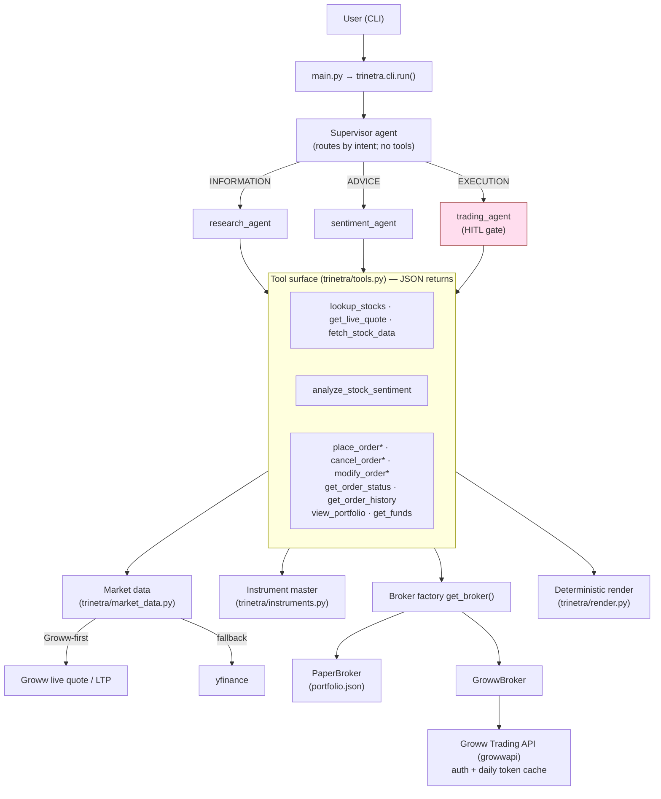
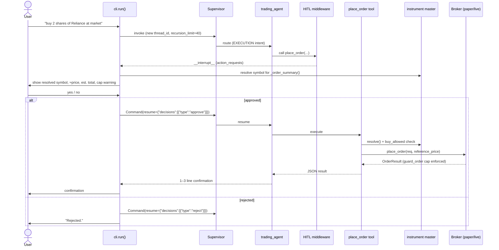
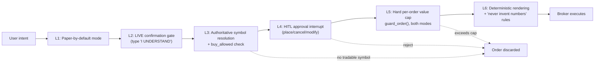

# Trinetra Capital AI: A Supervisor-Specialist Multi-Agent Architecture for Human-in-the-Loop Autonomous Equity Trading

🔱 *Multi-Agents. One Market. Zero Missed Moves.*

**Author:** Udit · **Version:** 1.0.0 · **Domain:** Autonomous multi-agent AI trading for Indian equities (NSE/BSE) via the Groww Trading API

---

## Abstract

Large language model (LLM) agents can now plan, call tools, and act on real-world systems, but applying them to financial execution raises an acute tension between autonomy and safety: a single hallucinated quantity or symbol can move real money. This paper presents **Trinetra Capital AI**, a production-grade multi-agent system that conducts research, sentiment and technical analysis, and order execution for Indian cash-segment equities through the Groww Trading API. The system adopts a hierarchical *supervisor-specialist* design: a fast routing supervisor dispatches each user request, by intent, to exactly one of three tool-equipped specialist agents (research, sentiment, trading), then relays the specialist's answer verbatim. Execution safety is enforced through a defence-in-depth model comprising paper-trading-by-default, a hard per-order rupee cap applied in both simulated and live modes, a human-in-the-loop (HITL) interrupt on every order/cancel/modify, an explicit live-mode confirmation gate, authoritative symbol resolution against the broker's instrument master before any order is constructed, and deterministic (non-LLM) table rendering to eliminate fabricated figures. A broker-abstraction layer makes the paper and live execution backends interchangeable behind a single normalised interface. The LLM layer is provider-pluggable: in the tracked code both the agent and supervisor models default to `meta/llama-3.3-70b-instruct`, with NVIDIA NIM, Groq, and OpenRouter providers selectable by configuration. We describe the quantitative methodology (an RSI/MACD/Bollinger/ATR indicator suite feeding a bounded composite score with ATR-derived risk levels), the safety architecture, and an honest account of current limitations including the absence of long-term cross-turn memory and equity-only v1 scope. Trinetra is offered as an engineering and safety case study in deploying LLM agents against irreversible, regulated actions.

**Keywords:** multi-agent systems, LLM agents, tool use, hierarchical orchestration, human-in-the-loop, algorithmic trading, technical analysis, sentiment analysis, AI safety, retail finance, Groww API, LangGraph

---

## Table of Contents

1. [Introduction](#1-introduction)
2. [Background and Related Work](#2-background-and-related-work)
3. [System Architecture and Methodology](#3-system-architecture-and-methodology)
4. [Quantitative Methodology](#4-quantitative-methodology)
5. [Safety and Risk-Management Design](#5-safety-and-risk-management-design)
6. [Implementation](#6-implementation)
7. [Discussion and Evaluation](#7-discussion-and-evaluation)
8. [Ethical and Regulatory Considerations](#8-ethical-and-regulatory-considerations)
9. [Conclusion and Future Work](#9-conclusion-and-future-work)
10. [References](#references)

---

## 1. Introduction

### 1.1 Problem and Motivation

Retail participation in Indian equity markets has expanded rapidly, and broker APIs such as the Groww Trading API now expose programmatic order placement, portfolio queries, and live market data to individual investors. In parallel, LLM agents have matured from text generators into tool-using planners capable of orchestrating multi-step workflows. The natural convergence — an LLM agent that researches a stock, forms a view, and places the order — is also the most dangerous, because order placement is *irreversible* and denominated in real money. The central engineering problem this work addresses is therefore not "can an agent trade?" but rather: **how does one give an LLM agent enough autonomy to be useful while constraining it so tightly that a model error cannot cause uncontrolled financial loss?**

Two failure modes dominate. The first is *numerical hallucination*: an LLM asked to display a portfolio or confirm a fill may invent prices, quantities, or profit-and-loss figures that look plausible but are false. The second is *action error*: an agent may resolve a company name to a non-existent or wrong ticker (a classic example being `INFOSYS.NS`, which is not a tradable symbol — the correct Groww symbol is `INFY`), or compute an oversized quantity, and then submit it. Trinetra Capital AI is designed around the premise that both classes of error must be intercepted *structurally*, not merely discouraged by prompting.

### 1.2 Contributions

This paper makes the following contributions:

- **A hierarchical supervisor-specialist agent architecture** in which a routing supervisor never calls tools itself, but dispatches each request by intent to exactly one of three specialist agents and relays the specialist's answer verbatim (`trinetra/agents.py`).
- **A defence-in-depth safety model** for irreversible financial actions, layering paper-by-default operation, a hard per-order value cap enforced in both modes, a human-in-the-loop approval interrupt on every risky tool, an explicit live-mode confirmation gate, authoritative pre-trade symbol resolution, and deterministic rendering (Sections 3 and 5).
- **A broker-abstraction layer** that makes simulated (`PaperBroker`) and live (`GrowwBroker`) execution interchangeable behind one normalised dataclass vocabulary, with the cap enforced at the abstract base class so neither backend can bypass it (`trinetra/broker/`).
- **An authoritative instrument-master resolver** that downloads, caches, and ranks the broker's official tradable-symbol universe, eliminating dead-ticker guessing before any order reaches the broker (`trinetra/instruments.py`).
- **A transparent quantitative methodology** combining a standard technical-indicator suite (RSI-14, MACD, Bollinger %B, ATR-14) and best-effort headline sentiment into a bounded composite score with ATR-derived stop-loss and target levels (`trinetra/market_data.py`).
- **A provider-pluggable LLM layer** that decouples the model vendor from the agent logic, allowing fast-routing supervision to be combined with worker-grade reasoning (Section 6).

### 1.3 Scope

The tracked v1 implementation targets the **equity cash segment** on NSE and BSE only. Derivatives (F&O), commodities, and currency segments are explicitly out of scope. The system runs as an interactive command-line application (`main.py` → `trinetra.cli.run()`); operator onboarding and a read-only health check are provided separately by `connect_groww.py`, which places no orders.

---

## 2. Background and Related Work

This section surveys the technical foundations Trinetra builds upon, at a credible survey level. Specific named technologies are documented in [References](#references); we deliberately avoid fabricating author/year citations.

### 2.1 LLM Agents and Tool Use

An *agent* in the contemporary sense is an LLM placed in a loop with a set of callable tools, where the model emits structured tool-call requests and observes their results before deciding its next step. This pattern generalises earlier reason-then-act prompting strategies into a robust mechanism for grounding model outputs in external state. The key property exploited in this work is that tools form a *narrow, auditable surface*: by exposing only a fixed catalogue of well-typed functions — and by requiring every numerical claim to originate from a tool result — one bounds what an otherwise free-form model can assert or do. In Trinetra the tool surface (`trinetra/tools.py`) is the only channel through which any agent touches the market or the broker; each tool returns a JSON string, giving the model structured, unambiguous observations.

### 2.2 Hierarchical Multi-Agent Orchestration

As task complexity grows, a single agent equipped with many tools tends to degrade: prompt context bloats, tool selection becomes error-prone, and one agent's reasoning style is rarely optimal for every sub-task. *Hierarchical* or *supervisor* orchestration addresses this by decomposing a problem across specialist agents, each with a focused prompt and a small tool set, coordinated by a router. The supervisor pattern used here (via `langgraph-supervisor`) is deliberately *thin*: the supervisor's sole responsibility is intent classification and hand-off; it holds no tools and produces no domain numbers. This separation of *routing* from *reasoning* is what enables the latency optimisation of Section 7 — the supervisor can run on a fast model while specialists run on more capable ones.

### 2.3 Algorithmic and Retail Trading Systems

Conventional algorithmic-trading stacks separate market-data ingestion, signal generation, risk management, and order routing into distinct layers, with strict pre-trade risk checks gating execution. Trinetra preserves this layering — market data (`trinetra/market_data.py`), signal generation (the sentiment specialist), risk control (the broker cap and HITL gate), and order routing (the broker layer) are cleanly separated — but substitutes natural-language intent and LLM reasoning for a fixed strategy engine. This makes the system *conversational* and exploratory rather than fully autonomous; a human remains in the execution path by design.

### 2.4 Human-in-the-Loop AI Safety

Human-in-the-loop (HITL) control is a well-established safety pattern for AI systems acting on consequential, irreversible domains: the agent proposes, but a human approves before the action commits. The engineering challenge is to make the interrupt *unavoidable* and *informative* — the human must be shown precisely what is about to happen, including any resolution or computation the agent performed. Trinetra implements HITL as a framework-level interrupt on a designated set of *risky* tools, surfacing a resolved order summary (symbol, approximate price, estimated total, and a cap warning) at the approval prompt (Section 3.5).

### 2.5 Technical-Analysis and Sentiment Signals

Technical analysis distils price and volume history into momentum, trend, mean-reversion, and volatility indicators; the relative strength index (RSI), moving-average convergence/divergence (MACD), Bollinger Bands, and the average true range (ATR) are canonical examples. News-sentiment analysis complements price signals by scoring the polarity of recent headlines. Neither is predictive in any guaranteed sense, and combining them into a single decision is inherently heuristic. Trinetra's contribution here is not a novel indicator but a *transparent, reproducible* scoring function (Section 4) whose every term is documented, bounded, and computed deterministically in Python rather than left to the LLM.

---

## 3. System Architecture and Methodology

### 3.1 Layered Overview

Trinetra is organised as a strict layering in which higher layers depend only on the normalised interfaces below them. Figure 1 shows the component map and data flow.

**Figure 1 — System architecture.**

The asterisked tools (`place_order`, `cancel_order`, `modify_order`) constitute `RISKY_TOOLS` and are gated by human approval. Market data is *always* live in both paper and live modes — only order placement and the displayed portfolio differ between modes.

### 3.2 The Supervisor-Specialist Design

The orchestration core (`trinetra/agents.py`) builds three specialist agents with `langchain`'s `create_agent`, then composes them under a `langgraph-supervisor` supervisor compiled with a checkpointer. The supervisor is configured with `output_mode="last_message"`, `add_handoff_messages=False`, and `add_handoff_back_messages=False`, so its output is the specialist's last message and internal hand-off chatter is suppressed.

The supervisor's prompt encodes a strict contract: *it never calls tools itself; it routes each request to exactly one specialist and relays that specialist's answer as-is*, preserving any pre-formatted tables and adding no commentary. This is the single most important architectural decision for safety and quality — by forbidding the router from generating domain numbers, the system removes an entire surface on which figures could be hallucinated.

### 3.3 Intent Routing

Routing is governed by an explicit priority order over user *intent*:

| Priority | Intent | Trigger examples | Routed to |
|---|---|---|---|
| 1 | **Execution** | buy, sell, place/modify/cancel order, portfolio, holdings, P&L, order history, funds/buying power | `trading_agent` |
| 2 | **Advice** | "should I buy X?", outlook/view on X, sentiment or technical analysis | `sentiment_agent` |
| 3 | **Information** | price of X, company info, fundamentals, market cap, symbol lookup | `research_agent` |

A subtle but deliberate rule is embedded in the prompt: a buy/sell is considered complete *only* once the trading agent has placed (or attempted) the order — the supervisor must never satisfy a trade request by merely quoting a price and stopping. To make this self-sufficient, the `trading_agent` is given its own copy of `get_live_quote` in addition to the trading tools, so it can serve market and budget-based orders without a fragile hop back to the research agent.

### 3.4 The Tool Surface

All agent capability is mediated by `trinetra/tools.py`. Each tool is a thin, documented wrapper over the broker and market-data layers and returns a JSON string. The catalogue partitions by specialist:

| Group | Tools | Specialist |
|---|---|---|
| `RESEARCH_TOOLS` | `lookup_stocks`, `get_live_quote`, `fetch_stock_data` | research |
| `SENTIMENT_TOOLS` | `analyze_stock_sentiment` | sentiment |
| `TRADING_TOOLS` | `place_order`, `cancel_order`, `modify_order`, `get_order_status`, `get_order_history`, `view_portfolio`, `get_funds` (plus `get_live_quote`) | trading |
| `RISKY_TOOLS` | `place_order`, `cancel_order`, `modify_order` | (HITL-gated) |

`place_order` embodies the pre-trade pipeline. It (1) resolves the user-supplied symbol against the Groww instrument master via `instruments.resolve()`, rejecting the order with up to three ranked suggestions if no tradable Groww symbol exists; (2) rejects a *buy* on any instrument whose `buy_allowed` flag is false; (3) builds a normalised `OrderRequest`; (4) for `market`/`sl_m` orders, fetches a reference last-traded price (LTP) so the value cap and any paper fill have a basis; and (5) calls `broker.place_order()`. The returned payload is annotated with the active `trading_mode` and a resolved-name note (e.g. recording that `INFOSYS` was resolved to `INFY`).

Two read tools embed pre-rendered tables: `view_portfolio` aggregates holdings, positions, funds, and a summary and attaches a `render.render_portfolio()` display table; `get_order_history` attaches a `render.render_orders()` order-book table. The trading prompt instructs the agent to output these `display` fields *verbatim*, which is the mechanism by which tabular figures are guaranteed never to be re-typed (and thus never hallucinated) by the LLM.

### 3.5 The Order-with-HITL Sequence

Figure 2 traces a single market-buy request end to end, including the human approval interrupt.

**Figure 2 — Order placement with human-in-the-loop approval.**

In the CLI loop (`trinetra/cli.py`), each turn constructs a fresh configuration with a new `uuid4` `thread_id` and `recursion_limit=40`, then invokes the supervisor. When the result carries an `__interrupt__`, `_print_approval()` surfaces the pending tool, and for `place_order` it calls `_order_summary()` to display the resolved symbol, the price the order is expected to execute around (limit/trigger/`≈ market`), the estimated total, and — critically — an explicit warning if that total exceeds the safety cap. Approval resumes the graph with `Command(resume={"decisions": [{"type": "approve"|"reject"}]})`. `_invoke()` wraps every call so that a `GraphRecursionError` (an occasional extra supervisor→worker hop) is recovered by reading the latest graph state rather than crashing the turn; `_show_final()` prints the last message that actually carries text, which is the specialist's clean output.

### 3.6 The Broker Abstraction and Paper/Live Execution

The broker layer (`trinetra/broker/`) defines a single normalised vocabulary in `base.py` — constants (`BUY`/`SELL`, `MARKET`/`LIMIT`/`SL`/`SL_M`, `CNC`/`MIS`, `CASH`, `DAY`), an `OrderRequest` dataclass whose `normalised()` method validates and canonicalises the symbol/exchange/type/price/trigger, and result/portfolio dataclasses (`OrderResult`, `Holding`, `Position`, `Funds`). The abstract `Broker` base class provides `guard_order()`, which enforces `settings.max_order_value` for **both** paper and live orders before anything irreversible happens, and declares the abstract order and portfolio methods that each backend must implement.

`get_broker()` is a singleton factory: it returns a `PaperBroker` when `settings.is_live` is false, otherwise a `GrowwBroker`. The two backends are fully interchangeable:

- **`PaperBroker`** persists a flat trade log to `portfolio.json`. Market and limit orders fill instantly; `SL`/`SL_M` orders are *rejected* because paper mode has no live feed to monitor a trigger. A market fill requires a reference price (so the agent must obtain a live quote first). Holdings, positions, and funds are derived by aggregating the trade log and enriched with live LTP via `market_data.ltp_many`; available funds equal `paper_starting_cash` minus net invested.
- **`GrowwBroker`** wraps the `growwapi` SDK. Its `_call()` performs exactly one transparent re-authentication retry on a 401/auth error, then re-issues the call. It defensively maps the normalised vocabulary onto the SDK's own constants via `_const()` (falling back to the literal value when the SDK names a constant differently), and implements place/cancel/modify/status/history (`get_order_list`) plus holdings (`get_holdings_for_user`), positions (`get_positions_for_user`), and funds (`get_available_margin_details`). Holdings are enriched with batched LTP, respecting Groww's cap of 50 symbols per call.

Authentication is handled in `groww_client.py`: a daily access-token cache (`.groww_token_cache.json`, keyed by date and auth method, written with best-effort `chmod 600`) is reused across the day. Token generation supports either a TOTP flow (`pyotp` TOTP derived from `GROWW_TOTP_SECRET` plus `GROWW_API_KEY`) or an approval flow (`GROWW_API_KEY` plus `GROWW_API_SECRET`). `get_client()` lazily creates and caches the client; `reset_client()` drops it to force re-auth.

### 3.7 The Instrument-Master Resolver

`trinetra/instruments.py` is the authoritative source of truth for what Groww can actually trade. It downloads Groww's public instrument CSV (`https://growwapi-assets.groww.in/instruments/instrument.csv`, no authentication), caches it to `.groww_instruments.csv`, refreshes once per day (`MAX_AGE_SECONDS = 86_400`), and falls back to a stale cache if the download fails. The index is filtered to `segment = CASH` and exchanges in `{NSE, BSE}`, with each row stored as an `InstrumentRecord` (trading symbol, exchange, name, series, ISIN, lot size, `buy_allowed`, `sell_allowed`).

`search()` ranks candidates with a transparent scoring scheme — exact ticker match 1000; exact normalised-name match 950; ticker prefix `780 − len`; name prefix `820 − len`, substring `680 − len`, or token-subset `560 − len` — plus bonuses (exchange match +8, NSE +6, series `EQ` +3) and penalties (ETF −200 unless the query itself asks for an ETF; a small −15 nudge against digit-bearing structured tickers when the query has no digits). `resolve()` returns the single best record (cached), and `to_instrument()` is a drop-in for `symbols.normalize()` that consults the master first and degrades gracefully when it is unavailable. This is what turns `INFOSYS` into `INFY` and `PHYSICSWALLAH` into `PWL` *before* an order is ever constructed.

### 3.8 Deterministic Rendering

Tabular outputs — portfolio holdings and the order book — are formatted in pure Python by `trinetra/render.py`, not by the LLM. `render_portfolio()` builds a holdings table with invested/value/total-P&L/holdings-count summary and a note for any symbols that could not be priced; `render_orders()` builds an order-book table. Money, number, and signed-value helpers handle `None` gracefully. Because the agent is instructed to emit the pre-rendered `display` field verbatim, every figure in a table is computed deterministically and is structurally incapable of being a hallucination.

---

## 4. Quantitative Methodology

The sentiment specialist's single tool, `analyze_stock_sentiment`, delegates to `market_data.technical_snapshot()` (`trinetra/market_data.py`), which fuses a technical-indicator suite with headline sentiment into a bounded decision. All values below are illustrative of the *method*; concrete numbers depend on live data at run time.

### 4.1 Data Window and Quality Gate

The function retrieves 90 calendar days of daily history (`period="90d", interval="1d"`) from yfinance and drops rows with missing `Close`/`High`/`Low`. If fewer than 30 clean rows remain, it returns an error rather than emitting a low-confidence signal — a deliberate refusal to over-claim on thin data.

### 4.2 Indicator Suite

Let *Cₜ*, *Hₜ*, *Lₜ* denote the closing, high, and low prices. The four indicators are computed as follows.

**Relative Strength Index (RSI-14).** Using Wilder-style smoothing implemented as an exponentially weighted mean with `com=13` (equivalent to a 14-period Wilder average) and a 14-period minimum:

$$
\text{RSI} = 100 - \frac{100}{1 + \dfrac{\overline{\text{gain}}_{14}}{\overline{\text{loss}}_{14}}}
$$

where gains and losses are the positive and negative parts of the daily price change.

**MACD histogram.** With fast/slow exponential moving averages and a signal line:

$$
\text{MACD} = \text{EMA}_{12}(C) - \text{EMA}_{26}(C), \quad
\text{signal} = \text{EMA}_{9}(\text{MACD}), \quad
\text{hist} = \text{MACD} - \text{signal}
$$

The reported crossover is *bullish* when `hist > 0`, else *bearish*.

**Bollinger %B.** With a 20-period simple moving average and 2σ bands:

$$
\%B = \frac{C - (\text{SMA}_{20} - 2\sigma_{20})}{4\sigma_{20} + \varepsilon}
$$

(ε is a small constant guarding against division by zero). %B near 0 indicates proximity to the lower band; near 1, the upper band.

**Average True Range (ATR-14).** With true range *TRₜ = max(Hₜ − Lₜ, |Hₜ − Cₜ₋₁|, |Lₜ − Cₜ₋₁|)* and the same `com=13` exponential smoothing:

$$
\text{ATR} = \overline{TR}_{14}
$$

The reference **price** used downstream is the live Groww LTP when available, otherwise the last clean close.

### 4.3 Headline Sentiment

The function scrapes up to ten headlines from the Yahoo Finance news page for the symbol (best-effort; failures are swallowed and treated as neutral) and scores each headline's polarity with TextBlob. The average polarity *s̄* yields a label: *bullish* if *s̄ > 0.15*, *bearish* if *s̄ < −0.15*, else *neutral*.

### 4.4 Composite Scoring Model

A single composite score on [0, 100] is assembled from a neutral baseline of 50, adjusted additively by the indicators and sentiment, then clamped. Table 1 enumerates every term exactly as implemented.

**Table 1 — Composite score contributions (baseline 50; final score clamped to [0, 100]).**

| Signal | Condition | Contribution |
|---|---|---|
| RSI | < 30 | +20 |
| RSI | 30–40 | +10 |
| RSI | 60–70 | −10 |
| RSI | > 70 | −20 |
| MACD histogram | > 0 | +15 |
| MACD histogram | ≤ 0 | −15 |
| Bollinger %B | < 0.2 | +10 |
| Bollinger %B | > 0.8 | −10 |
| Sentiment | (continuous) | `round(s̄ × 15)` |

The RSI logic favours oversold conditions and penalises overbought ones; MACD and %B add momentum and mean-reversion terms; sentiment contributes a bounded nudge of roughly ±15 points at its extremes.

### 4.5 Decision and Risk Levels

The clamped score maps to a discrete signal and a confidence label:

- **Signal:** `BUY` if score ≥ 65; `SELL` if score ≤ 35; otherwise `HOLD`.
- **Confidence:** `high` if score ≥ 80 or ≤ 20; otherwise `moderate`.

ATR-derived risk levels accompany every signal, anchoring stops and targets to realised volatility rather than fixed percentages:

$$
\text{stop\_loss} = P - 1.5\,\text{ATR}, \quad
\text{target}_1 = P + 2.0\,\text{ATR}, \quad
\text{target}_2 = P + 3.5\,\text{ATR}
$$

where *P* is the reference price. The full snapshot returned to the agent includes the price, each indicator value and its qualitative signal, the sentiment score/label and headline count, the composite score, the signal, the confidence, and the three risk levels. Because the entire computation is deterministic Python, the LLM's role is reduced to *formatting* a fixed numeric result — it cannot alter the figures.

---

## 5. Safety and Risk-Management Design

Trinetra's safety posture is a layered, defence-in-depth model in which no single control is trusted alone. Figure 3 depicts the controls an order traverses; Table 2 enumerates them.

**Figure 3 — Defence-in-depth control stack for an order.**

**Table 2 — Defence-in-depth controls and their enforcement points.**

| # | Control | Enforcement point | Effect |
|---|---|---|---|
| 1 | Paper-by-default | `config.py` (`trading_mode` defaults to `paper`) | Real orders require an explicit env change |
| 2 | Hard per-order value cap | `Broker.guard_order()` (`base.py`), both modes | Oversized notionals rejected before execution |
| 3 | HITL approval interrupt | `HumanInTheLoopMiddleware` on `RISKY_TOOLS` (`agents.py`) | Every place/cancel/modify pauses for a human |
| 4 | LIVE confirmation gate | `_confirm_live()` (`cli.py`) | Session aborts unless user types `I UNDERSTAND` |
| 5 | Authoritative symbol resolution + `buy_allowed` | `place_order` → `instruments.resolve()` (`tools.py`) | Wrong/dead/non-tradable symbols never reach the broker |
| 6 | Equity-only scope (v1) | `validate_for_live()`, CASH filtering | Constrains the action space to a known-safe segment |
| 7 | Deterministic rendering + "never invent numbers" prompt | `render.py`, trading/research prompts | Figures cannot be hallucinated |
| 8 | Token-cache hardening | `chmod 600` on `.groww_token_cache.json` | Limits credential exposure on disk |
| 9 | Graceful degradation | yfinance fallback, stale instrument cache, single 401 re-auth | No silent hard failure on transient errors |

Several controls deserve emphasis. The **value cap** is placed at the *abstract base class*, so neither broker backend can be implemented in a way that bypasses it — and it applies to paper mode too, so that operators practising with realistic sizes still experience the guardrail. The **HITL interrupt** is configured declaratively (`interrupt_on = {t: True for t in RISKY_TOOLS}`), making the set of gated actions auditable in one line. The **symbol-resolution-first** ordering in `place_order` means that even a confidently wrong LLM ticker is corrected (or rejected with suggestions) before an `OrderRequest` is built. Finally, `validate_for_live()` returns a list of human-readable blockers (missing credentials, an unsupported product, a non-positive cap), giving operators a pre-flight checklist before enabling real-money trading.

---

## 6. Implementation

### 6.1 Stack

Trinetra is a Python 3.12 package (`trinetra/`) built on LangGraph and LangChain, with hierarchical orchestration provided by `langgraph-supervisor`. Numerics use NumPy and pandas; sentiment uses `requests` + BeautifulSoup (Yahoo headline scraping) + TextBlob; market data is Groww-first with a yfinance fallback; brokerage uses `growwapi` (≥ 1.5.0) with `pyotp` for TOTP; configuration is loaded from `.env` via `python-dotenv`. The application ships with a Docker image (`python:3.12-slim`) and a `docker-compose` definition that injects `.env` and volume-mounts `portfolio.json`.

### 6.2 Provider-Pluggable LLM Layer

The LLM vendor is decoupled from agent logic in `trinetra/agents.py`. Three construction paths exist:

- **Worker (agent) LLM** — `build_llm()` returns a `ChatNVIDIA` (NVIDIA NIM) model by default, raising a clear error if `NVIDIA_API_KEY` is unset.
- **Supervisor LLM** — `build_supervisor_llm()` prefers a fast tool-calling model via `ChatGroq` (Groq) when `use_groq_supervisor` is true and a key is present, and *falls back to the worker LLM* if Groq is unavailable. The supervisor only routes, so this is the single biggest latency lever.
- **OpenRouter override** — when `OPENROUTER_API_KEY` is set and `TRINETRA_USE_OPENROUTER` is true (default true), an OpenAI-compatible `ChatOpenAI` client powers **both** the supervisor and the agents, overriding the above.

All models are instantiated with `temperature=0` for determinism. In the tracked code, both `agent_model` and `supervisor_model` default to **`meta/llama-3.3-70b-instruct`** (`trinetra/config.py`), and the OpenRouter default model is `openai/gpt-4o-mini`. We note explicitly that the README's tech-stack table lists an NVIDIA `nemotron-3-super-120b` model for the agents; this is **aspirational and not the code default** — the LLM layer should be understood as provider-configurable, with the real defaults as stated here. This is one of several documentation/code discrepancies recorded in the project manifest.

### 6.3 Configuration as a Single Source of Truth

All tunable behaviour flows through a frozen `Settings` dataclass (`trinetra/config.py`), populated from environment variables by a `_get()` helper that strips stray quotes and whitespace common in hand-edited `.env` files. No other module reads `os.environ` for trading behaviour. Table 3 lists the principal environment variables.

**Table 3 — Principal environment variables.**

| Variable | Default | Purpose |
|---|---|---|
| `NVIDIA_API_KEY` | — | LLM that powers the agents (required for the default provider) |
| `TRINETRA_AGENT_MODEL` | `meta/llama-3.3-70b-instruct` | Worker/agent model id |
| `GROQ_API_KEY` | — | Fast supervisor-routing model (optional) |
| `TRINETRA_SUPERVISOR_MODEL` | `meta/llama-3.3-70b-instruct` | Supervisor model id |
| `TRINETRA_GROQ_SUPERVISOR` | `true` | Use Groq for the supervisor when available |
| `OPENROUTER_API_KEY` | — | Enables the OpenRouter override (both layers) |
| `OPENROUTER_MODEL` | `openai/gpt-4o-mini` | OpenRouter model id |
| `TRINETRA_USE_OPENROUTER` | `true` | Toggle the OpenRouter override |
| `GROWW_API_KEY` | — | Groww TOTP token (flow A) or API key (flow B) |
| `GROWW_TOTP_SECRET` | — | TOTP secret (flow A) |
| `GROWW_API_SECRET` | — | API secret (flow B) |
| `GROWW_TRADING_MODE` | `paper` | `paper` or `live` |
| `GROWW_MAX_ORDER_VALUE` | `100000` | Hard per-order rupee cap |
| `GROWW_DEFAULT_PRODUCT` | `CNC` | `CNC` (delivery) or `MIS` (intraday) |
| `GROWW_DEFAULT_EXCHANGE` | `NSE` | `NSE` or `BSE` |
| `GROWW_REQUIRE_CONFIRMATION` | `true` | Market-order confirmation flag |
| `TRINETRA_PAPER_CASH` | `1000000` | Virtual starting cash for paper mode |
| `TRINETRA_PORTFOLIO_FILE` | `portfolio.json` | Paper trade-log path |
| `TRINETRA_LOG_LEVEL` | `INFO` | Logging verbosity |

### 6.4 Packaging, Entrypoints, and Logging

The interactive application launches via `main.py` → `trinetra.cli.run()`. `connect_groww.py` provides guided onboarding and a strictly read-only health check (profile, funds, holdings) that places no orders. `Human_in_Loop/prebuilt_HITL.py` is a legacy shim that launches the new CLI. Logging (`trinetra/logging_setup.py`) configures a single stderr handler at the configured level with the format `"%(asctime)s | %(levelname)-7s | %(name)s | %(message)s"`, namespaced under `trinetra`.

---

## 7. Discussion and Evaluation

### 7.1 Qualitative Evaluation

Trinetra is an interactive system whose correctness is best assessed qualitatively against representative request classes. For *information* requests ("what's the price of Reliance?"), the supervisor routes to the research agent, which must call `get_live_quote` and report only tool-returned figures. For *advice* ("should I buy Infosys?"), the sentiment agent returns the deterministic composite snapshot. For *execution* ("buy 2 shares of Reliance at market", "buy ₹10,000 worth of TCS"), the trading agent resolves the symbol, computes any budget-derived quantity as `floor(budget / price)`, and triggers the HITL gate before the broker is touched. The architecture's qualitative guarantees follow directly from its construction: the supervisor cannot fabricate numbers (it has no tools), tables cannot be fabricated (they are rendered in Python and emitted verbatim), and orders cannot bypass the cap or the human (both are enforced below the agent layer).

### 7.2 The Latency Rationale of Fast-Routing Supervision

Routing happens on *every* query, so the supervisor model is the dominant latency lever. By running the router on a fast tool-calling model (Groq) while reserving more capable worker models for the specialists, the system minimises the per-turn fixed cost without sacrificing reasoning quality where it matters. The fall-back-to-worker design means the optimisation is *best-effort*: if the fast provider is unavailable, the system still functions on the worker model, trading latency for availability. The README characterises this as reducing a typical query from roughly 30 s to well under 10 s; we report this as a design-intent figure rather than a benchmarked measurement, since the tracked code contains no latency harness.

### 7.3 Safety Guarantees

The strongest guarantees are *structural*. No order can exceed `max_order_value` because the cap is enforced in `Broker.guard_order()` beneath both backends. No risky tool can execute without a human decision because the interrupt is declared on `RISKY_TOOLS`. No real-money session begins by accident because of the `I UNDERSTAND` gate. No order is built on an unresolved or non-tradable symbol because resolution precedes `OrderRequest` construction. These are properties of the code paths, not of model behaviour, and therefore hold regardless of how the LLM reasons.

### 7.4 Limitations (Honest Account)

Intellectual honesty about current boundaries is essential for a research artefact:

- **No long-term cross-turn memory.** Conversation state uses LangGraph's `InMemorySaver`, and the CLI assigns a *fresh* `uuid4` `thread_id` on every turn (`trinetra/cli.py`). Consequently each turn is effectively independent — there is no persistent memory of prior turns within a session, let alone across sessions. Persistent memory (`PostgresSaver`) is on the roadmap but not implemented.
- **Stop-loss orders are not simulated in paper mode.** `PaperBroker` rejects `SL`/`SL_M` orders because it has no live feed to monitor a trigger; stop-loss behaviour can only be exercised in live mode.
- **Equity cash segment only (v1).** F&O, commodity, and currency segments are out of scope.
- **Best-effort sentiment.** Sentiment relies on scraping up to ten Yahoo Finance headlines and TextBlob polarity; scraping failures degrade silently to a neutral score, and headline coverage is neither guaranteed nor curated.
- **No streaming market feed.** Quotes are request-driven (Groww quote/LTP with a 10-second LTP cache, or a yfinance fallback); a live websocket tick feed is planned, not present.
- **Fundamentals depend on a third party.** Fundamentals come from yfinance `.info`, whose availability and field coverage are outside the system's control.
- **Heuristic signal.** The composite score is a transparent heuristic, not a validated alpha model; it carries no statistical performance guarantee.

These limitations are deliberately surfaced rather than hidden, and several map directly to roadmap items.

---

## 8. Ethical and Regulatory Considerations

Trinetra can place **real orders with real money** when `GROWW_TRADING_MODE=live`, which places it squarely within the responsibilities that attend automated trading by retail participants in India. Several principles govern its design and intended use.

**Not investment advice.** The composite signal is a transparent technical/sentiment heuristic, explicitly not a recommendation. Operators are directed in the project's disclaimer to start in paper mode, keep the per-order cap conservative, review every HITL prompt, and consult a SEBI-registered advisor before trading. The system makes no claim of profitability and carries no warranty.

**Accountability through human-in-the-loop.** By requiring explicit human approval on every order, cancellation, and modification, the architecture keeps a person *in the execution path* and therefore accountable for each committed action. This is a deliberate choice to avoid fully autonomous trading, in which responsibility for an erroneous order would be ambiguous.

**Retail and regulatory context.** The system operates through a regulated broker's official API under that broker's terms, and confines itself to the equity cash segment in v1. Credentials are sourced only from the operator's own environment, the token cache is permission-hardened, and no order is ever placed by the onboarding/health-check path. Operators remain solely responsible for compliance with applicable market regulations and for every order the system places on their behalf.

**Transparency.** The decision logic is fully inspectable: indicator formulas, score contributions, and risk levels are documented (Section 4) and computed deterministically, and tabular outputs are rendered in code rather than narrated by an LLM. This auditability is itself an ethical property — a user can always trace *why* a figure or signal was produced.

---

## 9. Conclusion and Future Work

Trinetra Capital AI demonstrates that an LLM multi-agent system can be given meaningful autonomy over irreversible financial actions *if and only if* safety is treated as a structural property of the architecture rather than a behaviour requested of the model. The supervisor-specialist design separates routing from reasoning; the broker abstraction makes simulated and live execution interchangeable behind one normalised interface and enforces a hard value cap beneath both; the instrument-master resolver corrects symbol errors before they can propagate; deterministic rendering removes numerical hallucination from the output path; and a human-in-the-loop interrupt keeps a person accountable for every committed order. The quantitative layer is a transparent, reproducible heuristic with volatility-anchored risk levels, and the LLM layer is provider-pluggable with a fast-routing optimisation that does not compromise availability.

The project's own roadmap identifies the natural next steps, several of which directly address the limitations of Section 7.4: **persistent memory** via `PostgresSaver` (eliminating the per-turn `thread_id` reset and enabling genuine cross-turn context); a **Groww live websocket streaming feed** to replace request-driven quotes; a dedicated **portfolio P&L engine with alerts**; expansion beyond the equity cash segment to **F&O and commodity** segments (with the corresponding risk controls); and **cloud deployment with scheduled scans**. Further research directions include backtesting and statistically validating the composite signal, formalising the safety guarantees, and studying the human-factors of the approval interface so that the human reviewer remains an effective check rather than a rubber stamp.

---

## References

The following frameworks, services, standards, and methods are relied upon by the implementation. In keeping with the accuracy requirements of this paper, no author/year citations or DOIs are fabricated; entries point to technologies and well-known concepts.

1. **LangGraph** — graph-based orchestration and checkpointing framework for stateful LLM applications (incl. `InMemorySaver`). Official documentation.
2. **LangChain** — agent and tool-abstraction framework (`create_agent`, `@tool`, `HumanInTheLoopMiddleware`). Official documentation.
3. **langgraph-supervisor** — hierarchical supervisor orchestration for LangGraph (`create_supervisor`). Official documentation.
4. **Groww Trading API (`growwapi`)** — official broker API for order execution, portfolio, funds, and market data on NSE/BSE; public instrument master CSV. Official documentation: `https://groww.in/trade-api/docs`.
5. **NVIDIA NIM / `langchain-nvidia-ai-endpoints`** — hosted LLM inference endpoints (`ChatNVIDIA`). Official documentation.
6. **Groq / `langchain-groq`** — low-latency LLM inference for fast routing (`ChatGroq`). Official documentation.
7. **OpenRouter / OpenAI-compatible API (`langchain-openai`, `ChatOpenAI`)** — provider-pluggable model access. Official documentation.
8. **yfinance** — market-data and fundamentals retrieval library (fallback data source). Project documentation.
9. **TextBlob** — lexicon-based sentiment polarity scoring. Project documentation.
10. **BeautifulSoup / `requests`** — HTML parsing and HTTP for best-effort headline retrieval. Project documentation.
11. **NumPy and pandas** — numerical and time-series computation underlying the indicator suite. Project documentation.
12. **`pyotp`** — RFC 6238 TOTP implementation used for the Groww TOTP authentication flow.
13. **`python-dotenv`** — environment-variable loading for configuration.
14. **Docker / Docker Compose** — containerised packaging and deployment (`python:3.12-slim`).
15. **Technical-analysis methods** — Relative Strength Index (RSI) with Wilder smoothing; Moving Average Convergence/Divergence (MACD); Bollinger Bands and %B; Average True Range (ATR). Standard, widely documented indicators.
16. **Human-in-the-loop control** — established AI-safety pattern for human oversight of consequential, irreversible automated actions.

---

[↑ Documentation Index](../README.md)
